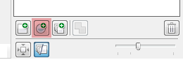

# Наложение фильтров на изображение в PHOTO-PAINT

Я давно хотел начать рассказывать про **PHOTO-PAINT**, но как то всё не получалось. Надеюсь этот материал станет не последним, а лишь началом серии статей про этот растровый редактор.

В этой небольшой заметке я расскажу о **линзах**, которые существенно отличаются от тех, что применяются в CorelDRAW.

Суть **линз в PHOTO-PAINT** заключается в том, что они позволяют применять определённые фильтры к объектам (так здесь называются слои), не изменяя их. То есть с помощью линз можно накладывать фильтры, добиваясь различных визуальных эффектов и при этом оставить исходное изображение нетронутым.

Можно наложить несколько линз на один объект/изображение, менять их местами в «стопке», тем самым добиваясь различных эффектов, включать и выключать их видимость.

Для того что бы применить линзу, откройте докер **Objects** (объекты), выберите нужный объект (привыкайте, объект — слой), и нажмите кнопку **New Lens** (создание линзы) внизу докера, или воспользуйтесь командой New Lens (создать линзу...) в меню Object > Create (Объект > Создать).

В появившемся диалоговом окне выберите необходимый фильтр, и нажмите ОК.

С линзами можно работать как с другими объектами, менять им уровень прозрачности, назначать режим наложения, размеры, позицию и прочее.
