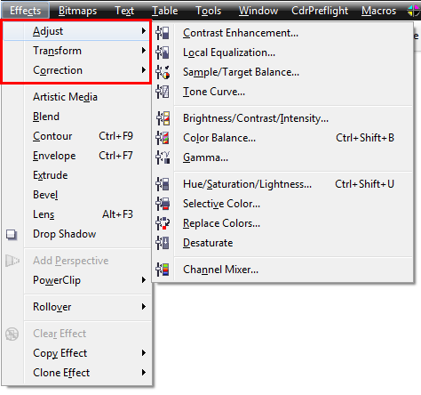
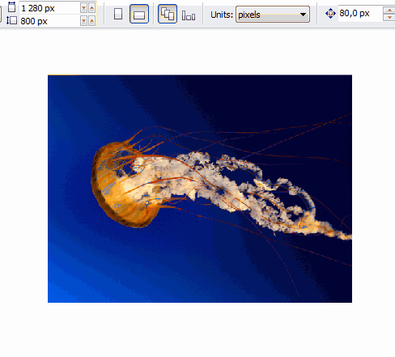

# Обработка растровых изображений в CorelDRAW

Существует мнение что **растровые изображения** нужно обрабатывать в специализированных редакторах, таких как PhotoShop и Corel PHOTO-PAINT. А между тем, такие элементарные задачи, как быстрая корректировка цвета, контраста, обрезка, наложение фильтров можно легко выполнить не выходя из **CorelDRAW**.

Для этого в программе предусмотрены меню **Effects** (Эффекты) и **Bitmaps** (Растровые изображения), в которых собраны все необходимые команды.

Стоит отметить что в CorelDRAW своя логика работы с растровыми изображениями, которая позволяет работать с ними как с обычными векторными объектами. К примеру, можно обтравить изображение инструментом **Shape**, или обрезать с помощью команд обрезки.

И не верьте байкам про то, что CorelDRAW некорректно работает с растром ;)
