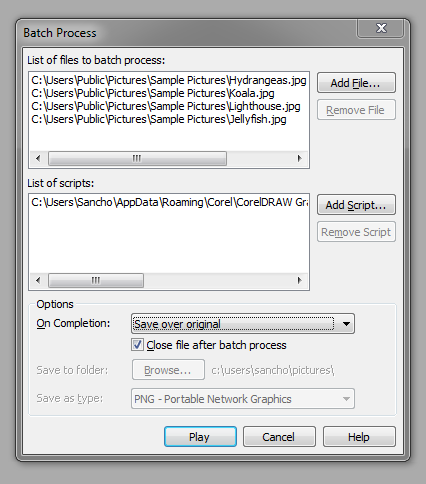

# Пакетная обработка изображений с помощью Corel PHOTO-PAINT

Иногда возникает потребность применить одни и те же действия к большому количеству изображений. Для этого, в растровом редакторе **Corel PHOTO-PAINT** предусмотрена функция **Batch Process (Пакетная обработка)**, которую можно найти в меню File (Файл).

Как видно, окно функции разделено на три секции. В первой необходимо указать какие файлы обрабатывать. Во второй, указать скрипты, которые содержат необходимые команды обработки изображений. Не пугайтесь, программировать ни чего не нужно — ниже будет рассказано как быстро и просто записать скрипт. И наконец, в третей области расположены дополнительные опции, т.е. какие действия выполнить с изображением после обработки. Можно например, сохранить поверх старых файлов, или в новую папку, или даже в другом формате.

Итак, как записать необходимые действия в скрипт:

1.  Открыть **докер Recorder** (Ctrl + F3)
2.  Нажать круглую **красную кнопку** внизу докера
3.  Выполнить необходимые действия над изображением (например, применить какой либо фильтр тоновой/цветовой коррекции)
4.  Нажать кнопку Stop (рядом с нажатой ранее кнопкой записи)
5.  Сохранить записанный скрипт с помощью кнопки Save (располагается вверху докера)

Собственно, вот и всё. Записываем необходимый порядок действий в скрипт, сохраняем его и с помощью Batch Process обрабатываем изображения.
