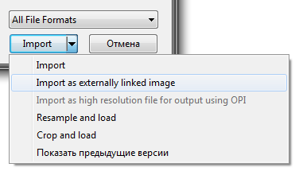
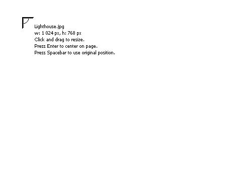

# Подробнее об импорте растровых изображений

Казалось бы, **импорт растровых изображений** — банальная функция любого графического редактора, о чём тут можно вообще написать?! Однако в **CorelDRAW** есть свой набор «плюшек», связанных с этой функцией, на которые кто-то, возможно, не обращал внимания. А зря!

Итак, первой «плюшкой» у нас будет **расширенное меню импорта**. Увидеть его можно, нажав маленькую стрелочку справа от кнопки Импорт в диалоговом окне выбора изображения.

Данное меню, помимо стандартного импорта, предоставляет нам несколько дополнительных функций. К примеру можно предварительно обрезать или изменить размеры импортируемого изображения.

Пожалуй самой «вкусной» функцией будет **импорт изображения в качестве линка** (ссылки). Данная функция хорошо знакома тем, кто имел опыт работы с программами для вёрстки, такими как InDesign. Суть её заключается в том, что вы импортируете в документ CorelDRAW не всё изображение полностью (имеется виду вес файла), а только превью низкого разрешения, что существенно снижает вес документа.

Если в документе много изображений, линки позволяют ускорить работу с ним, а так же предотвратить возможную потерю данных, т.к. слишком большие (более 1Gb) документы можно вообще не открыть в следующий раз.

Несколько дополнительных функций для работы с линкованными изображениями можно найти в [макросе BitmapLinksManager](http://cdrpro.ru/macros/).

Вторая «плюшка» заключается в том, что после того как вы выбрали изображение и нажали кнопку Импорт, курсор меняет свой вид на «уголок», предлагая указать куда именно нужно поместить изображение. Однако, если кликнуть левой кнопкой мыши и не отпуская потянуть в любую сторону по диагонали, можно «на лету» указать не только точное местоположение изображения, но и его геометрические размеры.

А закончу эту заметку я следующей «плюшкой». При перетаскивании изображения из файлового менеджера или банального Проводника, в пустое окно CorelDRAW, создаётся новый файл с уже помещённым в него изображением. Фишка в том, что после любой манипуляции в документе, нажатие кнопки Сохранить не покажет диалоговое окно выбора папки и указания имени для нового файла, а сохранит документ в ту же папку и с тем же именем что и у изображения.
