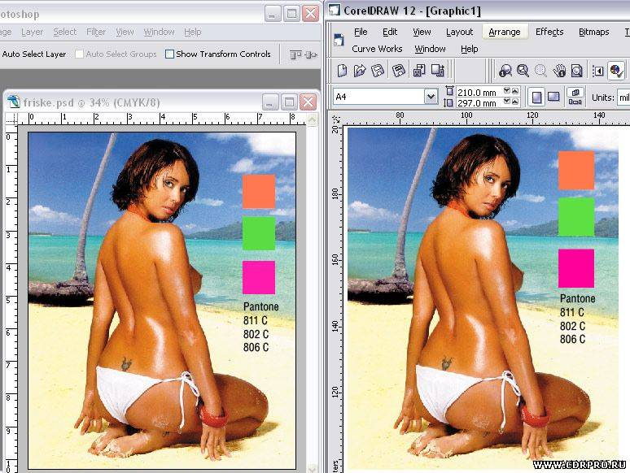

# Настройка CMS (Color Management System) в CorelDRAW

_Дата публикации: 02.11.2012_   
_Автор: cmyk_

Corel DRAW в отличии от Adobe Illustrator'а не имеет цветового режима документа, и поэтому вы можете использовать цвета каких угодно моделей цвета или фиксированных палитр для раскрашивания объектов. Сюда же входят и стоповые точки градиентной заливки, и узлы мешей. Об этой особенности Корела следует помнить и в случае когда дело касается дизайна полиграфии пользоваться палитрой в которой только CMYK.  

Однако, полиграфия подразумевает и печать т.н. смесевыми цветами, то есть такими, цвет которых при печати получается не в процессе растрирования четырех базовых цветов CMYK, а в предварительном процессе смешивания красок в ведерке. Если CMYK красный это процесс смешивания желтого и маженты на листе бумаги при печати, то смесевый красный это просто красная краска.  

Поскольку в Кореле цветовой режим документа не предусмотрен, то смесевые цвета (цвета смесевых красок) отображаются как есть - описание цвета в модели HSB трансформируется в RGB цвет по заданному RGB профилю и в финале профилю монитора.  

А вот с цветами CMYK предусмотрено два варианта. Первый - реликтовый - базовые цвета приравниваются к комплементарным RGB: Cyan = Green + Blue; Magenta = Blue + Red; Yellow = Red + Green. Черный раскидывается на RGB поровну. CMYK отображается натурально как модель субтрактивного синтеза - без учета каких бы то ни было особенностей технологии печати. Второй вариант - более новый и современный - с учетом всех этих особенностей, которые становятся доступны программе через указанный профиль устройства печати.  

Переключение между этими вариантами отображения CMYK'а - кнопка Calibrate Colors, которую теперь вы в интерфейсе не найдете и в справке о ней ничего не прочитаете. Кажется с версии 9 она пропала - но поскольку я перетаскиваю настройки Корела от одного пользователя к другому и от старой версии к новой - то у меня она есть. А вы можете ее найти в диалоге кастомизации интерфейса:  

Перетащите кнопку Calibrate Colors из окна настройки интерфейса в любую из фиксированных панелей.

По умолчанию эта функция включена, но, бывает так что настройки слетают и тогда вместо привычого CMYK'a вы обнаруживаете RGB'шные цвета "вырви глаз". Достаточно будет нажать эту кнопку чтобы вернуть все на место.  

## Диалог Color Management

Выберите меню Tools > Color Management, и вы увидите одноименный диалог, где "в простой и ненавязчивой форме" представлена схема возможных соединений компонентов в единый тракт воспроизведения цвета, а также имеется интерфейс для выбора устройств и настройки их параметров. Там же есть кнопка Help, нажав которую вы сразу же попадете на соответсвующий раздел справки.  

Чтобы настроить компонтент - щелкните на его значке (иконке). Чтобы выбрать имя устройства из списка - разверните список. Там есть команды Download Profiles, и Get profile from disk... - для скачивания профилей из сети и загрузки с локального диска соответственно.  

Чтобы собрать нужную схему - включить, исключить профиль, или определить порядок профилей - щелкайте оранжевые стрелки. Метафорически цвет идет по цепи сверху вниз. От источников: сканер, камера, файл - к Color Engine (Internal RGB), и от него к получателям - принтерам и/или монитору. Монитор - последний компонент.  

**Internal RGB** - в центре схемы - это настройка выбранного color engine, или цветового движка (мотора, двигателя, паровоза). Щелкните на нем и вы можете выбрать тип паровоза - Kodak или Microsoft (по умолчанию Kodak). А также методы трансформации цвета в выбранный для Internal RGB профиль: Rendering Intent. По умолчанию - Automatic, что означает: Saturation для векторной графики и Perceptual для растровой в документе. В списке профилей Internal RGB - доступные ICC профили.  

**Import/Export** - значок в виде листочков - это настройка политики управления профилями при импорте и экспорте документов и изображений. Две стрелки к этому значку от Internal RGB - одна включает использование настроенной политики для импорта, другая для экспорта. Если обе стрелки ВЫКЛючены, то применяется политика Ignore Embedded ICC Profile, и Do not embedd ICC Profile соответственно.  

У этого компонента списка профилей нет - они в свойствах политик внутри диалога Advanced Import/Export Settings который вызывается щелчком мыши на его иконке.  

**Scanner/Difital Camera** - значок сканера и фотокамеры - не кликабелен и имеется только список доступных профилей. Если стрелка включена, то используется указанный профиль для коррекции цвета при загрузке изображений в документ после выполнения команды Acquire Image, то есть, после сканирования или фотосъемки минуя запись в файл.  

**Separations Printer** - значок многосекционной печатной машины - щелкните его чтобы получить доступ к диалогу переназначения профилей имеющимся принтерам. Этот профиль используется только если включены стрелки: к нему от Internal RGB + от него к значку Monitor.  

В списке этого компонента CMS вы найдете доступные профили устройств, аналогично тому, как это вы можете сделать в настройках Системы Управления Цветом в Фотошопе.  

**Composite Printer** - значок настольного принтера - щелкните его чтобы получить... в общем, все тоже самое что для Separations Printer с тем отличием что вы можете включить самую нижнюю, длиную стрелку, чтобы настольный принтер получал цвет откорректированный по профилю печатной машины. Это применяется при изготовлении цветопроб на нем.  

**Monitor** - значок монитора, в который ведут все стрелки - щелкните его чтобы открыть диалог Advanced Display Settings, где вы можете задать цвет индикации выхода цветов за пределы заданного гамюта (Out of gamut colors); определить как отображать значения CMYK - процентами (0-100) или абсолютными величинами (0-255); и кроме того определить как будут отображаться цвета смесевых красок - как есть, или преобразованными в CMYK эквивалент.  

Компонент имеет список доступных профилей устройств, среди которых может оказаться и тот, который шел с драйверами вашего монитора.  

## Настройка отображения цветов в Corel Draw на соответствие с Photoshop

Поскольку входящий в кореловский пакет редактор растровой графики Corel Photopaint не пользуется такой популярностью как Photoshop, то возникает необходимость настроить Корел так, чтобы он отображал цвета в точности как они выглядят в документах в Фотошопе.  

Самое простое решение это:

* Выбрать для Internal RGB тот же самый профиль что выбран в ФШ для RGB, или оставить там Generic RGB;
* Выбрать такой же Rendering Intent как в Фотошопе.
* Выбрать для Separations Printer тот же самый профиль что выбран в ФШ для CMYK;
* Выбрать для Monitor тот же самый профиль что выбран в ФШ для RGB;  

Однако всей полноты совпадений можно добиться только если встречно изменить в Фотошопе Color Engine с адобского, на майкрософтовский, и в Кореле с кодаковского на майкрософтовский и выбрать одинаковый Rendering Intent. Практически же это не требуется - пусть в ФШ остается ихний ACE, а в Кореле - ихний Kodak.  

## Особенности Корела в управлении цветом

При использовании ранее упомянутой функции Calibrate Colors, CMYK в документе Corel'а отображается совершенно адекватно выбранному для Separations Printer профилю. Безотносительно к тому, включен ли этот профиль в тракт цветовоспроизведения в диалоге Color Management или нет. То есть, выставлены ли к нему и от него стрелки. В общем, все по порядку...  

Если ВКЛючить профиль Separations Printer в тракт - пустить стрелку от Internal RGB к нему, а от него к Monitor'у - с воспроизведением CMYK'а все будет прекрасно, но цвета RGB гамюта воспроизводиться не будут! То есть, действительные значения их не изменятся, но на экране они будут выглядеть сконвертированными в CMYK. Это как при включении Proof Colors в Фотошопе.  

Если не волнует RGB вообще - можно считать что и такое положение нормальное, пока вы не столкнетесь с использованием смесевых цветов в дизайне. Смесевые цвета описаны в Кореле в модели HSB и при этих условиях они тоже не будут отображаться правильно будучи преобразованными в CMYK по текущему профилю Separations Printer. В случае с, например, флюоресцентными цветами искажения приведут их к полной непохожести на тот цвет, каким они будут отпечатаны.  

Казалось бы - тогда выключить эти стрелки исключив из тракта управления цветом CMYK профиль, поскольку он и так используется при ВКЛюченной функции Calibrate Colors (та самая функция, та самая кнопка). Все верно - можно пустить стрелку прямо от Internal RGB к монитору, чтобы CMYK отображался в пространстве CMYK принтера, а RGB - вместе с цветами смесевых красок - в пространстве RGB.  

Однако в этом случае поджидает засада! Становится невозможным преобразовать средствами Корела (Bitmaps > Mode > ...) картинку из CMYK в RGB. То есть, оно преобразуется, но без учета профиля CMYK. В результате цвета искажаются чрезвычайно. Оно и понятно - если вместо конкретного цвета базовой краски взять абстрактный Cyan, то есть, который получается просто смешиванием RGB'шных Green + Blue, и учтя количество черного проинвертировать и переписать данные в 3 байта вместо 4, то, ни о какой похожести цветов до и после конвертирования быть не может.  

Функция Calibrate Colors только отображает скорректированные данные - а все другие функции которым нужны действительные данные цвета, получают CMYK без учета цвета базовых красок и прочего изрядного количества параметров печати.  

Это явление имеет место не только при конвертировании готовых картинок из CMYK в RGB, но и при растеризации векторных объектов если они используют цвета CMYK. А также при экспорте такого объекта в графический файл в режиме RGB. А также это влияет на цвета превью формата EPS. А также в моменты трансформации объектов вы увидите их в другом цвете.

Поэтому при использовании такой настройки CMS будьте внимательны при конвертировании цветов, при растеризации и экспорте вектора в растр, и в файлы.

В целом же такое поведение программы вносит изрядную путаницу в использование профилей при растеризации, импорта, экспорта, сохрания файлов и печати их. Возможно это баг, возможно в ХЗ его исправили - если это так - сообщите об этом пожалуйста.

Преобразование CMYK > RGB идет в условиях данной настройки - то есть, когда Separations Printer не включен в тракт - совершенно нормально. На снимке внизу - эти самые "условия", то есть, правильная функциональная настройка CMS Корела.  

## Синхронизация собственных профилей в Фотошопе и Кореле

Если же оказалось что в Кореле недоступен профиль который используется в Фотошопе, например потому что вы на базе какого-то из имеющихся произвели свои собственные настройки, то сохраните этот профиль на диск и затем загрузите в Кореле.  

Запустите Фотошоп, выполните Edit > Color Settings. Разверните список CMYK и найдите там строчку Save CMYK... Откроется диалог сохранения в файл. По умолчанию путь для профилей в среде Windows XP таков.  

### C:\WINDOWS\system32\spool\drivers\color

Корел, как и ФШ, проверяют и свою собственные папки где хранят некоторые профили. Однако, чтобы обновлять только один файл в случае необходимости и чтобы он был доступен всем приложениям в системе - лучше записать его по указанному адресу.  

Затем, запускаете Корел (если запущен - перезапускаете) и находите только что сохраненный файл по имени профиля в списке доступных. Поэтому в ФШ позаботьтесь о том, чтобы ваша настройка CMYK имела какое-то осмысленное название.  

На снимке выше вы видели что в качестве Separations Printer у меня стоит нечто WorkingCMYK. Это вот откуда:  

Если вы обнаружите что в настройках CMS Корела слетает выбранный профиль для Internal RGB - забудьте. Также сохранить пресет не представляется возможным - при попытке взять данные из пресета - настройки либо частично не восстанавливаются, либо вообще какая-то лажа записывается. Впрочем, может быть это у меня локальный глюк.  

И еще, насчет настройки отображения смесевых цветов, при включенной опции - Map Spot Colors into CMYK Gamut - которая доступна в диалоге Advanced Displaty Settings, который появляется по щелчку на иконке элемента Monitor.  

Это не обычное преобразование HSB значений цвета смесевых красок в текущий CMYK, это табличное сопоставление смесевого цвета цветам четырехкрасочного процесса.  

В Кореле внутреннее представление цвета описано в HSB, а в Фотошопе в Lab'е. Кроме того разные Color Engine. Корел, очевидно берет для смесевых красок параметр Dot Gain из CMYK'ового профиля. И поэтому что касается отображения смесевых цветов, да и CMYK'а тоже - все-таки небольшие отличия в отображении можно обнаружить. Можете полюбоваться на тетеньку и потыкать ее пипеткой в разные места чтобы проверить как совпадает цвет там и там. С учетом, конечно, того что он в RGB преобразован.  

Справа было три образца смесевых цветов - теперь от них только RGB отображение. По цифрам похоже, но 806 сильно отличается и даже на глаз заметно.  

Впрочем, для дизайна это не существенно - вы же знаете что смесевые цвета напечатаются с одной формы одной краской - не зависимо от того, где было подготовлено их изображение - в Кореле или Фотошопе. Конечно, при подгонке tint'ов или в градиентах это может иметь значение, но тут уже вступает в силу настройка тракта цветовоспроизведения в целом - откуда вы знаете что в Фотошопе правильнее чем в Кореле, или наоборот?  

