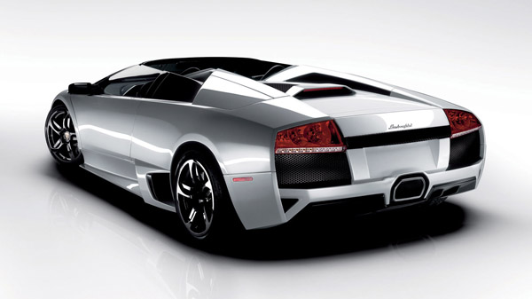
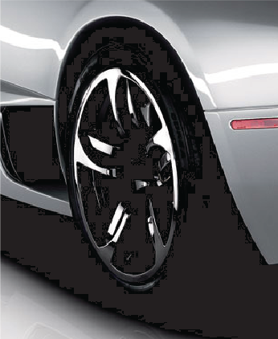

# Preserve pure black — хорошо или плохо?

_Дата публикации: 03.02.2011_

Читая различные форумы, я обратил внимание на то, что часто стали советовать включить галочку **Preserve pure black** (Сохранить чистый чёрный) в настройках управления цветом. Однако стоит разобраться в этом вопросе более детально, стоит ли её включать, и к чему это всё может привести.

Сначала давайте разберёмся, для чего используется эта опция. Вспомним, что в **CorelDRAW X5** была полностью переработана система работы с цветом и профилями. Это, безусловно, большой и правильный шаг в развитии программы. Однако не всем правильная работа пришлась по вкусу в силу того, что при конвертации чёрного цвета из одной цветовой модели в другую, получается результат не совсем тот, который привыкли видеть. То есть, если мы конвертируем **100% чёрный** CMYK в Gray, последний получится не 100%. Может быть для кого то из вас это баг/недоработка/проблема, но на самом деле это правильное поведение цвета при такого рода конвертациях.

Именно для таких случаев была добавлена галочка **Preserve pure black**. Её включение гарантирует, что все 100% чёрные цвета, при конвертациях, останутся 100% чёрными. То есть из C:0 M:0 Y:0 K:100 мы получим G:0. А теперь давайте посмотрим на этот вопрос с другой стороны. К примеру, у нас есть некое растровое RGB изображение, которые мы хотим использовать в печатной продукции.

Помним про то, что Preserve pure black у нас, эксперимента ради, включен! Берём наше изображение и импортируем его в документ CorelDRAW. Затем, нам нужно поменять цветовую модель на CMYK. Для этого выделяем картинка и выбираем пункт CMYK Color (32-bit) в меню Bitmap > Mode. Смотрим на изображение, и вроде бы всё нормально. Однако если мы напечатаем это изображение или просто отключим нашу подопытную галочку, то увидим следующий результат.

Программа отработала честно, она заменила 100% RGB чёрный, на 100% CMYK чёрный.

Какие выводы из всего этого нужно сделать? Будьте внимательны, и используйте данную опцию очень осторожно!
