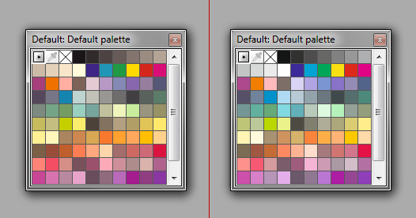
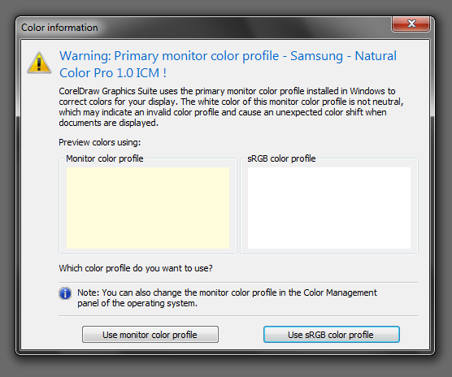

# Желтизна цвета

_Дата публикации: 22.07.2010_   
_CorelDRAW X5+_

Одним из глобальных нововведений в **CorelDRAW X5** стала новая **система управления цветом (CMS)**. Рассказывать о ней можно много и долго, поэтому я решил разделить материал на несколько отдельных частей. В этой, речь пойдёт о **желтизне** и о том, почему она возникает и как с ней бороться.

Итак, в 99% случаев всему виной неадекватный **цветовой профиль** монитора. Программа CorelDRAW X5 при первом запуске проверяет его наличие в системе, и в случае обнаружения проблемы отображения белого цвета, предлагает решение в виде использования стандартного **sRGB профиля**. Этим решением и нужно воспользоваться.

Желтизна цвета в CorelDRAW X5

Однако могло случиться так, что по каким-то причинам Вы поступили иначе и цвета теперь отображаются с жёлтым оттенком. В этом случае Вам нужно сбросить настройки. Сделать это можно двумя способами:

* Во время запуска **CorelDRAW** удерживать нажатой **клавишу F8**, и на вопрос о сбросе параметров, ответить ДА. Однако этот способ убьёт и другие настройки тоже.
* Удалить все ключи (кроме "По умолчанию") из этой ветки реестра: _HKEY_CURRENT_USER\Software\Corel\CorelDRAW\15.0\Draw\Application Preferences\ColorProfileMonitorMapping_

После этого CorelDRAW снова спросит, какой профиль использовать для отображения цвета на Вашем мониторе.

Если Вы вдруг не знаете, или сомневаетесь, **что такое цветовой профиль**, то вам стоит дополнительно обратиться за помощью к [Вике](http://ru.wikipedia.org/wiki/ICC-профиль) и Гуглу.
