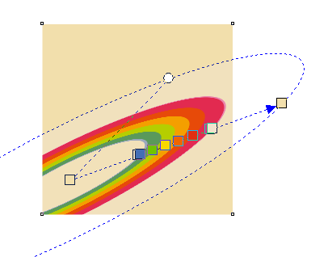

# Новые возможности заливки в CorelDRAW X7

В новой версии графического редактора **CorelDRAW X7** были существенно доработаны **инструменты заливки**. Что именно изменилось, в сравнении с Х6 и более ранними версиями, я и постараюсь кратко описать в этом материале.

Первое, на что стоит обратить внимание, это новое окно **Edit Fill** (F11), которое объединило в себе все типы заливки, кроме **Mesh Fill** (Сетчатая заливка). Совершенно все опции окна Edit Fill, доступны и в докере **Object Properties** (Свойства объекта).

Независимо от того где именно вы будите делать настройки, в докере или в окне Edit Fill, изменения в документе будут происходить моментально.

## Прозрачность

Одно из важных изменений — узлы заливки получили свойство **Transparency** (Прозрачность), по аналогии с узлами сетчатой заливки.

И как видно по скриншоту, прозрачность, вместе с цветом, можно настраивать непосредственно на объекте с помощью инструмента **Interactive Fill tool** (Интерактивная заливка, G).

## Трансформация заливки

В новой версии CorelDRAW, заливку можно трансформировать, как автоматически, трансформируя сам объект,

так и непосредственно саму заливку, независимо от объекта, используя инструмент **Interactive Fill tool** (Интерактивная заливка, G).

Данная возможность доступна только при условии, что у заливки включен параметр **Free scale and skew**.

## Дополнительные опции заливки

1.  Привычный тип отображения заливки;
2.  Зеркальный повтор;
3.  Повтор.

Опция **Smooth**, делающая заливку более сглаженной.

К новым возможностям заливки можно отнести и **Content Exchange**, но об этом в другой раз.

## На заметку:

Если попробовать сохранить файл в одну из предыдущих версий, то вы увидите такое окно:

Выбрав Keep appearance, все объекты с новыми настройками заливки будут автоматически сохранены как растровое изображение.
