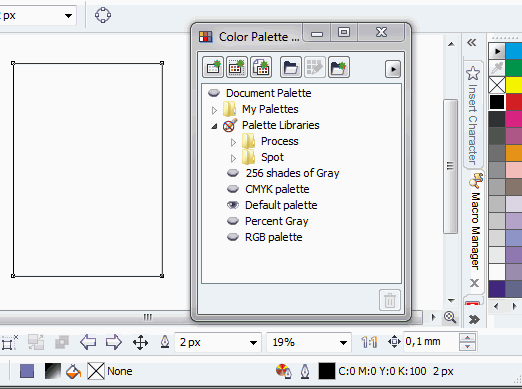

# Названия цветов вместо их значений (X5)

_Дата публикации: 12.02.2011_

Одним из нововведений **CorelDRAW X5** является то, что при работе с цветами палитр, отдаётся предпочтения их числовому значению, вместо имён, при идентификации. Проще говоря, в панели состояния теперь вместо **имени цвета** заливки и обводки, отображаются их **числовые значения**. Большинство профессионалов работают именно со значениями цвета, а не с их названиями, которые зачастую не говорят совершенно не о чём. Однако есть люди которые по каким то личным соображениям привыкли видеть именно название цвета. Если вы один из них, тогда читайте дальше и вы узнаете как вернуть отображение имён цветов.

Для этого вам потребуется установленный второй пакет обновлений (SP2), минимум.

Итак, открываем **Менеджер палитр** (Color Palette Manager) в меню Window > Dockers. И перетаскиваем палитру **Default palette** в **My Palettes**. Всё!

Однако есть несколько замечаний:

* Имя цвета будет отображаться только для тех объектов, цвета которых были заданны именно из этой палитры.
* Палитра теперь будет именно палитрой, а не контейнером. Поэтому теперь всегда будут отображаться только одна цветовая модель, именно та, которая была в Default palette при её перетаскивании.

Как видите, палитра всего лишь дублируется, поэтому всегда можно вернуться с палитре по умолчанию.
