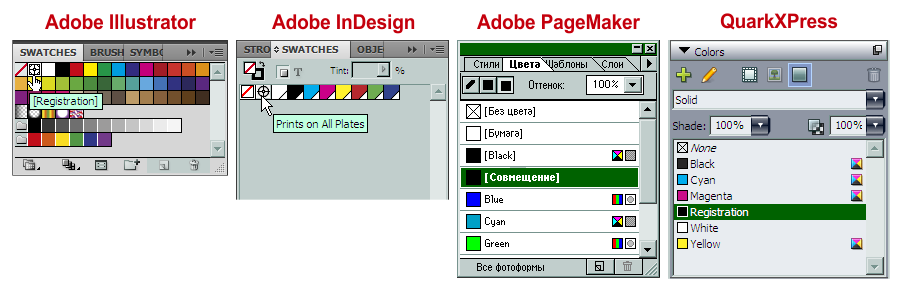
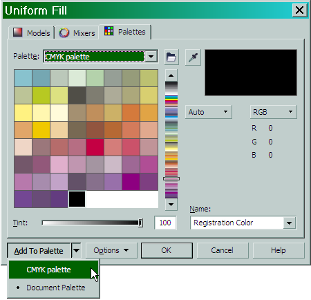

# Цвет совмещения (Registration Color) в CorelDRAW

Автор: Роман Тищенко

Как я уже упоминал, CorelDRAW уже во многом вплотную подошел по своим возможностям к специфическим программам верстки. Относится это не только к работе с текстом, но также и охватывает другие аспекты создания профессиональных макетов для печати. Это и знаменитые возможности CorelDRAW по спуску полос, и наличие слоев-шаблонов, и возможность индивидуальной настройки направляющих для каждой страницы, и управление цветом, и многое другое.

Рассмотрим в этой статье так называемый Цвет совмещения ( **Registration Color** ), который может использоваться при создании цветных полиграфических макетов. Которые, в свою очередь, планируется печатать офсетным способом.

CorelDRAW во многом автоматизирует спуск макетов на большие листы с расстановкой служебных элементов — меток совмещения, обреза, сгиба, цветовых шкал... Но часто приходится делать это вручную — или из-за требований типографий или по другим причинам.  
Поэтому часто приходится наблюдать, как начинающие, неопытные дизайнеры или верстальщики ухитряются делать так, чтобы метки совмещения, метки реза и другие элементы присутствовали во всех каналах — Cyan, Magenta, Yellow, Black (CMYK). А, значит, и на всех пленках, пластинах, с которых будет производиться печать. Эти элементы красят в цвет C:100/M:100/Y:100/K:100\. Или, скажем, C:0/M:100/Y:0/K:100, если макет двуцветный. Но если в макете планируются дополнительные плашечные цвета (Spot colors)? Что делать тогда? «Голь на выдумки хитра» — поверх креста с цветом C:100/M:100/Y:100/K:100, ставят копию такого же креста плашечного цвета и задают ему атрибут **Overprint** (Наложение). И так можно сделать не один раз! Срабатывает!  
Но зачем? Все можно сделать гораздо проще. Для такой надобности в CorelDRAW имеется специальный цвет. Если этим цветом покрасить объект, то при цветоделении этот объект будет присутствовать во всех цветовых каналах, на всех печатных формах (Plates). Это и есть Цвет совмещения ( **Registration Color** ).

В отличие от других программ-конкурентов, цвет этот в CorelDRAW запрятан довольно глубоко. Для сравнения посмотрите, как в некоторых других программах предоставляется возможность окраски объектов в цвет совмещения:

Как видим, образец этого цвета находится на самом видном месте. А где же он спрятан в CorelDRAW? Чтобы его найти, запустим стандартное окно **Uniform Fill** (Однородная заливка). Для этого можно щелкнуть на одноименном инструменте или нажать **Shift+F11**.

На закладке **Models** (Модели), в выпадающем списке **Model** (Модель) выбираем **Registration Color** (Цвет совмещения). В этом же окне можно задать и его оттенок в процентах.  
Данный цвет виден, как черный. Следует также заметить, что, хоть мы и выбирали его среди цветовых моделей, строго говоря, **Registration color** не является моделью представления цвета. Это служебный, вспомогательный цвет, который используется лишь для создания меток совмещения (меток приводки) цветов при цветоделении.

Увы, поместить образец данного цвета на **Default Palette** (Палитру по умолчанию) не получится. Но, чтобы не проделывать каждый раз, когда этот цвет необходим, вышеуказанную операцию, образец данного цвета можно поместить на другую палитру. Например, **CMYK Palette**. Она имеет тот же состав, что и **Default Palette** (если основной цветовой режим документа — CMYK), но ее можно менять (добавлять, удалять, изменять цвета).

Для начала включим ее: выберем **Window > Color Palettes > CMYK palette** (Окно > Цветовые палитры > Палитра CMYK) и поместим ее в удобное место. Затем в меню палитры можно включить опцию **Set As Default** (По умолчанию), чтобы она была постоянно включена. **Default Palette** (Палитру по умолчанию) можно выключить. И, чтобы она больше не появлялась при следующих запусках CorelDRAW, перед этим снимем галочку с опции **Set As Default** (По умолчанию).

Если сравнить меню обеих палитр, то можно увидеть, что недоступные для Палитры по умолчанию команды, стали активными для вновь включенной:

Активна также и «пипетка» для добавления новых цветов в палитру.

Подготовительная работа закончена и теперь в нашу новую основную палитру можно добавить **Registration Color** (Цвет совмещения).  
Это можно сделать разными способами.

*   Выбрать пипетку, расположенную в начале палитры и щелкнуть ею по объекту, имеющему цвет Registration Color.  
    
*   Выбрать в меню палитры Edit Color (Изменить цвет) и появившемся окне редактора палитры нажать кнопку Add Color (Добавить цвет). То диалоговое окно, которое при этом появится, нам уже знакомо. И хоть называется оно теперь Select Color (Выбор цвета), по сути, оно ничем не отличается от знакомого нам диалога Uniform Fill (Однородная заливка). Выбираем вышеописанным способом Registration Color, жмем OK и еще раз OK.  
    Вызвать диалоговое окно Palette Editor (Редактор палитр) можно еще и выбрав одноименный пункт в меню Tools (Инструменты).  
    
*   Все в том же диалоговом окне Uniform Fill (Однородная заливка) выбираем нужный нам цвет (в данном случае Registration Color) и нажимаем кнопку Add To Palette (Доб. в палитру), предварительно выбрав нужную нам палитру в выпадающем списке.  
    

Этими способами можно добавлять в палитры и любые другие цвета.

Итак, используя Цвет совмещения ( **Registration Color** ), можно красить им служебные элементы при верстке, спуске полос макетов, которые планируется печатать офсетным способом.