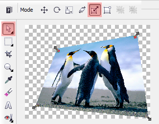
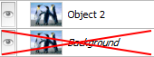
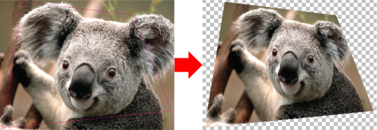
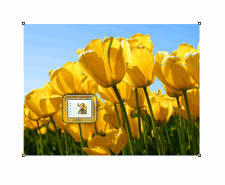

# Деформация изображения

В самом **CorelDRAW** для свободной деформации растровых изображений инструмента не предусмотрено. Есть эффекты 3D Rotate (Трёхмерный поворот) и Perspective (Перспектива), но это всё не то. Но это не означает что нет возможности добиться нужного эффекта. В этой заметке я расскажу о двух способах как применить необходимую деформацию к растровому изображению.

Оба способа используют одну и ту же функцию редактора **Corel PHOTO-PAINT** — **деформацию** (Distort), однако в одном случае это делается автоматически так, что вы даже не заметите что использовался PHOTO-PAINT.

## Ручной метод

Выделяем изображение в CorelDRAW и нажимаем кнопку **Edit Bitmap** (Редактировать растровое изображение) для того, что бы открыть его в редакторе Corel PHOTO-PAINT. Если изображение является фоном, переведите его в объект.

Затем, с помощью инструмента **Object Pick** (Выбор объекта), в режиме **Distort** придайте необходимое искажение. После, закройте редактор, и на вопрос сохранить изображение, ответьте ДА. Изображение в CorelDRAW обновится автоматически.

Тут может появиться один вопрос — а как быть если нужно придать точную форму, тесть что бы углы изображения были в определённых местах. Для этого необходимо создать кривую поверх изображения, придать ей необходимую форму, убрать заливку и применить тонкий абрис. Затем перевести кривую в растровое изображение с прозрачным фоном.

_Важно что бы это новое изображение имело точно такое же значение **dpi** как и у того, что мы будем деформировать, а так же что бы оба изображения были с прозрачностью (прозрачные пиксели, а не эффект интерактивной прозрачности)._

Выделив два этих изображения, выбираем команду Edit Bitmap в меню Bitmap (Растровые изображения), после чего увидим что они открылись в редакторе Corel PHOTO-PAINT в виде одного документа с двумя объектами (слоями). Подстраиваем наше изображение под «шаблон», который потом удаляем.

## Автоматический метод

Результат достигается с помощью макроса (выложу код, как будет время). Для деформации, необходимо изображению придать нужную форму с помощью инструмента **Shape** и запустить макрос, всё остальное он сделает сам.

Согласитесь, этот вариант намного проще! :)
