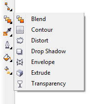
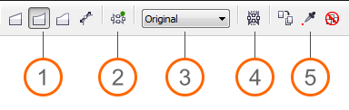
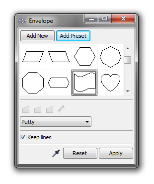

# Эффект Envelope (Оболочка) в CorelDRAW

Эффект **Envelope (Оболочка)** позволяет менять форму без непосредственного редактирования самого объекта. К тому же, как и любой другой эффект, его можно очистить в любое время, вернувшись к первоначальному виду объекта. Давайте рассмотрим как именно создавать и изменять этот эффект и какие настройки он поддерживает.

Применять эффект оболочки можно к примитивам, кривым, тексту, а также группам из этих объектов. Стоит отметить, что если в группе будет хотя бы один объект с не поддерживаемым типом (например растровое изображение), эффект применить не получится.

## Способы применения эффекта Envelope (Оболочка)

### Первый способ

Воспользоваться инструментом **Envelope (Оболочка)**, который расположен на панели инструментов (Toolbox), в раскрывающемся списке интерактивных эффектов. При выборе этого инструмента и какого либо объекта в документе, стандартная панель (Standard) станет похожей на панель редактирования кривой, а вокруг объекта появится рамка с узлами. Данную рамку можно интерактивно редактировать точно также как и любую кривую.

На стандартной панели также доступны заготовки, к котором можно добавить свои, и опции относящиеся именно к эффекту оболочки.

1.  Режим оболочки:
    *   **Straight line mode (Режим прямой)** — создание оболочки на основе прямых линий;
    *   **Single-arc mode (Режим одной дуги)** — создание оболочки с выгнутыми или вогнутыми краями (подходит для создания эффекта арки);
    *   **Double-arc mode (Режим двойной дуги)** — создание оболочки с S образными линиями;
    *   **Unconstrained mode (Произвольный режим)** — создание оболочки произвольной формы (можно добавлять/удалять узлы, менять тип линий/узлов).
2.  **Add new envelope (Создать новую оболочку)** — добавляет новую оболочку объекту у которого уже есть оболочка.
3.  **Mapping mode (Режим сопоставления)** — определяет каким образом будет изменяться форма объекта относительно оболочки. Доступно четыре варианта.
    *   **Horizontal (По горизонтали)** — растягивает объект до основных размеров оболочки, а затем сжимает его по горизонтали по форме оболочки;
    *   **Putty (По углам)** — сопоставляет угловые маркеры (узлы) поля выделения объекта с угловыми узлами оболочки;
    *   **Original (Оригинал)** — действует аналогично режиму Putty, но при этом другие узлы сопоставляются линейно вдоль кромки поля выделения объекта;
    *   **Vertical (По вертикали)** — растягивает объект до основных размеров оболочки, а затем сжимает его по вертикали по форме оболочки.
4.  **Keep lines (Сохранять прямые)** — прямые линии объекта остаются прямыми.
5.  Дополнительные операции, которые позволяют скопировать свойства эффект, скопировать форму в качестве эффекта, или очистить эффект.

Стоит отметить, что настройки режима оболочки, режима сопоставления и сохранения прямых линий необходимо выполнять до изменения формы эффекта.

При использовании одного из трёх первых режимов оболочки, доступны клавиши модификаций Ctrl и Shift. При удержании клавиши **Ctrl** и перемещении узла, противоположный узел будет перемещаться на равное расстояние в том же направлении, а если удерживать **Shift** — в противоположном направлении.

### Второй способ

Воспользоваться **докером Envelope (Оболочка)** (Ctrl+F7). В целом, он содержит те же настройки оболочки, однако дополнительно предлагает выбрать оболочку из стандартных заготовок — кнопка **Add Preset (Добавить заготовку)**.

### Третий способ

Воспользоваться командой **Copy Effect > Envelope from** (Скопировать эффект > Оболочку) в меню **Effects** (Эффекты). Для этого выделите объект к которому необходимо применить эффект, выполните команду Copy Effect, а затем укажите на объект к которому применён эффект оболочки с необходимыми параметрами.

## Полезно знать

В случае, если к объекту применён эффект оболочки, при переключении на инструмент **Shape**, программа автоматически переключится на инструмент **Envelope**.
