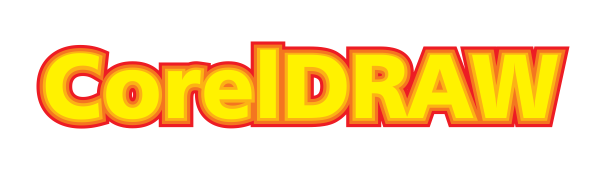
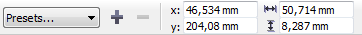
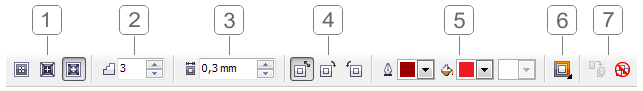
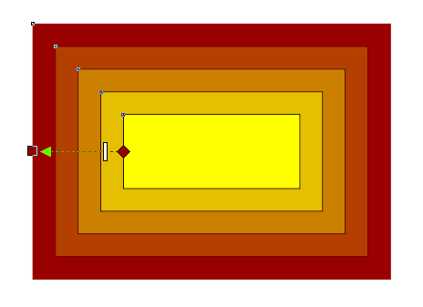

# Инструмент Contour (Контур) в CorelDRAW

В этом материале речь пойдёт о векторном **эффекте «Контур»** и соответствующем ему инструменте. Обзор больше рассчитан на начинающих пользователей **CorelDRAW**, но, я думаю, будет полезен и более продвинутым пользователям для «закрепления материала». Итак начнём...

_Простой пример использования эффекта Контур_

**Эффект Контур** можно применять к базовым фигурам, кривым, а так же к тексту. По умолчанию инструмент **Contour** (Контур) расположен в выпадающем списке эффектов на стандартной панели инструментов:

После выбора инструмента Contour, панель свойств отобразит доступные настройки эффекта.

В начале расположен **блок пресетов** (наборов настроек/заготовок), в который можно добавлять свои заготовки. Затем располагаются поля, отображающие координаты и размеры (с учётом эффекта) выделенного объекта.

## Настройки эффекта Контур

1.  **Направление.** Доступны три варианта: _To center_ (к центру), _Inside_ (внутрь), _Outside_ (наружу). При выборе первого варианта, объект будет полностью «покрыт» эффектом, при этом количество «ступеней» будет автоматически рассчитано на основе параметра _Offset_ (см. далее).
2.  **Steps (Шаги).** Доступен только при выборе направления Inside (внутрь) или Outside (наружу), и задаёт количество «ступеней» контура.
3.  **Offset (Смещение).** Задаёт интервал между контурами объекта.
4.  **Направление перетекание цвета.** Доступны три варианта: _Linear_ (линейное), _Clockwise_ (По часовой стрелке), _Counterclockwise_ (против часовой стрелки).
5.  **Цвета.** Настройки цветов для конечного контура. Для заливки и абриса цвет задаётся отдельно. Если исходный объект имеет градиентную заливку, в настройках цвета контура будет доступно два цвета для заливки.  
    _Важно запомнить следующий момент_ — контур создаёт заливку и абрис только в том случае, если таковые имеются у исходного объекта. Например, если исходный объект имеет абрис, но не имеет какой либо заливки, эффект контур так же будет содержать только абрис.
6.  **Object and color acceleration (Ускорение объекта и цвета).** Задаёт частоту с которой меняется размер и цвет от начала к концу эффекта. По умолчанию бегунки установлены по центру, что соответствует равномерному распределению.
7.  **Copy & Clear (Копирование и удаление эффекта).** Первая кнопка позволяет скопировать эффект с другого объекта и применить его к текущему. Последняя же, удаляет эффект с объекта.

_Маркеры интерактивного редактирования эффекта Контур_

Благодаря маркерам, инструмент Контур позволяет интерактивно изменять настройки эффекта непосредственно в рабочей области. Ромб указывает на начало эффекта/границу исходного объекта, квадрат указывает на конец эффекта, а стрелка — направление эффекта, соответственно. Перетаскивая квадрат, можно менять направление эффекта, а так же его размеры. А с помощью разделительной белой черты можно редактировать количество «ступеней» (плотность) контура.

## Полезно знать

Управлять эффектом Контур, так же можно из одноимённого докера, расположенного в меню _Window_ (Окно) > _Dockers_ (Окна настройки).

**Ctrl + F9** — клавиатурное сочетание для быстрого доступа к докеру Contour (Контур).

Как и большинство других эффектов CorelDRAW, эффект Контур можно отделить от объекта. Для этого выделите эффект и выполните команду **Break Contour Group Apart** (Разъединить Контурная группа) в меню _Arrange_ (Упорядочить) или в контекстом меню объекта. Клавиатурное сочетание этой команды — **Ctrl + K**.
