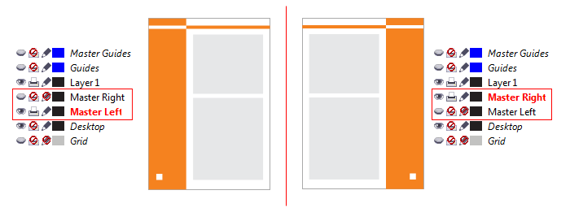

# Индивидуальные настройки мастер слоёв для каждой страницы

_Дата публикации: 14.07.2011_

Предположим у нас есть задача сделать каталог, в котором страницы разных глав будут оформлены по-разному, например различными цветами. Или нам, к примеру, как то нужно разделить мастер слои для чётных и нечётных страниц, и при этом не использовать опцию **Facing pages**. Вариант типа _«А мы скопируем и вставим!»_ можете скромно оставить при себе. Итак, приступим к решению задачи…

Первым делом усвоим, для чего вообще нужны **мастер слои в CorelDRAW**. А нужны они для того чтобы все повторяющиеся элементы страниц лежали в одном месте в единственном экземпляре, но при этом визуально находились на всех необходимых нам страницах. Если вы вдруг захотите поменять оформление страниц, вам не нужно будет делать это на каждой странице отдельно. Достаточно будет внести изменения только на мастер слоях. В определённом контексте мастер слои можно назвать шаблонами.

Важно отметить что манипуляции со слоями, касательно их расположения в «стопке», желательно сделать до того как вы наплодите страниц.

Создаём необходимое кол-во **мастер слоёв**, и размещаем на них графику. Для чётных и нечётных страниц необходимо создать отдельные мастер слои, так как **CorelDRAW**, на текущий момент, не поддерживает развороты в мастер слоях.

Собственно, весь секрет заключается в том, что в Менеджере объектов (**Object Manager**) необходимо переключиться в режим **Layer Manager View**, и для каждой страницы установить мастер слоям необходимые значения опций печатаемости (Printable), видимости (Visible) и редактируемости (Editable).
