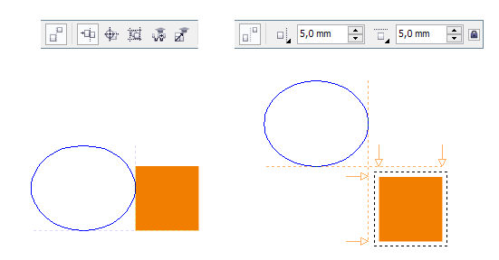
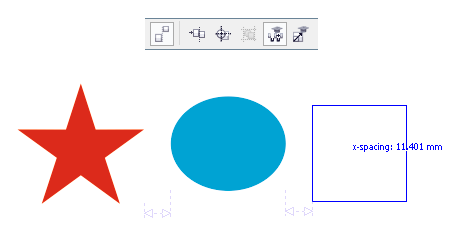
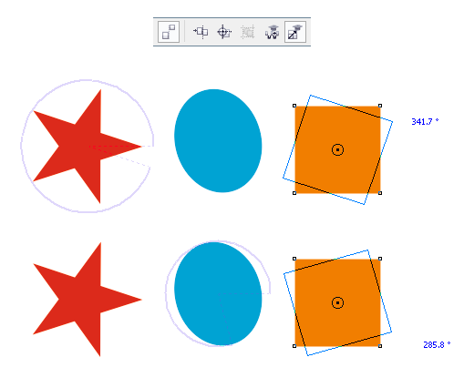
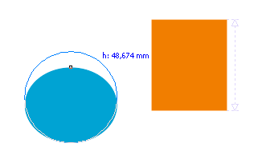

# Интерактивное выравнивание, распределение и трансформация объектов в CorelDRAW X6.2

Одним из нововведений **CorelDRAW X6** стала функция **быстрого выравнивания** с помощью интерактивных направляющих **Alignment Guides**, которая позволяет выравнивать не только относительно какой либо из сторон объекта, но также относительно заданной границы.

Данная функция доступна как через **меню View** (Вид), так и через **панель Layout** (Макет) которая по умолчанию скрыта.

**Alignment Guides** — очень удобный инструмент для быстрого выравнивания, но разработчики решили пойти дальше. В итоге, в **обновлении X6.2**, помимо улучшения уже существующего функционала, было добавлено ещё несколько полезных опций. Также появился новый докер **Alignment and Dynamic Guides** который объединил в себе новые направляющие с уже знакомыми нам **динамическими направляющими**.

Одной из новых опций стала функция **Intelligent spacing** (Интеллектуальный интервал), которая позволяет распределять различные объекты на равный интервал.

Ещё одной новинкой стала функция **Intelligent dimensioning** (Интеллектуальный подбор размеров), которая позволяет очень быстро и просто применить аналогичный поворот или масштаб, базируясь на параметрах других объектов в документе.

В случае с распределением и подбором размера, помимо самих направляющих **CorelDRAW X6.2** показывает рядом с курсором значения расстояния между объектами, угол поворота или размер, в зависимости от конкретной операции.

_П.С. Функции Intelligent spacing и Intelligent dimensioning будут доступны вам только при наличии так называемой премиум подписки, а начиная с CorelDRAW X7 — при наличии любой подписки._
