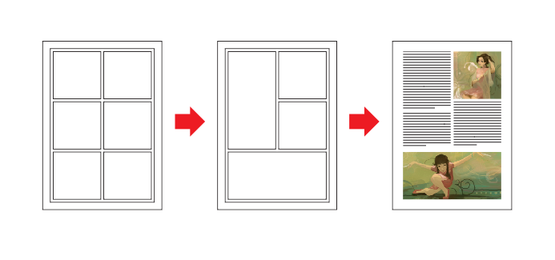
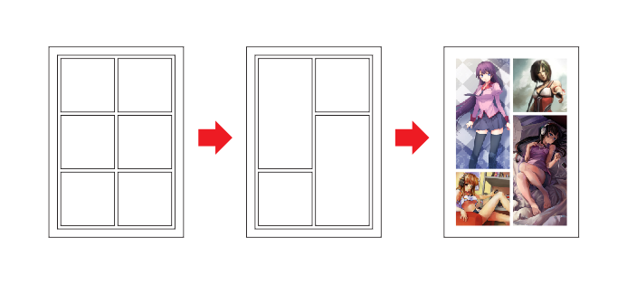

# Малоизвестная особенность таблиц в CorelDRAW

_Дата публикации: 27.09.2010_

Начиная с 14 версии, CorelDRAW научился работать с таблицами. Не сказать что они работают супер удобно, но сам факт их присутствия уже радует. Таблицы в основном используются для верстки каких то данных. Однако, в CorelDRAW, они имеют одну, весьма интересную, возможность.

С помощью них достаточно удобно и быстро можно сделать разметку или же коллаж из фотографий.

Как работать с текстом в таблицах, я думаю понятно. А вот как быстро поместить изображение в ячейку нашей таблицы? Очень просто! Для этого «хватаем» необходимую картинку правой кнопкой мыши, и тащим в нужную ячейку. И как только она окрасится в другой цвет, отпускаем кнопку. Ячейки таблицы в данном случае работаю как эффект **PowerClip**, однако редактировать содержимое можно без дополнительных манипуляций. Извлечь содержимое так же просто — просто перетащите его левой кнопкой мыши за пределы таблицы.

Удачи в экспериментах!
