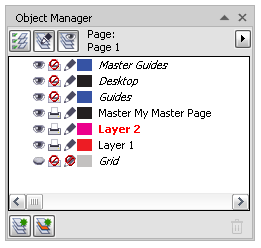

# Менеджер объектов

_Дата публикации: 20.04.2010_

Для того, что бы уверенно работать в **CorelDRAW**, как минимум, нужно чёткое понимание структуры документа, а точнее, как работать со слоями в векторном редакторе, что такое мастер страницы, рабочий стол и т.д. В этом нам поможет докер **Object Manager** (менеджер объектов).

## Object Manager

Для начала откроем вышеупомянутый докер, если он закрыт. Для этого вызовем команду Object Manager в меню Window > Dockers. В нём отображается структура активного документа.

Сверху расположены три функциональные кнопки, а справа располагается кнопка вызова контекстного меню.

Кнопка **Show** **Object** **Properties**, как уже понятно из названия, отвечает за отображение свойств объекта.

Кнопка **Edit** **Across** **Layers** позволяет работать с объектами не только на активном слое, но и во всех остальных. Соответственно если вы хотите, что бы объекты, расположенные на других слоях, автоматически блокировались, просто выключите эту опцию. При большом кол-ве слоёв и объектов это очень удобно. Кстати говоря, название активного слоя отображается красным цветом!

Кнопка **Layer** **Manager** **View** переключает отображение структуры документа в более простой вид, при котором отображаются только слои (см. изображение ниже). В этом режиме очень хорошо видно, в каком порядке они расположены. Например, объекты, расположенные на слое **Desktop**, по умолчанию, перекрывают другие объекты, которые находятся на слоях текущей страницы. Это можно исправить путём простого перетаскивания слоя Desktop под нужные слои.

В центральной части докера Object Manager отображается структура документа, согласно тем правилам, которые указаны с помощью вышеупомянутых кнопок. Для любого элемента, будь то страница, слой или объект, доступно контекстное меню с соответствующим набором команд.

В нижней части докера располагаются кнопки для создания нового слоя (**New** **Layer**), нового мастер слоя (**New** **Master** **Layer**) и кнопка удаления выделенного слоя и всех объектов, которые располагаются на нём.

Слои, названия которых отображаются курсивом, являются служебными. Удалить их невозможно.

## Структура документа

По умолчанию, новый документ созданный в CorelDRAW содержит одну страницу с одним рабочим слоем (**Layer 1**) и слоем направляющих (**Guides**), а так же одну мастер страницу, которая содержит три слоя: общие направляющие, рабочий стол (**Desktop**) и сетка (**Grid**). Наверное, Вы уже заметили, что в менеджере объектов отображаются два слоя Guides. Дело в том, что начиная с 14 версии, каждая страница имеет свой слой направляющих, для того, что бы нужные направляющие на одной странице не мешались на другой. А вот направляющие, которые были созданы на мастер странице, отображаются во всём документе. Из вышесказанного не трудно догадаться, что все объекты, которые располагаются на мастер странице, отображаются на всех страницах документа.

Особенное внимание стоит обратить на слой Desktop. Если Вы работаете с многостраничным документом, то все объекты, расположенные за пределами страницы, автоматически перемещаются на этот слой (при условии что свойство **Editable** включено). Если быть точнее, то происходит это не сразу после создания объекта или перемещения его за пределы страницы, а после переключения с одной страницы на другую.

## О слоях

Каждый слой имеет набор определённых свойств, таких как имя, цвет, видимость, и т.д. Большая часть которых, доступна непосредственно в окне **Object** **Manager**. Полный же набор свойств доступен только в окне Layer Properties, которое можно вызвать командой Properties, через контекстное меню этого слоя. Описывать все свойства нет смысла, так как они весьма понятны. Одна стоит обратить внимание на некоторые моменты. Первое – невозможно преобразовывать выделенные объекты в растровые, на слое с отключенным свойством **Printable**. По умолчанию это свойство отключено у слоя Desktop. Второе – цвет слоя нужен для настройки отображения объектов в каркасном режиме. Не сложно заметить, что цвет отображения каркаса равен цвету слоя. В случае со слоями направляющих – цвет слоя присваивается направляющей в момент её создания.
