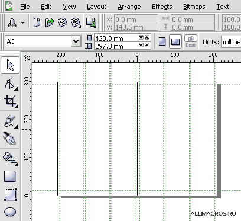
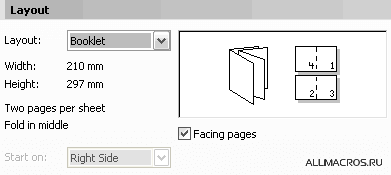
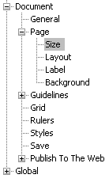
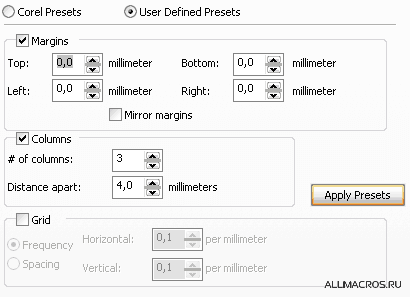

# Настройки страниц в CorelDRAW

Удивительно, но многие не знают, что в CorelDRAW можно настроить многостраничный документ так чтобы отображался сразу разворот, а не одна страничка как по умолчанию. До этого и многого другого можно добраться через настройки `Tools > Options (Ctrl + J) > Document`. Здесь собственно и содержатся все настройки документа.

В данный момент нас интересует раздел `Document > Page`. 

Если нам, без дополнительных настроек, нужно отобразить страницы разворотом то заходим в `Document > Page > Layout` и ставим галочку `Facing pages`.

Если же нам надо сверстать небольшой буклет на А4 формате, то проделываем следующее. Создаём новый документ и заходим в `Document > Page > Size` и задаём формат А3, а также ставим галочку `Lendscape` (почему именно А3 да ещё и Lendscape, когда нам надо вертикальный А4 (Portrait), я думаю вы догадались).
После чего переходим в `Document > Page > Layout` и из выпадающего списка выбираем пункт `Booklet`, 

ну и не забываем про галочку `Facing pages`. Нажимаем OK и вуаля.

Теперь займёмся колонками и отступами. `Tools > Options (Ctrl + J) > Document > Guidelines > Presets`, кликаем `User Defined Presets`. 

Отступы от края листа до основного композиционного блока задаются в полях `Margins`. Но у CorelDRAW в этих настройках есть на мой взгляд одна недоделка — поля `Left` и `Right`. На их месте логичней было бы увидеть поля `Inside` и `Outside`. Но так как CorelDRAW все-таки не верстальная программа, то можно и не ждать исправления этих параметров в будущих версиях, а принять как есть. Вы спросите, а в чём разница? А в том что частенько приходится задавать внешний и внутренний отступ листа разного размера. Внутренний, как правило, меньше в 1,5-2 раза. С полями `Left` и `Right` такого не получится, так как `Left` это всегда будет `Left`, без разницы чётной полосы(страницы) или не чётной.

Осталось настроить колонки. Ставим галочку `Columns` и в полях ввода задаём кол-во колонок и расстояние между ними. Колонки распределяются относительно значений `Margins`, причём не имеет значения стоит галочка `Margins` или нет. Если вы захотите расставить колонки относительно краёв страницы(листа), то в полях `Margins` придётся поставить нули. 

Также хочу обратить ваше внимание на очень интересную функцию сортировки страниц – `Page Sorter View (View > Page Sorter View)`.