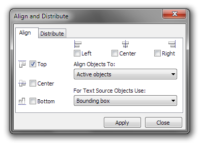
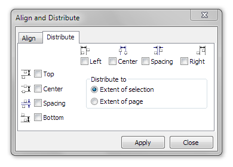

# Выравнивание и распределение объектов

_Дата публикации: 02.11.2012_

Графический редактор **CorelDRAW** имеет одну из самых мощных и удобных функций выравнивания и распределения (**Align and Distribute**). Однако далеко не все пользуются ей в полной мере. В этой заметке, я расскажу обо всех типах выравнивания и распределения, а так же перечислю все клавиатурные сочетания для их быстрого выполнения.  

Итак, всё, что нам нужно, по умолчанию, находится в меню **Arrange** > **Align and Distribute**. В этом подменю расположены лишь часто используемые функции выравнивания, а так же, в самом низу, расположена команда вызова окна Align and Distribute, в котором и находятся все доступные функции. Так же, кнопка вызова этого окна становится доступна на панели свойств, при выделении нескольких объектов. Однако происходит это не всегда, например, если выделить два или более текстовых объекта. Поэтому лучше назначить клавиатурное сочетание на вызов этого окна, или вытащить кнопку на постоянную панель.  

На первой закладке окна Align and Distribute расположены настройки выравнивания. С помощью галочек, можно указать относительно какой стороны выравнивать (по вертикали и горизонтали). Выпадающий список Align Objects To задаёт режим, относительно чего производить выравнивание:  

* Active objects – относительно последнего выделенного объекта. Именно этот режим используется для выравнивания с клавиатуры.
* Edge of page – относительно границ рабочего листа.
* Center of page – относительно центра рабочего листа.
* Grid – относительно сетки.
* Specified point – после нажатия на кнопку «Применить» предлагается выбрать точку, относительно которой будет выполнено выравнивание. В данном режиме имеет смысл, предварительно включить прилипания курсора к направляющим и объектам.

В другом выпадающем списке расположены дополнительные параметры, касающиеся только текстовых объектов. По умолчанию, выравнивание производится с учётом габаритных размеров (Bounding box). На изображении ниже, довольно наглядно изображено как работает этот параметр.  

На второй закладке расположены настройки распределения. Иконки возле галочек, довольно наглядно показывают, относительного какого промежутка будет выполнено распределение, т.е. расстановка объектов на одинаковое расстояние. Доступно всего два режима: относительно выделения и относительно рабочего листа. Существенным недостатком этой функции, является отсутствие возможности расставить объекты через заданный интервал, однако этот вопрос можно решить с помощью макросов (VBA).  

Не забываем добавлять что-то от себя, если есть что добавить. Так же можете высказать идеи для макросов, касательно выравнивания и распределения.  

## Список клавиатурных сочетаний:

Операция                            | Клавиша / сочетание
------------------------------------|---------------------
Выровнять влево                     | L
Выровнять вправо                    | R
Выровнять по верху                  | T
Выровнять по низу                   | B
Выровнять центры по вертикали       | C
Выровнять центры по горизонтали     | E
Центрировать на странице            | P
Распределить влево                  | Shift + L
Распределить вправо                 | Shift + R
Распределить до верха               | Shift + T
Распределить до низа                | Shift + B
Распределить центры по вертикали    | Shift + C
Распределить центры по горизонтали  | Shift + E
Распределить пробелы по вертикали   | Shift + A
Распределить пробелы по горизонтали | Shift + P
