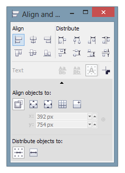

# Выравнивание и распределение в CorelDRAW X6.1

Несколько лет назад, я подробно описывал функции [выравнивания и распределение объектов в CorelDRAW](vyravnivanie-i-raspredelenie-obektov/index.md). Сегодня я расскажу какие изменения данный функционал претерпел в **обновлении Х6.1**. Самым главным изменением стал «переезд» опций из диалогового окна в докер, который выглядит следующим образом:

Как видите дизайн и расположение элементов стали более компактными и удобными. Помимо внешнего вида, функции **выравнивания и распределения** получили незначительные улучшения:

*   Пропала кнопка «Применить», т.к. все операции применяются моментально.
*   Можно комбинировать операции выравнивания и распределения друг с другом.
*   Добавили опцию, которая позволяет учитывать абрис объектов.
*   Добавили наглядные подсказки в виде линий, которые непосредственно на объектах показывают относительно чего и как происходит выравнивание или распределение, а также пунктирный абрис, который показывает относительно какого объекта происходят операции.
