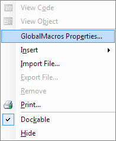

# Как создать новый GMS файл

_Дата публикации: 02.11.2012_

Создать новый GMS файл очень просто:

1\. Откройте в проводнике, или другом файловом менеджере, папку GMS. Например ...Program Files (x86)\Corel\CorelDRAW Graphics Suite X4\Draw\GMS\

2\. Создайте в этой папке новый пустой текстовый файл. Для этого в контекстом меню выберете пункт Создать > Текстовый документ.

3\. Переименовываем только что созданный файл. Задаём нужное имя и меняем расширение на gms (возможно потребуется включить отображение расширений для файлов в Windows), например на "MyNewMacros.gms".

4\. Запускаем CorelDRAW и открываем Visual Basic Editor (для этого жмём Alt+F11).

5\. В редакторе VBA находим наш проект - "GlobalMacros (MyNewMacros.gms)"

6\. Открываем его Properties (Свойства) через контекстное меню.

В появившемся диалоговом окне в поле "Project Name" вводим имя, например "MyNewMacros" и жмём ОК.

7\. Сохраняем наш файл (Ctrl+S). Теперь можно добавлять модули, формы, функции...
