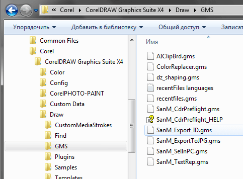
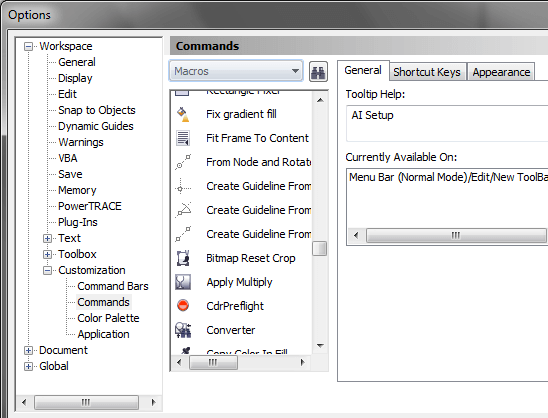

# Как устанавливать макросы

Описание базового процесса установки макросов в CorelDRAW.

**Важно: в версии CorelDRAW Home & Student использование макросов не предусмотрено!**

Перед установкой нужно обязательно закрыть CorelDRAW, если он открыт. Если макрос закомпилирован в `exe`, то просто запустите его и следуйте инструкциям. Если же он в `gms` – скопируйте его в одну из следующих мест:

* `Program Files (x86)\Corel\CorelDRAW Graphics Suite (версия)\Draw\GMS\`
* `Users\Имя пользователя\AppData\Roaming\Corel\CorelDRAW Graphics Suite (версия)\Draw\GMS\`

Запустить CorelDRAW.

**Сделать кнопку для макроса:**

В меню `Tools > Options (Ctrl + J) > Customization > Commands`, выбрать `macros`
(`Сервис/Инструменты > Опции > Схемы/изготовление > Команды > Макросы`).

Перетащить выбранный макрос на любую панель.  
Здесь же можно назначить клавишу быстрого запуска.