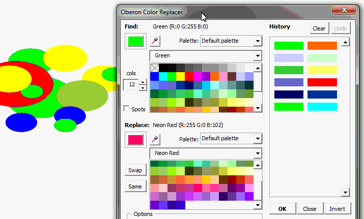
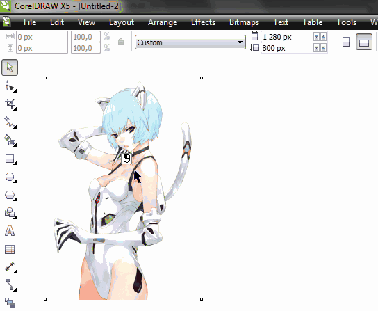

# О макросах в CorelDRAW

_Дата публикации: 02.11.2012_

Знаете ли Вы, что такое **макросы**? На этот довольно простой вопрос, зачастую не могут ответить даже те, кто проработал в **CorelDRAW** несколько лет. А те, кто знают, не всегда ими пользуются, видимо предпочитая делать всё руками вместо того, что бы справится с поставленной задачей в несколько кликов. Думаете, я преувеличиваю? Нет! В этой статье я постараюсь рассказать, что такое макросы и для чего они нужны, а так же приведу примеры бесплатных и платных макросов, и, как экономится время, силы и нервы.

## Что такое макросы?!

Для начала немного теории. Если говорить простым языком то это мини, а иногда совсем даже не мини, программы которые выполняют набор определённых команд, тем самым заметно ускоряя и упрощая процесс работы в CorelDRAW, а иногда и добавляя совершенно новые возможности. Кто-то мог подумать, что речь идёт о скриптах, однако **скрипты и макросы в CorelDRAW** это две разные вещи, хотя и имеют одну цель – максимально упростить работу. Возможность использовать макросы в CorelDRAW, появилась в 10 версии этой программы. До неё все вопросы автоматизации решались только через скрипты, которые, в современных версиях программы, уже не актуальны.

Многие макросы, особенно бесплатные, распространяются в виде одного или нескольких файлов, упакованных в архив. В редком случае – в виде кода. Файл с расширением **GMS** может содержать как один, так и несколько макросов. Он то, нам и нужен. В остальных файлах могут быть иконка, лицензионное соглашение или просто описание, для чего этот макрос и кто его написал. Как устанавливать макросы Вы можете прочитать в [этом](../kak_ustanavlivat_makrosi/index.md) материале.

В одном обзоре я уже писал, что когда приходит время делать календари, народ начинает в панике бегать по интернету в поисках, где бы бесплатно скачать календарные сетки на новый год. Не все конечно, но довольно большой процент пользователей.  И ведь даже не подозревают о том, что решение вопроса, находится от них в паре кликов. Почему я вдруг заговорил о календарях? Да всё очень просто – календарную сетку можно легко и быстро сделать с помощью макроса **Calendar Wizard**. Подробный [видео урок](https://www.youtube.com/watch?v=RfPU3Om5q3o). Помимо этого макроса, вместе с CorelDRAW, устанавливаются ещё несколько. Среди них конвертер файлов, нумератор страниц, а так же макрос для создания образцов цвета, которые потом можно распечатать.

Помимо встроенных макросов, Вы так же можете написать свои, если обладаете достаточным уровнем знания **VBA**, или просто скачать в интернете уже готовые решения, коих очень много, как платных, так и бесплатных. Начать Вы можете с раздела [Макросы и скрипты](http://cdrpro.ru/macros/) нашего сайта.

## Решение задач с помощью макросов

Начну, пожалуй, с одного из популярных вопросов – как быстро заменить один цвет на другой. Конечно же, есть стандартная возможность решить этот вопрос – **Find & Replace** в меню Edit.  Однако, кто хоть раз ей пользовался, прекрасно знает насколько она неудобна. Взять хотя бы то, что цвет можно менять отдельно в заливке и отдельно в обводке, а вот вместе никак. Да и этот «мастер» если честно раздражает. Получается довольно весомое кол-во лишних движений. Оно вам нужно, тратить время на бесполезные клики мышкой? Мне точно нет, ибо время – деньги! Оптимальным решением вопроса является совершенно бесплатный макрос ColorReplacer. Его интерфейс очень прост, и содержит достаточное кол-во опций для решения поставленной задачи.

В продолжение темы можно упомянуть про небольшой сборник макросов, который называется Color Edit. С помощью него вы можете нажатием всего одной кнопки, преобразовать всё выделенное в **CMYK**, **RGB** или **Gray**. Опять же, сравнивая Find & Replace и Color Edit, скорость работы и удобство последнего вне конкуренции.

А теперь внимание, вопрос! Какой редактор вы используете для обработки растровых изображений? Я думаю, что большинство из Вас ответят **«PhotoShop»**. А теперь представим ситуацию, что вам нужно обработать большое, ну или не очень, кол-во фотографий внедрённых в документ CorelDRAW. И что будете делать? Экспортировать все фото в **tif** или **psd**, затем редактировать в PhotoShop’е и, наконец, импортировать обратно в CorelDRAW и расставлять? Не мучайте себя, воспользуйтесь макросом ExImPhotoshop. Теперь, для того, что бы отредактировать фотографию, вам будет достаточно выделить её в документе, запустить одну из двух функций макроса и подождать пару секунд. Нужное Вам растровое изображение само откроется в PhotoShop’е. После редактирования, его нужно сохранить и закрыть. И на конец, для того чтобы вернуть его обратно в документ CorelDRAW, в последнем запускаем вторую функцию макроса, которая и возвращает изображения с изменениями на своё место. Согласитесь, так намного проще.

Продолжая тему связки программ, я не могу обойти стороной макрос **Copy To Adobe Illustrator**, который позволяет перекидывать объекты из Illustrator’а в CorelDRAW и обратно через буфер обмена. Но лично я больше его использую в связке CorelDRAW - Adobe InDesign. Почитать подробнее про этот макрос, а так же скачать его можно [здесь](http://cdrpro.ru/macros/).

Несколько лет назад, я написал очень простой макрос **CurveInfo**, который показывал площадь и периметр кривой в CorelDRAW. Он оказался настолько востребован, что я решил его улучшить, и теперь он может показывать данные, как отдельного пути, так и кривой в целом. А так же, количество узлов кривой. Может быть, в дальнейшем будут и ещё какие-то улучшения, а пока что вы можете совершенно бесплатно скачать и использовать этот [макрос](http://cdrpro.ru/macros/).

А теперь представим ситуацию, что Вам нужно проверить сделанный вами макет перед отправкой в типографию или клиенту, что бы не быть балбесом в лице последних. Или наоборот, Вам нужно проверить чужой макет перед печатью, например, что бы всё было в **CMYK**’е, не было эффектов и т.д. Естественно, что первым делом Вы откроете информацию о документе. И, например, увидите в ней, что в документе есть несколько **RGB** цветов, когда Вам нужно всё в CMYK. Что будете делать? Как будите искать эти RGB цвета? А вот теперь представьте, что в документе кроме RGB цветов ещё где-то несколько RGB изображений с прозрачностью, а так же тени, линзы и ко всему прочему в документе несколько страниц. В общем, полный набор! Как всё быстро найти и исправить? Ответом на этот, и ещё много других вопросов, является сборник макросов **CdrPreflight**. С помощью него вы всего в пару кликов можете найти проблемные места в документе, и так же быстро их исправить. [Узнать подробнее](http://cdrpro.ru/macros/cdrpreflight/).

## В качестве заключения

Можно ещё долго перечислять макросы и приводить примеры, как они удобны и как быстро позволяют решать поставленные задачи, порой, казалось бы, не выполнимые. Но, как говорится, пора и честь знать.
