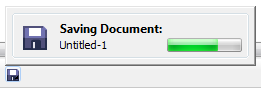

# Как посмотреть ход выполнения сохранения в CorelDRAW X5 и выше

_Дата публикации: 30.03.2011_

Иногда натыкаюсь на вопросы, как посмотреть ход выполнения процесса сохранения документа в программе **CorelDRAW X5**. В связи с этим решил написать маленькую заметку, отвечающую на данный вопрос.

Итак, напомню что такие операции как сохранение или печать, начиная с **15 версии CorelDRAW**, происходят в **фоновом режиме**. За информирование пользователя о статусе подобных процессов отвечает **Background Tasks**. К примеру во время сохранения документа, на панели состояния (Status Bar) отображается **иконка дискетки**. Собственно, что бы посмотреть ход выполнения процесса, достаточно кликнуть по этой иконке, после чего появится вот такое плавающее окошко.
