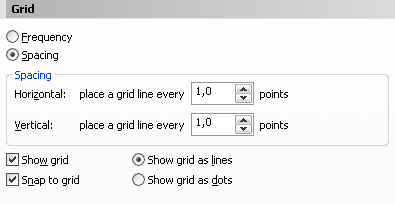

# Особенности рисования для WEB в CorelDRAW X4

_Дата публикации: 02.11.2012_

Вопреки расхожему мнению в **CorelDRAW X4** можно рисовать **web графику**, будь то баннер, иконки или дизайн целого сайта, даже не смотря на отсутствие режима просмотра в пикселях. Но ни кто не сказал что это легко, и подойти к этому вопросу нужно с особой точностью, и пониманием что все же это не растровый редактор. Итак, отбросив все предубеждения, берёмся за выполнение поставленной задачи.  

Логично было бы предположить, что раз уж мы рисуем для web, то и единицы измерения документа нужно поменять на **pixels**. Однако в этом случае перед нами возникнет ряд проблем. Одна из самых главных проблем – неточное прилипание к пиксельной сетке. Поэтому мы пойдём другим путём, и выберем в качестве единиц измерения **points**. При этом разрешение нашего документа будет **72dpi**, а это как раз то, что нам нужно. Следующим нашим шагом будет настройка сетки и прилипания к ней. Для этого перейдём в меню View > Setup > **Grid and Ruler Setup** и изменим настройки так, как показано на скриншоте.  

Вот собственно и всё, можно начинать рисовать. Остался лишь один вопрос – как посмотреть наш рисунок в 100% масштабе. И как бы ни казалось странным, но установка значения 100% для Zoom Levels нам не поможет. Поэтому вытаскиваем из настроек (Options (Ctrl+J) > Customization > Commands > View) кнопку **Zoom 1:1**.  

## Полезно знать

Границы страницы могут не попадать в сетку, поэтому не стоит использовать её за отправную точку! Всегда ориентируйтесь на сетку.  

При экспорте в растр, в этом случае, нужно указать единицы измерения **pixels**, **72dpi**, и попутно проверить масштаб и размер, который должен совпадать с тем, что вы нарисовали. Остальные настройки на ваше усмотрение.
