# Что нового в CorelDRAW X5

_Дата публикации: 02.11.2012_

В этом обзоре я постараюсь рассказать о значительной части того, что Вас ждёт в **CorelDRAW X5**. Хочу сразу сказать, что совершенно обо всём, включая все программы и утилиты пакета CorelDRAW Graphics Suite X5, рассказывать в рамках одной статьи не имеет смысла, хотя бы потому, что мало кто станет это читать. Поэтому данный материал является лишь началом серии заметок, в которых я постараюсь рассказывать обо всех нововведениях по порядку, которых, кстати говоря, очень много. А сейчас о самом интересном в CorelDRAW X5.

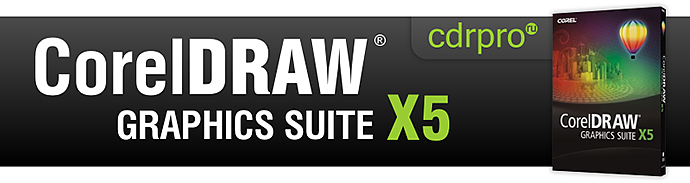

Итак, начнём с того, что заглянем в настройки нового Color Management, для этого кликнем в меню Tools > Color Management > Default Settings. Как видно, управление цветом претерпело серьёзные изменения, и возможно вы уже успели заметить, что кроме глобальных настроек, теперь каждый документ содержит собственные настройки цвета. Бегло пробежавшись взглядом по окну **Default Color Management Settings** (рис. 1), первое, что можно заметить – стало намного удобнее и самое главное понятнее, в первую очередь, для новичков. Подавляющее большинство параметров нам уже известно из предыдущих версий, однако есть и новые, среди которых раздел Open в Color management Policies. Могло показаться, что в работе с цветом особо ни чего не изменилось. На самом же деле изменений много, так что я оставлю эту тему для отдельной статьи.

Что бы приступить к дальнейшему осмотру, нужно создать новый документ. Очередное изменение – диалоговое окно **Create a New Document** (рис. 2). Это окно содержит достаточное кол-во основных параметров документа, таких как формат, единицы измерения, режим просмотра. Новые среде них: Primary color mode, Rendering resolution, а также настройки цвета документа. Хочу обратить внимание, что параметр Primary color mode не ограничивает документ определённой цветовой моделью.  
Создав новый документ, хочется сразу сказать пару слов об интерфейсе в целом. Глобальных перемен, по сравнению с Х4, нет. Слегка переработанная строка состояния (**Status Bar**), расширенные подсказки, возможность блокирования панелей (по умолчанию они заблокированы) (рис. 3), вот то, что первым бросается в глаза. Строка состояния стал более информативной, т.к. теперь можно легко и быстро выбрать тип отображаемой информации с помощью маленьких чёрных стрелочек. Есть и ещё изменения, но о них буду рассказывать по ходу дела. Также, рядом с отображением информации о заливке, появилась новая кнопка, отображающая статус опции Proof Colors (рис. 4).  
**Proof Colors** это очередное и, весьма полезное новшество. С помощью него можно быстро посмотреть, как будет выглядеть документ при печати на конкретном принтере или же на web-странице. Настроить эту опцию можно, открыв новый докер, в меню Tools > **Color Proof Settings** (рис. 5). В качестве основных настроек доступен выбор цветового профиля вывода и способ цветопередачи. Результат можно тут же напечатать или экспортировать в CPT, JPG, PDF или TIF.

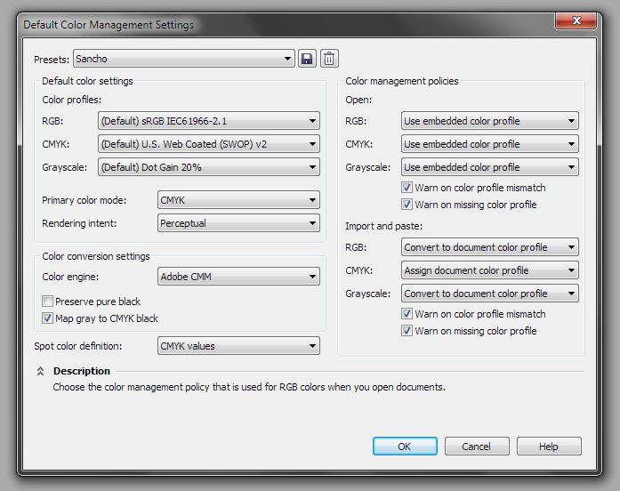   
рис.1

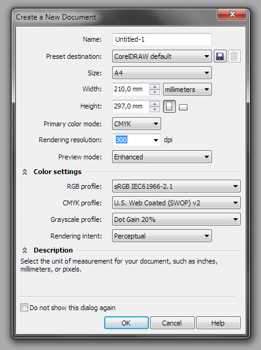   
рис.2

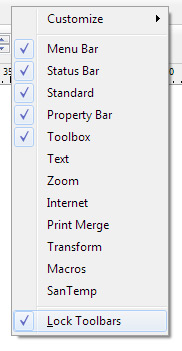   
рис.3

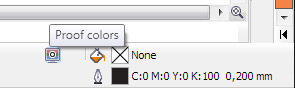   
рис.4

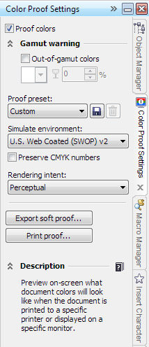   
рис.5

Продолжая тему просмотра документа, заглянем в меню View. Здесь нас ждут очередные изменения, среди которых новый режим просмотра документа под названием **Pixels**, в основном, предназначенный для работы с графикой для Web. В этом режиме документ выглядит как в растровом редакторе (рис. 6). Разработчики не забыли и про пиксельную сетку, которая появляется только при масштабе документа в 800% и более. Включить или выключить её отображение можно всё в том же меню View. Не забыли они и про опцию прилипания к этой сетке, которую можно найти рядом со всеми остальными опциями прилипания в выпадающем меню Snap To (рис. 7). Попутно хочу обратить внимание на новый вид прилипания **Snap to Page**, обеспечивающий прилипание к краям и центру страницы. Так же было замечено, что для растровых изображений, в режиме Pixels, строка состояния отображает не dpi, а кол-во пикселей по ширине и высоте – мелочь, а приятно.  
Вернувшись в меню View к режимам просмотра, замечаем, что режима Enhanced with Overprints больше нет. Вместо него теперь дополнительная опция **Simulate Overprints**. Сразу под ней опция **Rasterize Complex Effects**, которая предназначена для просмотра, как будут растрированы сложные эффекты при печати, такие как прозрачности и тени (рис. 8).

Что же касательно рабочей области, а вернее её масштабирования, то тут две приятности. Первая – масштабирование колесом мыши теперь может работать в 2 режимах (как в старых версиях и как в Х4). Настраивается это в меню Tools > Options > Workspace > Toolbox > Zoom…, параметр **Center mouse when zooming with the mouse wheel**. Вторая приятность – разворачивая/сворачивая докеры, масштаб документа слегка изменяется. Для чего это делается, я думаю, вы быстро поймёте.

Разобравшись с навигацией и отображением документа, пора переходить на осмотр инструментов. Пробежавшись по панели **Toolbox** взглядом, может показаться, что изменений почти нет. Однако детальный осмотр порадовал. Среди нового были замечены **2 Point line tool** и **B-Spline tool**, значительные изменения коснулись Dimension tools, Connectors и Mesh Fill tool. Незначительными, но весьма приятными, изменениями порадовали Rectangle tool, Eyedropper tool, Artistic Media tool и ещё несколько инструментов. Оставив новое для самостоятельного осмотра, сразу перейду к описанию изменений в уже знакомых нам инструментах.

Несомненно, одним из значительных изменений в CorelDRAW X5 является работа инструмента **Mesh Fill**. Новый алгоритм работы с сетчатой заливкой, делает её весьма привлекательной на вид (рис. 9). Наконец-то можно забыть о визуальных неровностях в виде угловатостей и крестов. По сути, этот алгоритм является дополнительной опцией, и его всегда можно отключить или обратно включить. Для этого предусмотрена кнопка **Smooth mesh color** на панели свойств Mesh Fill tool. На этом изменения, касающиеся сетчатой заливки, не заканчиваются. Следующим новшеством является расширенная работа с цветом узлов. Во-первых, цвет выделенного узла теперь отображается в строке состояния, где его можно не только посмотреть, но и изменить. Во-вторых, на панели свойств есть выпадающий список, в котором видно цвет выделенного узла, и который можно легко поменять. И для полного счастья рядом есть пипетка (рис. 10). И это ещё не всё! Для каждого отдельного узла можно задавать свою прозрачность. И на закуску – все узлы, по умолчанию имеют тип Smooth.

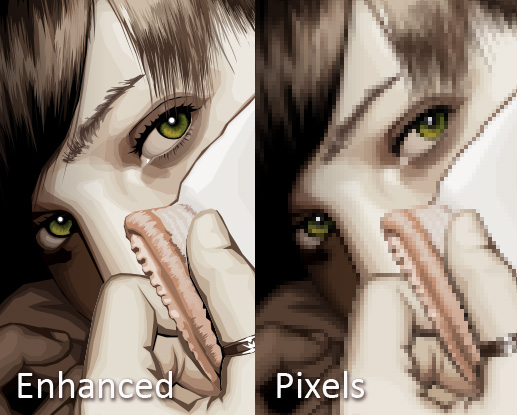   
рис.6

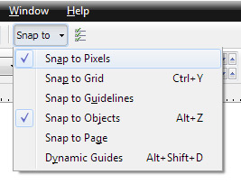   
рис.7

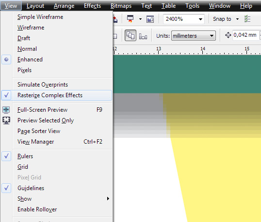   
рис.8

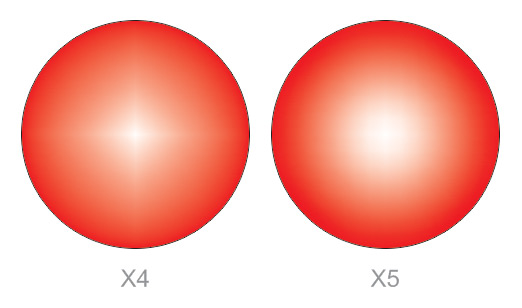   
рис.9

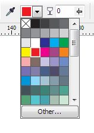   
рис.10

Прямоугольник (**Rectangle tool**) наконец-то обзавёлся нормальными скруглениями углов, которые не деформируются при непропорциональном изменении размеров. Кроме того, углы теперь могут быть трёх типов и масштабироваться с объектом (опционально) (рис. 11). Хочу заметить, что с помощью инструмента Shape Tool можно быстро отредактировать радиус одного из углов, зажав при этом Ctrl – ещё одно приятное изменение.

Пипетку (**Eyedropper tool**) разделили на два инструмента, один из которых забирает цвет, а другой – атрибуты. Улучшения коснулись только Color Eyedropper. Рядом с курсором появилась быстрая подсказка отображающая цвет, дублирующийся выводом числовых значений (рис. 12). Улучшили выбор размера области забора цвета, сделав его не выпадающим списком, а кнопками. Так же, найденный цвет можно добавить в одну из открытых палитр, специальной кнопкой на панели свойств. И самое главное, на что нужно обратить внимание, пипетка автоматически переключается в режим Apply color, и если вы хотите вернуться в режим выбора цвета, вам нужно зажать Shift. Что действительно порадовало, так это то, что пипетку добавили во многие места, где её очень не хватало, например в диалог **Uniform Fill** (рис. 13) и некоторые выпадающие списки.

Что же касается кистей (**Artistic Media tool**), то тут есть несколько приятных изменений, это масштабирование кисти вместе с кривой и отключение отображения габаритных маркеров для более удобного рисования. Ну и наконец-то добавили новых кистей (рис. 14).

Тех же, кто рисует с помощью планшета, хочу порадовать – теперь CorelDRAW распознаёт 100 уровней нажима вместо 32. Вообще, если говорить о рисовании кривых от руки, то тут прослеживаются заметные улучшения получаемой кривой, особенно это касается кистей.

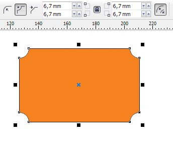   
рис.11

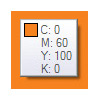   
рис.12

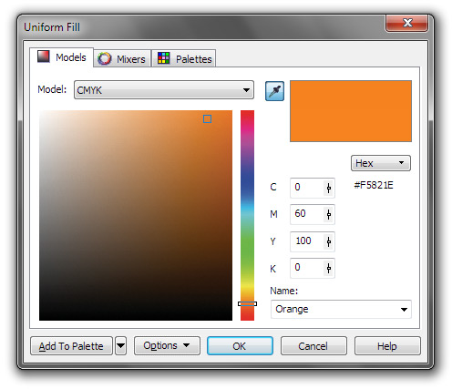   
рис.13

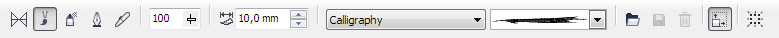   
рис.14

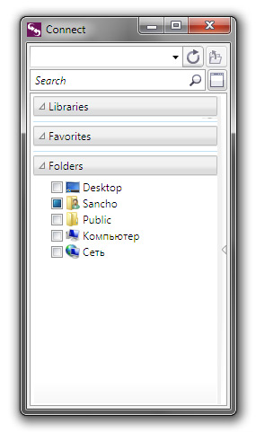   
рис.15

Пришло время заглянуть в меню Window > Dockers. Среди нового Connect, Tray, Object Coordinates, Join Curves и Color Proof Settings, о котором я писал выше. Докеры Link Manager и Internet Bookmark Manager объединили в Links and Bookmarks. Изменения коснулись докеров Transformations, Shaping и Color Palette Manager (в прошлом Color Palette Browser). Из меню убрали Web Connector и ScrapBook, хотя сами докеры из CorelDRAW X5 ни куда не делись. Теперь обо всём поподробнее.

Докеры **Connect** (рис. 15) и **Tray** работают в паре и являются интеграцией с новой утилитой **Corel CONNECT**, которая предназначена для поиска и быстрого доступа к различным векторным и растровым файлам.

С помощью докера **Object Coordinates** (рис. 16) можно создать/изменить примитивы и кривые, предварительно задав нужные настройки координат, размера, поворота и прочего. При этом функция имеет весьма наглядное превью.

Докер **Join Curves** (рис. 17) предусмотрен для объединения разомкнутых кривых. Это весьма полезно, особенно после импорта оных из других векторных редакторов. Превью так же присутствует.

Докер **Transformations** претерпел незначительные изменения. Теперь вместо кнопки Apply To Duplicate можно сразу задать количество копий в поле Copies (рис. 18), а так же он стал запоминать последнее состояние параметров Relative Center, Relative Position, Proportional, Use Anchor Point и Reference Point.

Изменение в докере **Shaping** всего одно, и то весьма условное – добавили режим **Boundary**. На самом деле эта функция есть и в CorelDRAW X4 в меню Effects, отсутствуя при этом в докере.

Заканчивая обзор докеров, плавно перейдём к палитрам, управление которыми стало гораздо удобней благодаря реорганизации структуры докера **Color Palette Manager** (рис. 19). Все палитры теперь рассортированы по двум секциям, Process и Spot. Так же можно создавать свои собственные секции (папки) в My Palettes.

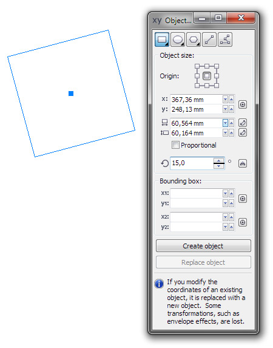   
рис.16

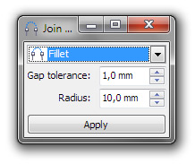   
рис.17

   
рис.18

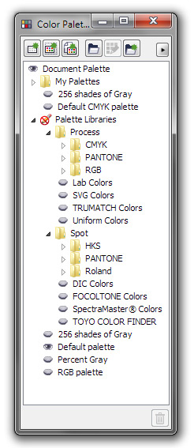   
рис.19

   
рис.20

Что же касается самих палитр, то тут тоже не обошлось без изменений. Самое незаметное из которых – все палитры были переведены в новый формат на основе XML стандарта. Замечу, что поддержка CPL палитр ни куда не делась. Слегка изменили контекстное меню палитр и добавили пипетку (рис. 20). Если активировать её, то рядом с курсором будет видно что с зажатым Ctrl, за раз, мы можем добавить в палитру сразу несколько цветов. Так же можно перетаскивать цвета из палитры в палитру или же перетащить любой объект из рабочей области на палитру. В обоих случаях возле курсора будут видны те цвета, которые будут добавлены в палитру. Предлагаю вам самостоятельно поэкспериментировать с перетаскиванием различных типов объектов в палитру, например с градиентной или сетчатой заливкой, или же растровых изображений.

Так же в CorelDRAW X5 присутствуют две очень интересные палитры. Первая – **Default Palette**, представляет собой контейнер, который содержит в себе RGB или CMYK палитру, в зависимости от значения параметра Primary color mode конкретного документа. Удобство её в том, что вам не нужно переключатся между этими палитрами вручную, одновременно работая в разных документах с разными цветовыми моделями. Вторая – **Document Palette** (палитра документа), которая сохраняется с ним в CDR файл, т.е. в каждом документе эта палитра содержит свои собственные цвета. Они могут быть как Process, так и Spot. Все использовавшиеся цвета в документе добавляются в эту палитру автоматически. Если вам это не нужно, то можно отключить опцию **Automatically Update** в контекстном меню палитры.

Так же добавили новые палитры Pantone® и слегка изменили Palette Editor, добавив кнопку выбора типа цвета между Process и Spot.

Напомню, что теперь каждый документ может содержать свои собственные цветовые настройки (рис. 21), такие как **Primary color mode**, **Rendering intent** и цветовые профили. Последние можно внедрить в сам файл, включив опцию **Embed color profiles** при сохранении файла.

Если вы помните, то в Х4 можно выбирать цветовую модель, через которую будут отобраться эффекты. Теперь же все эффекты по умолчанию отображаются в RGB режиме. Градиентная заливка тоже является эффектом, так что не удивляйтесь, если вам покажется, что переходы в ней от цвета к цвету выглядят неправдоподобно. Просто они отображается в RGB, независимо от того какие цвета используются в градиенте на самом деле. Если нужно посмотреть, как это будет выглядеть в CMYK модели, то есть два пути: включить опцию **Simulate Overprints** или воспользоваться функцией **Proof Colors**, предварительно сделав нужные настройки (рис. 22).

Кстати говоря, ещё одним приятным новшеством стала возможность работы с **hex** значениями RGB цветов (рис. 23). Даже пипетка в подсказке дополнительно отображает hex значения цвета.

Кто меня знает, тот наверное уже задался вопросом «А где же про макросы?». А вот мы и добрались до них, а вернее до **VBA**. И здесь нас ждёт приятный сюрприз в виде нового докера **Macro Manager** (рис. 24). С помощью этого докера стало гораздо удобнее находить, запускать и даже подключать новые макросы без перезагрузки CorelDRAW. Подробный список изменений в **CorelDRAW Object Model** я опубликую позже. Так же разработчики интегрировали **VSTA**, поддерживающий языки программирования VB.NET и C#, однако интеграция эта пока что весьма условная.

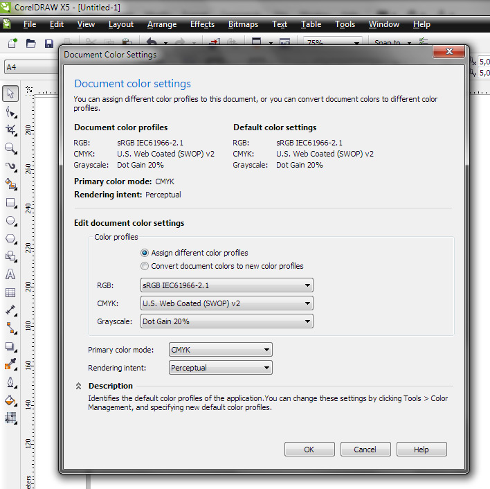   
рис.21

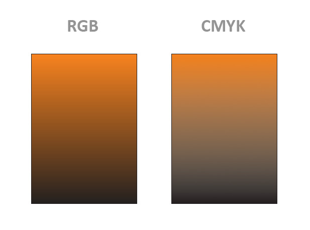   
рис.22

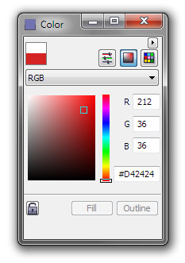   
рис.23

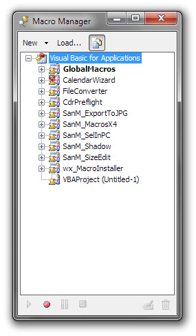   
рис.24

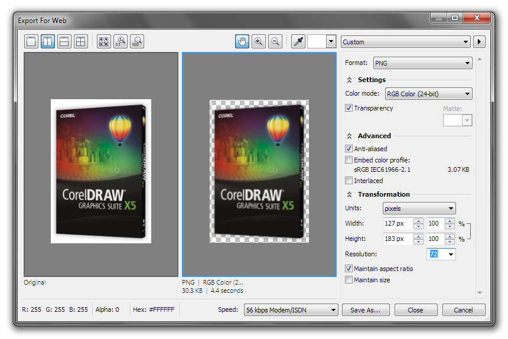   
рис.25

Пришло время рассказать о фильтрах ввода/вывода, а точнее об импорте и экспорте. И прежде чем рассказать Вам об изменениях в каждом конкретном фильтре, хочу обратить внимание на новую функцию **Export For Web** (рис. 25). Судя по всему это не что иное, как доведённая до ума функция Web Image Optimizer. В качестве формата можно выбрать PNG, GIF и JPEG. Описывать все её возможности нет смысла, скажу лишь, что очень порадовала прозрачность в PNG и GIF.

Кстати говоря, функцию Prepare For Service Bureau переименовали в **Collect For Output**.

Что же касательно фильтров то тут, естественно, не обошлось без добавления поддержки форматов Adobe CS4. Да и поддержка PostScript форматов была значительно улучшена, частично благодаря интеграции с **GPL Ghostscript**.

А теперь о некоторых форматах подробнее:

* PDF: экспорт доступен из двух мест: publish to PDF и через обычный Export
* PDF: поддержка формата Acrobat 9.0
* PDF: для версий Acrobat 5-9 используется тот же алгоритм шифрования, что и в программе Acrobat.
* PDF: значение Bleed по умолчанию установлено в 0.125" (3,175 mm)
* PDF: добавлена опция Always Overprint Black
* EPS: галочка Preserve Overprint теперь помнит своё состояние при последующем экспорте
* EPS: импорт PS Level 3
* AI: в диалоговое окно настройки фильтра добавлена закладка Preflight
* TIFF: поддержка файлов с компрессией JPEG 6 и JPEG 7
* TIFF: если файл содержит несколько страниц, Corel предложит выбрать какие импортировать.
* А так же весьма расширили поддержку формата RTF и добавили поддержку DocX.

Вот мы и подошли к концу обзора, и напоследок я приберёг ещё несколько приятных моментов. CorelDRAW X5 наконец-то обзавёлся поддержкой многоядерных процессоров, которая позволяет ускорить такие процессы, как импорт RAW файлов, применение эффектов к растровым изображениям, сохранение и печать, а так же копирование и вставка объектов. Улучшили **PowerTRACE**, благодаря чему, результат теперь более аккуратный. Ну и естественно не обошлось без поддержки Windows 7, а точнее технологий taskbar thumbnails и Windows Touch.
