# Что нового в CorelDRAW X6

Что же нового и полезного в этот раз приготовили нам разработчики CorelDRAW X6? Изменений как всегда много! В этом обзоре я вкратце расскажу только об основных нововведениях и изменениях 16 версии CorelDRAW.

Итак, обо всём по порядку...

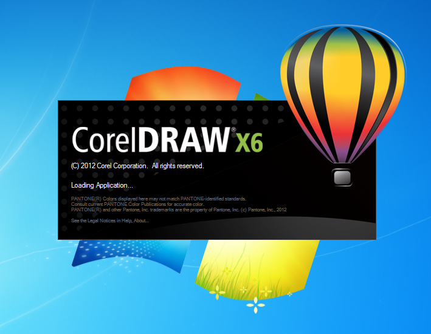

## Повышение производительности

CorelDRAW GS теперь обладает **полной поддержкой 64-разрядных процессоров**, позволяя быстрее работать с большими документами. Также в X6 была улучшена поддержка многопоточности (обработка нескольких потоков разными процессорами) для операций копирования/вставки больших объектов, экспорта, а так же печати нескольких документов.

## Поддержка OpenType и работа с текстом

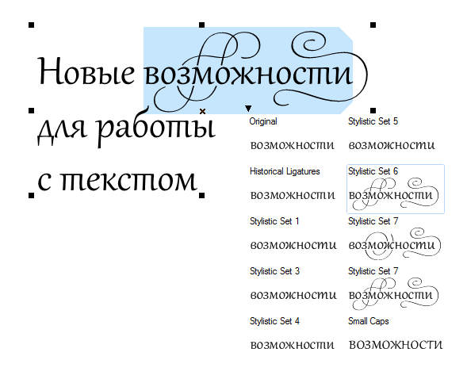
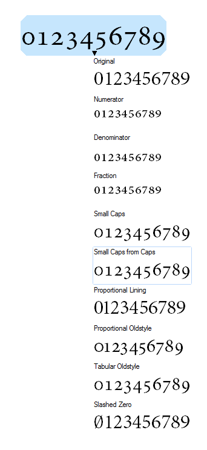

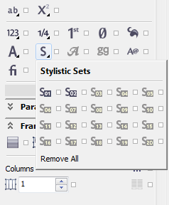
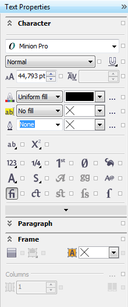

В значительной степени была переработана система работы с текстом. Теперь нам доступны многие типографские функции **OpenType**, такие как лигатуры, контекстные и стилистические варианты начертания, орнаменты, дроби, каллиграфические символы и пр. Так же, появился новый докер **Text Properties**, который собрал в себя большинство настроек текста в удобном виде.

## Новое «лицо» докера Object Properties

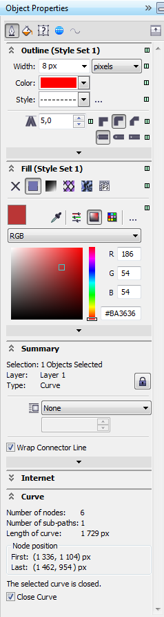
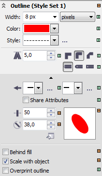

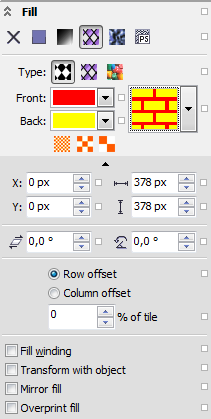
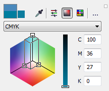

До неузнаваемости был переработан докер **Object Properties**. Он включает в себя достаточно большое количество основных настроек, которые теперь тесно связаны с новыми стилями.

## Новые стили

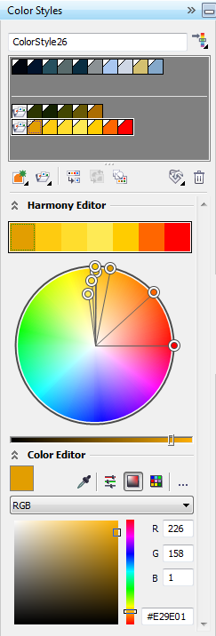
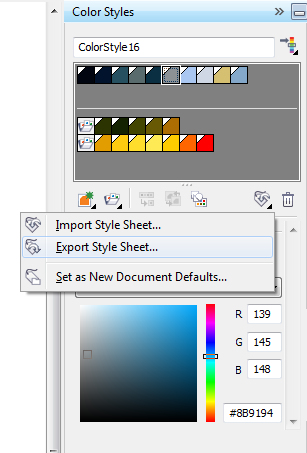
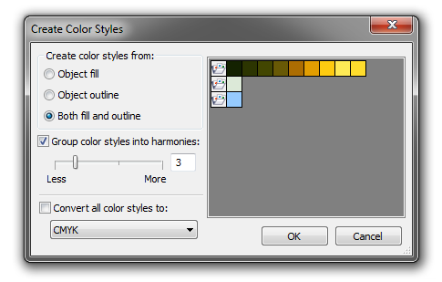
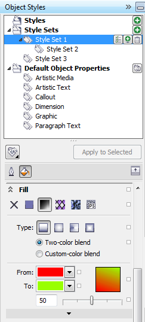
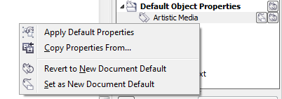

В **CorelDRAW X6** полностью удалили поддержку старых цветовых стилей. На смену им пришли совершенно новые, многофункциональные **Color Styles**, с возможностью создавать **Harmony** (Гармонии). Стили для объектов и текста также получили новую жизнь. Теперь их можно создавать и применять к заливке, абрису, тексту и фреймам, создавать группы стилей, легко и быстро изменять стили по умолчанию, а так же экспортировать и импортировать все стили из одного документа в другой. Основное управление стилями производится через новые докеры **Color Styles** и **Object Styles**.

## Улучшенный PowerClip

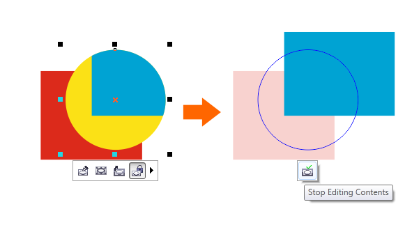
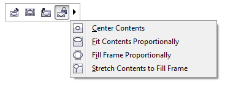
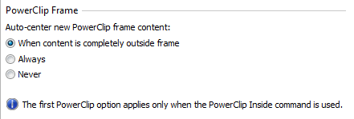

Эффект **PowerClip** был значительно улучшен, за счёт добавления нового функционала, а так же улучшения существующего. Например были добавлены команды подгонки содержимого под размеры контейнера, добавлена плавающая панель с основными функциональными кнопками. Так же, при переходе в режим редактирования, объекты оставшиеся вне контейнера не скрываются полностью, а остаются слегка заметными.

## Мастер страницы и нумерация

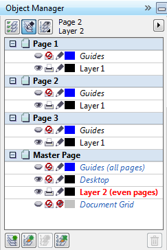
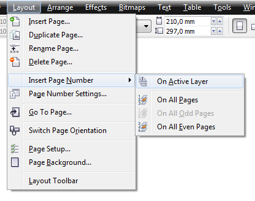
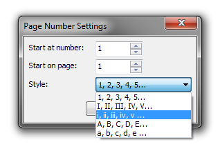

Разработчики **CorelDRAW X6** немного изменили логику мастер страниц, теперь их можно создавать отдельно для чётных и нечётных страниц. Также добавили простую нумерацию страниц, которую можно помещать как на отдельные страницы, так и на мастер страницы.

## Новые инструменты

*   **Freehand Pick** — выделение объектов рамкой произвольной формы
*   **Smear Tool** — «размазывание»
*   **Twirl Tool** — закручивание
*   **Attract Tool** и **Repel Tool** — притягивание и расталкивание

## Другие новинки CorelDRAW X6

*   **Quick Pan** — пожалуй, самый быстрый и удобный способ навигации. Заключается он в том, что «лапка» появляется при нажатии и удержании средне кнопки мыши.
*   **Alignment Guides** — интерактивное выравнивание объектов с помощью «виртуальных» направляющих.
*   **Selection Groups** — новая возможность интерактивно «привязать» определённое выделение к конкретной цифре на клавиатуре (над буквами).
*   **Три типа углов** для интерактивного контура + новое «лицо» докера **Contour**.
*   Поддержка прозрачности в **Vector Pattern Fill**.
*   **Расширен список режимов наложения** для интерактивной прозрачности.
*   **VBA 7.1**, а также поддержка **Custom .NET Control** (WPF).

Напомню что это далеко не полный список улучшений, который ждёт вас в **CorelDRAW X6**. Обо всём более подробно можно узнать скачав пробную версию с сайта corel.com уже сейчас.
