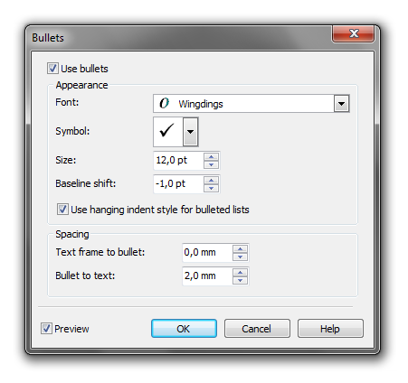
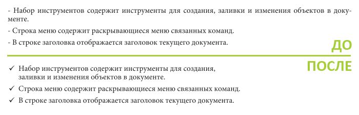

# Оформление списков (Bullets)

_Дата публикации: 16.08.2010_

Продолжаю рассказывать про работу с текстом в графическом редакторе **CorelDRAW**. В этой части речь пойдёт об оформлении списков. Продолжать я буду с тем же текстом что использовался в предыдущем обзоре – _Профессиональная работа с текстом (2 часть)_.

Итак, в нашем тексте есть один список. В данный момент, он выглядит далеко не так как хотелось бы. Вот главные проблемы неоформленных списков:

* В качестве маркера используется дефис (короткая черточка);
* Пространство между маркером и началом текста в разных пунктах отличается;
* Если текст не входит в одну строку, тогда наблюдается весьма неприятное отсутствие отступа с лева, у последующих строк.

Для того что бы упростить жизнь дизайнеру, разработчики CorelDRAW предусмотрели «инструмент» для быстрого оформления списков. Для его вызова, достаточно выбрать пункт **Bullets** в **меню Text**, предварительно выделив те абзацы, которые необходимо оформить в виде списка. Так же необходимо удалить те самые дефисы и пробелы после них, в начале каждой строки.

В открывшемся окне **Bullets**, первое, что нужно сделать – поставить галочку **Use bullets**. После этого станут доступны все необходимые нам параметры. По умолчанию выбран **шрифт Wingdings**, в котором находятся различные значки. Мы можем раскрыть список символов, и выбрать наиболее подходящий для нашего текста. Я выбрал галочку. Так же доступны параметры для настройки размера маркера и его вертикального сдвига. Галочка **Use hanging indent style for bulleted lists** отвечает за включение/выключение автоматического отступа для последующих строк. Ниже расположены параметры для настройки отступа маркера от левого края фрейма, и для настройки расстояния от маркера до начала текста.

Так же, для списка, я задал выключку относительного левого края, и с помощью сочетания **Shift + Enter** принудительно перенёс часть текста на следующую строку, для того что бы текст выглядел более приятно. Если бы я использовал просто Enter, тогда бы строка была отдельным пунктом в нашем списке.

## Полезно знать

* Что бы быстро преобразовать выделенный текст в список, достаточно нажать **Ctrl + M**.
* Ну и конечно же, всё вышесказанное актуально только для Paragraph Text.