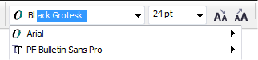

# Быстрый выбор шрифта в CorelDRAW

Как известно, опыт приходит с годами. Для дизайнера, вместе с ним приходит и знание шрифтов, что называется «в лицо». Как оказалось, в CorelDRAW уже давно существует возможность выбора шрифта путём ввода его названия с клавиатуры.

Согласитесь, если Вы знаете что за шрифт Вам нужен, быстрей напечатать его имя, чем найти в списке из сотни и более установленных шрифтов. Для этого достаточно просто кликнуть в поле выбора шрифта и начать вводить имя. Автоматически будет подставляться ближайшее похожее имя. И пусть вас не смущает то, что не мигает курсор ввода в поле выбора.

Важно заметить, что раскладка клавиатуры в этот момент должна быть английской.
