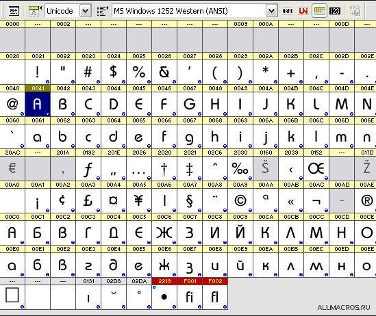
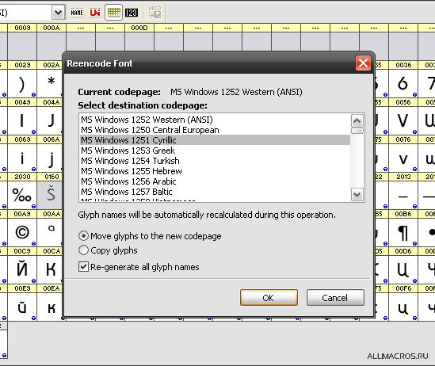
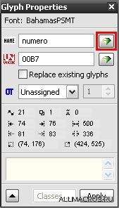
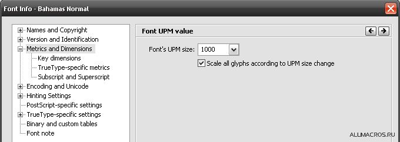
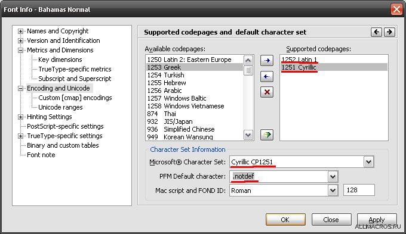
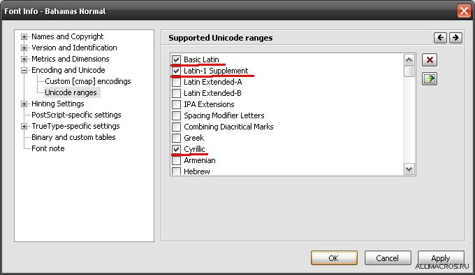
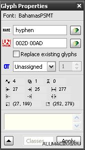

# CorelDRAW и шрифты

_Дата публикации: 02.11.2012_

Довольно часто на форумах рунета возникают темы с названиями типа «**Корел не видит шрифты!!!**» или «**В Кореле шрифты стали серыми. Помогите!!!**». Если быть точным, то эти темы стали появляться с выходом 12 версии CorelDRAW. Что же такого произошло с этой программой и как быть?

Именно с 12 версии, программа CorelDRAW перешла на современный стандарт кодирования символов — [Юникод](http://ru.wikipedia.org/wiki/ЮНИКОД). Шрифты перестали работать по вполне логичной причине — они не поддерживают юникод. Обычно это пиратские шрифты, скачанные в интернете или купленные в ближайшем лотке с дисками за 100р.

«Умельцы» придумали несколько способов заставить эти самые шрифты «работать». Но это не решение вопроса, а грабли, которые рано или поздно ударят по лбу в самый неподходящий момент. Одно единственно верное решение — пользоваться лицензионными шрифтами или теми, что распространяются бесплатно.  

Но что же делать если у нас в наличии устаревший лицензионный шрифт, который по каким либо причинам не был обновлён? В этой ситуации нам поможет программа [FontLab](http://www.fontlab.com/font-editor/fontlab-studio/) (в данном примере рассматривается 5 версия). Наша задача сделать юникодный шрифт и попутно переделать его в OTF.  

При открытии файла шрифта в FontLab, мы можем увидеть примерно такую картину. Она может несколько отличатся.  

На всякий случай выполним очистку Юникода – меню **Glyph > Glyph Names > Clear Unicode**. Согласимся на вопрос, ответив Yes. А теперь сгенерируем юникод – меню **Glyph > Glyph Names > Generate Unicode**. В результате мы видим что все (русские и английские) символы находятся в кодировке 1252\. Это неправильное положение вещей, т.к. русские символы должны находится в кодировке 1251\. Чтобы их переместить, нужно выполнить команду **Glyph > Glyph Names > ReencodeGlyphs** и в качестве кодировки назначения указать 1251.  

Некоторые глифы(символы) могут находится не на своём месте! Это происходит из за их неправильного имени. Чаще всего «убегает» с нужного места знак процента «%». Чтобы вернуть глиф на своё место достаточно выделить его и скопировать в буфер, а затем поставить курсор на нужное место и вставить. Ну и не забываем удалить ненужную копию стоящую не на своём месте.

Хочу заметить, что иногда глиф имея неправильное имя, продолжает стоять на своём месте. Чаще всего это символ номера «№». Чтобы исправить это, открываем, если ещё не открыта, палитру **Glyph Properties** (меню Edit > Properties). Выделяем нужный глиф и жмём волшебную кнопку на палитре Glyph Properties (на скриншоте выделена красной рамкой). Она присвоит правильное имя! Ну и на всякий случай проверяем, чтобы все глифы стояли на своих местах.  

Убедившись в правильности расположения глифов, открываем свойства шрифта – меню **File > Font Info**. В категории **Metrics and Dimensions** проверяем значение параметра **Font’s UPM size**, оно должно быть равным 1000, учитывая то, что у нас будет PS шрифт. Если значение отличается, то применяем 1000, ставим галочку «Scale all…» и применяем настройки.  

В диалоговом окне нас предупреждают, что будет изменён UPM размер и будет потеряна TrueType hinting информация. Подтверждаем своё решение.  

Далее нас интересует категория **Encoding and Unicode** и подкатегория **Unicode ranges**. Настраиваем, как показано на скриншотах.  

И ещё один нюанс… Обычно отсутствуют символы 00AD и 00A0 — символ переноса и неразрывный пробел. Исправляем следующим образом: Выделяем символ 002D(дефис) и в палитре **Glyph Properties** (меню Edit > Properties) в поле Unicode после 002D вписываем через пробел 00AD и нажимаем Enter.  

Тоже самое проделываем и для 00A0\. Его «родителем» будет символ пробела 0020. Осталось сгенерировать шрифт — меню **File > Generate Font**. В качестве формата нужно указать Open Type PS (*.otf).  

_В этой статье я указал лишь малую часть информации, которую следовало бы знать. Интернет вам в помощь )))))_
