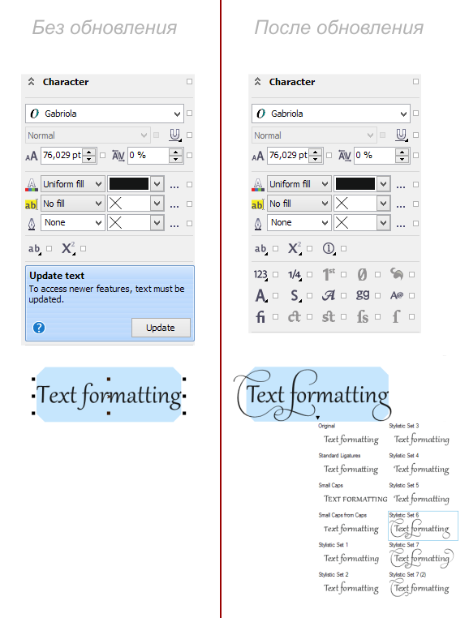

# Для чего нужна панель Update Text (Обновить текст)

Как обычно, среди некоторых пользователей есть недопонимание почему при открытии в **CorelDRAW X6** файлов предыдущих версий, появляется панель Update Text, и для чего она нужна.


На самом деле всё достаточно просто ровно на столько, на сколько это написано на самой панели: _Для доступа к более новым функциям текст необходимо обновить_.



Если вы читали обзор _Что нового в CorelDRAW X6_, то должны помнить что в новой версии текстовый движок был переработан для поддержки **OpenType**, при этом старый ни куда не делся, так как он необходим для совместимости с предыдущими версиями. Вот и получается что при открытии файлов в которых используется старый движок, программа спрашивает что делать с текстом.

П.С. Собственно, при сохранении файла в одну из предыдущих версий, программа аналогично спрашивает как поступить с текстом: сохранить возможность редактирования (при этом часть форматирования, связанная с новыми возможностями, пропадёт) или сохранить форматирование (при этом программе придётся перевести текст в кривые).

## Автоматическое обновление текста при открытии файла

Для этого необходимо добавить следующий код в модуль **ThisMacroStorage** стандартного **GlobalMacros** и снять галочку с опции **Delay Load VBA** в настройках VBA.

```vb
Private Sub GlobalMacroStorage_DocumentOpen(ByVal Doc As Document, ByVal FileName As String)
  If Doc.TextFormatter < 1600 Then Doc.TextFormatter = 1600
End Sub
```

Или воспользуйтесь новой версией макроса **CdrTools**.
