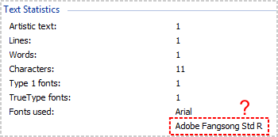
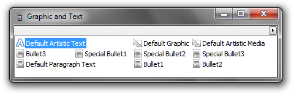
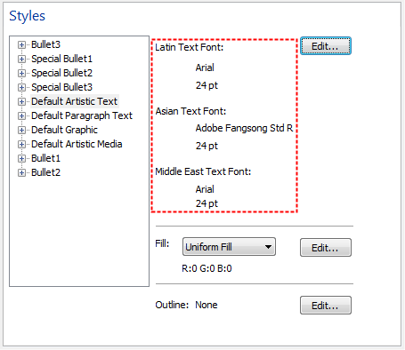

# Фантомные шрифты в документе CDR

На форумах иногда спрашивают, почему в окне **Информация о документе** отображаются названия шрифтов, которые не используются в документе. Ошибка программы? Нет, это не ошибка! Если разобраться в особенностях работы **CorelDRAW**, то нам сразу станет ясно, почему так происходит. Итак, разбираемся…

Начнём издалека. Знаете ли Вы, почему при создании нового текстового блока, всегда, по умолчанию, применяется один и тот же шрифт, а не тот который мы использовали последним? Да всё очень просто — CorelDRAW использует стили для оформления текста. Каждый раз, когда Вы создаёте новый текстовый блок, ему автоматически применяется стиль, назначенный по умолчанию. Кстати говоря, эти стили сохраняются вместе с документом, так что можно их менять под необходимые требования.

Добраться до стилей можно через меню **Window > Dockers > Graphic and Text Styles**.

Теперь заглянем в свойства стиля, который применяется по умолчанию. Кстати говоря, это или **Default Artistic Text** или **Default Paragraph Text**, в зависимости от типа текста, который был создан. Для того чтобы отобразить свойства, достаточно в контекстном меню стиля выбрать пункт **Properties**. При этом откроется окно глобальных настроек на пункте **Document > Styles**, и автоматически будет выбран запрашиваемый нами стиль в правом списке. Вот тут то и откроется нам страшная тайна! Шучу :) Ни какой тайны то и нет.

Присмотревшись, сразу станет ясно, почему в окне **Информация о документе** CorelDRAW отображает неиспользуемые нами шрифты — их использует наш стиль! Каждый текстовый стиль в CorelDRAW содержит настройки шрифтов для трёх типов набора текста: латинский, азиатский и ближневосточный. Так что, набрав всего один текст, Вы, сами того не зная, можете использовать сразу три шрифта :)
