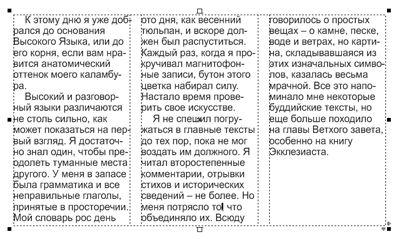
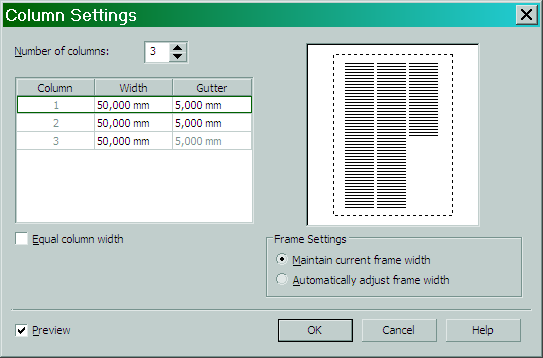
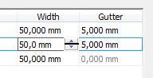
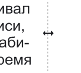
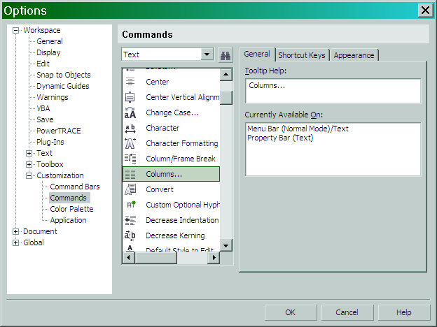
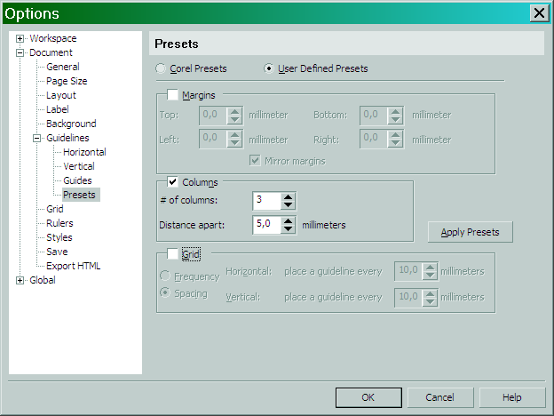

# Колонки для простого текста в CorelDRAW

Автор: Роман Тищенко

CorelDRAW, пытаясь приблизиться по возможностям к программам верстки, имеет возможность разделить **Paragraph Text** (простой текст) на колонки. Они связаны друг с другом таким образом, что текст из первой колонки при ее заполнении перетекает в следующую и т.д.

Разбиение на колонки целесообразно использовать, если в тексте много коротких строк–абзацев, длина которых намного меньше ширины страницы. Это относится, например, к стихотворениям, маркированным спискам, диалогам… Зачастую именно в CorelDRAW верстают газеты или журналы. Конечно, специализированные программы для этого подходят куда больше, чем графический редактор, но ситуация иногда обязывает. Тогда и применяется многоколоночный набор, как в газетных или журнальных статьях.  
Чтобы создать колонки, выделите текстовый блок (напоминаю, это относится только к **Paragraph Text**) и выберите команду меню **Text > Columns…** (Текст > Колонки...) На экране появится диалоговое окно **Column Settings**.

Рассмотрим элементы этого окна.

Счетчик **Number of columns** (Число колонок) определяет, сколько их будет в тексте.

Таблица, расположенная ниже, дает возможность задать параметры колонок. **Column** указывает номер колонки, а поля **Width** (Ширина) и **Gutter** (Переплет, Средник) позволяют задать ширину колонки и расстояние между этой колонкой и следующей. То есть, все колонки и расстояния между ними могут быть разными!

Если же флажок **Equal column width** (Колонки равной ширины) включен, то колонки будут все одинаковой ширины и расстояния между ними, соответственно, тоже будут одинаковые. Остаются доступными для изменения только параметры колонки № 1 и у всех остальных колонок они будут аналогичные.

Какие опции этого диалогового окна у нас еще остались? **Maintain current frame width** (Сохранить текущую ширину рамки) и **Automatically adjust frame width** (Автоматически изменять ширину рамки). Если выбрана первая, то ширины колонок и расстояний между ними будут рассчитываться при условии, что ширину текстового блока менять нельзя. Если выбрана вторая опция — размеры колонок можно задавать какие угодно, при этом ширина текстового блока будет изменяться в соответствии с новыми размерами колонок и расстояний между ними.

Чтобы изменить размеры колонок или расстояний между ними щелкните мышкой прямо по числовому значению и вводите новое.

Кстати, менять ширину колонок можно и без диалогового окна, а непосредственно на странице. Выберите инструмент **Text tool** (F8) и мышкой, указатель которой превратится в двунаправленную стрелку, перетаскивайте границы колонок.

Тем самым вы будете изменять ширину колонок и расстояние между ними.

Если вы часто пользуетесь многоколоночным набором, то кнопку «Колонки» можно вынести на панель инструментов «Текст» (по умолчанию ее там нет) или на Панель свойств (**Property Bar**).

Желающие могут назначить горячую клавишу.

Если планируется в CorelDRAW делать сложную верстку (многоколоночный набор текста, графика, таблицы и т. д.) страниц, тогда, для удобства, можно дополнительно использовать и пресеты направляющих .

Выберите пункт меню **View > Setup > Guidelines Setup…** (Вид > Настройка > Настройка направляющих...), перейдите в раздел **Presets**, подраздел **User Defined Presets**, включите опцию **Columns** и задайте количество (# of columns) колонок и расстояние между ними (**Distance apart**).  
На странице появятся направляющие в виде колонок, к которым удобно привязывать графику и другие объекты.

Те же колонки, кстати, вполне могут применяться к некоторым, скажем так, нетрадиционным задачам. Например, к созданию календарей (если по каким-то причинам не подходят автоматизированные генераторы). Способ этот, кстати, довольно универсален. Многие программы поддерживают разбиение текстовых блоков на колонки — графические и текстовые редакторы, программы верстки…

Как я уже говорил, CorelDRAW, все-таки является графическим редактором, а не специализированной программой для верстки печатных изданий. Но, умело применяя его функции и возможности, можно вплотную приблизиться к профессиональному виду сверстанных страниц.
