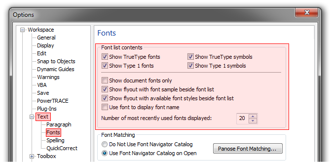
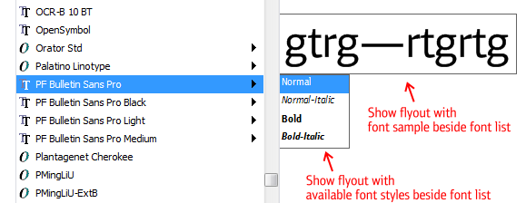
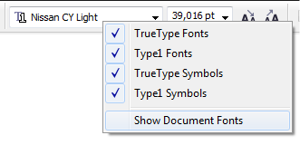

# Настройка списка шрифтов

_Дата публикации: 18.02.2011_

Зачастую в системе бывает установлено очень много шрифтов, что в свою очередь влечёт за собой усложнения в навигации по списку шрифтов в CorelDRAW. Что бы хоть как то облегчить работу с таким списком, необходимо его настроить.

Итак, вот они эти самые настройки (Options > Workspace > Text > Fonts):

Первые четыре галочки отвечают за то, какого типа шрифты будут отображаться в списке. **Show document fonts only** — показывать только те шрифты, которые используются в текущем документе. Порой это бывает очень удобно. Следующие две галочки отвечают за отображение плавающих окошек, в которых отображается пример шрифта, и доступные начертания.

Хочется отметить, что включение галочки **Show flyout with font sample beside font list** отключает живое превью. То есть, во время подбора шрифта, он не будет автоматически временно применяться к выделенному тексту в документе. Советую включать эту опцию тем, кто работает с большими объёмами текста в CorelDRAW, либо компьютер не обладает достаточно мощным процессором. **Use font to display font name** — показывать название шрифта, в списке, самим шрифтом. Советую отключить данную опцию, поскольку названия становятся порой совершенно нечитабельными, что затрудняет поиск нужного шрифта. Ну и последний параметр задаёт, сколько будет отображаться шрифтов в списке недавно используемых. Допустимое значение: 0–20.

## Полезно знать

Первые пять параметров так же доступны, для быстрой настройки, в отдельном всплывающем окошке. Его можно вызвать простым нажатием правой кнопки мыши в поле выбора шрифта.

