# Отступы и интервалы в тексте в CorelDRAW

Автор: Роман Тищенко

В этой статье рассмотрим:

*   отступы для абзаца слева, справа и для первой строки;
*   расстояния «по вертикали» — между абзацами и строками текста;
*   расстояния «по горизонтали» между символами и словами.

## Абзацные отступы

Для визуального отделения одного абзаца от другого часто используют отступ в начале первой строки. Это классический способ обозначения абзаца. Начало строки сдвигается вправо на некоторое расстояние, и мы сразу видим, где начинается следующий абзац. Для выделения абзаца из всех остальных, могут понадобиться и другие отступы — отступ вправо начала всех строк и отступ влево окончаний всех строк. Таким способом можно отделить избранный абзац от остального текста, выделить его, обратить на него внимание.  
Напоминаю, что отступы можно настроить только для **Paragraph Text** (Простой текст).

Выберите инструмент **Text tool** (F8) и поместите курсор в абзац. На краях выделенной области линейки (по ширине текстового блока) вы увидите специальные маркеры, перетаскивая которые, можно настраивать абзацные отступы.

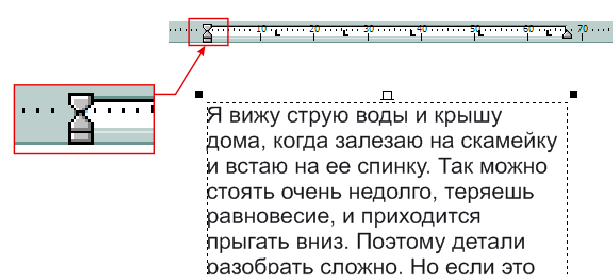

*   Левый верхний треугольный маркер. С его помощью настраиваем отступ слева для первой строки. То есть, расстояние от левого края текстового блока до начала первой строки.
*   Левый нижний треугольный маркер. Перемещая его, настраиваем отступ от начала всех строк (кроме первой) текущего абзаца.
*   Левый нижний прямоугольный маркер. Перетаскивая его, мы изменяем одновременно левый отступ, как для первой строки, так и для всех остальных. Когда вы будете его двигать мышкой, то увидите на линейке специальный символ в виде кружочка, который показывает текущую позицию отступа.
*   И, наконец, правый треугольный маркер. Перемещая этот маркер, вы можете изменить значение правого отступа. То есть расстояние от правого края текста до правой границы текстового блока.

Мы рассмотрели интерактивный способ изменения отступов с помощью передвижения мышкой специальных маркеров.  
Но все эти параметры можно настроить и точно. Если вы не хотите, чтобы отступ для первой строки у вас получился, скажем, в 7,453 мм, то выберите в меню команду **Text > Paragraph Formatting** (Текст > Форматирование абзаца). Появится докер **Paragraph Formatting**, в котором нас сейчас интересует группа **Indents** (Отступы)

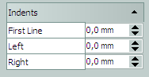

Счетчик **First Line** (Первая строка) задает значение отступа для первой строки. **Left** (Слева) — отступ слева для всех строк, **Right** (Справа) — правый отступ.  
Используя отступы первой строки, отделяют абзацы друг от друга. Применяя же левый и правый абзацные отступы, мы можем выделить отдельный абзац.

## Расстояние между абзацами и строками текста

Теперь рассмотрим вертикальные расстояния. Это расстояния между отдельными абзацами и отдельными строками в абзаце.  
Для абзаца можно задать интервалы перед ним и после него, отделяющие его от других абзацев. Такие интервалы еще называются «_отбивками_». Абзацные отбивки (до и после абзаца) часто применяют для заголовков разных уровней. Тут главное не путать абзацные отбивки (интервалы перед абзацем и после абзаца) и абзацные отступы (расстояния от левого/правого края абзаца до границ текстового фрейма).  
Именно эти два способа (отбивки и отступы) используются для визуального разделения абзацев. В российской полиграфической традиции, типографике чаще используют отступы первой строки (иногда применяется термин «_красная строка_»), традиция западной типографики использует отбивки. Строгих правил нет, поэтому у нас все чаще используют метод межабзацных интервалов, особенно в электронных документах. В частности, на сайте cdrpro.ru используется именно этот способ.

Абзацные отбивки можно применить только для **Paragraph Text** (Простой текст). Дело в том, что CorelDRAW рассматривает **Artistic Text** (Фигурный текст) независимо от размера, как один абзац. Естественно, для текста, состоящего из одного абзаца, теряет смысл понятие «интервал между абзацами».  
Для изменения интервалов до и после абзаца нам понадобится то же докер **Paragraph Formatting** (Форматирование абзаца), группа **Spacing > Paragraph and Line** (Интервал > Абзац и строка)

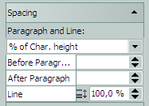

Вводя числовые значения в счетчики **Before Paragraph** (Перед абзацами) и **After Paragraph** (После абзацев), можно изменять абзацные отбивки.  
Счетчики для изменения абзацных интервалов можно и вынести на панель инструментов «Текст» или на **Property Bar** (Панель свойств).

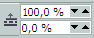

Это элемент **Tools > Options… > Workspace > Customization > Commands > Text > Space Before and After Paragraph** (Инструменты > Параметры > Рабочее пространство > Настройка > Команды > Текст > Интервалы перед параграфами и после них).

Теперь рассмотрим, что же такое межстрочный интервал. Как уже упоминалось в статье «Профессиональная работа с текстом (2 часть)», этот интервал еще называют «интерлиньяж» (то есть расстояние между базовыми линиями соседних строк). Работает этот параметр как для **Paragraph Text** (Простой текст), так и для **Artistic Text** (Фигурный текст).

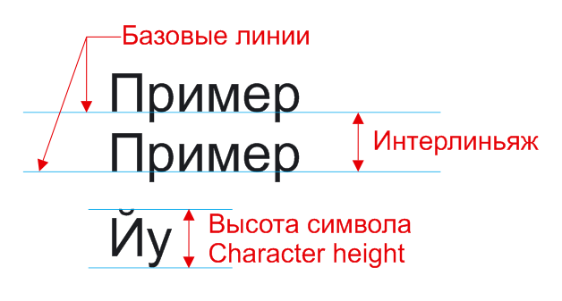

Для интерлиньяжа и отбивок в CorelDRAW предусмотрено три единицы измерения.

*   **% of Char. height** (% от высоты символа). На рисунке видно, что так называется расстояние от самого верхнего до самого нижнего выносного элемента букв.
*   **Points** (пункты). Можно задать не относительное, а абсолютное значение межстрочного интервала в пунктах (pt). Точно задавая значение интервала в пунктах, нужно помнить, что это значение останется неизменным при изменении размера шрифта.
*   **% of Pt. size** (% размера в пт). Имеется в виду размер шрифта (кегль) в пунктах. То есть, если кегль шрифта равен 12 пунктов, то интерлиньяж при значении счетчика **Line** в 100 %, тоже будет равен 12 пунктам.

Межстрочный интервал можно также изменить интерактивно. Но делается это не с помощью маркеров на линейке, а другим способом.

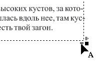

Подведите указатель мыши к правому нижнему углу выделенного текстового блока. Там вы увидите маркер в виде двух линий и маленькой, направленной вниз, стрелочки. Потяните за него. Подвигайте вверх-вниз. Вы увидите, что межстрочный интервал плавно изменяется — увеличивается или уменьшается в зависимости от того, тянете вы вниз или вверх.  
Для фигурного текста (**Artistic Text**), аналогичные действия можно проделать только инструментом **Shape**.

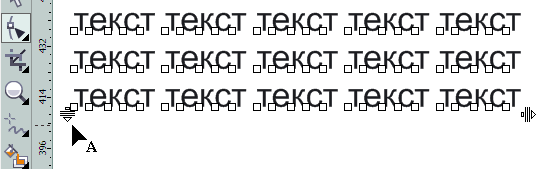

Не рекомендуется заменять отбивки добавлением пустого абзаца (то есть, добавлять пустые строки нажатием клавиши **Enter**). При редактировании текста или изменении параметров стиля абзацы могут поменять свое положение. Если пустой абзац (строка) попал в начало или конец колонки или текстового блока, то он никуда не денется и пустое место будет видно. Отбивки же в начале и конце колонок (текстовых блоков) не отображаются, и текст выглядит корректно.

Можно еще упомянуть о следующем. Идеология настройки интерлиньяжа и абзацных отбивок в CorelDRAW несколько отличается от таковой в программах обработки текста и верстки от других фирм. Если вы, скажем, в MS Word или Adobe InDesign выставите интерлиньяж, отличный от заданного по умолчанию, он применится и к двум линиям из соседних абзацев. И в свойствах абзаца вы не увидите появившихся отбивок.

В CorelDRAW все происходит по-иному. Мы видим четкое разграничение между понятиями «_интервал между строками одного абзаца_» и «_интервал между абзацами_». Поэтому, меняя интерлиньяж для нескольких абзацев, мы увидим, что абзацные отбивки остались без изменений. И, чтобы расстояния между абзацами были равны расстоянию между строками внутри абзацев, придется их выставить вручную. Такой подход логичнее, но не привычнее.

А вот при интерактивном изменении межстрочного интервала при помощи мыши, автоматически пропорционально увеличиваются и интервалы между абзацами.  
Аналогично работают и кнопки изменения межстрочного интервала **1 Line Spacing** (Одинарный интервал), **1.5 Line Spacing** (Полуторный интервал) и **2 Line Spacing** (Двойной интервал).

Эти кнопки аналогичны имеющимся, например, в MS Word и работают не идентично, но внешне очень похоже. То есть автоматически изменяют абзацные отбивки соответственно интерлиньяжу. Их можно поместить на панель инструментов «Текст» (по умолчанию их там нет) или на Панель свойств (Property Bar). Найти их можно здесь: **Tools > Options… > Workspace > Customization > Commands > Text** (Инструменты > Параметры > Рабочее пространство > Настройка > Команды > Текст).

## Расстояния между символами и словами

Теперь рассмотрим три вида «горизонтальных» интервалов. Интервалы между символами, специфические интервалы между парами символов и интервалы между словами. Данные параметры применимы для обоих видов текста: для **Paragraph Text** (Простой текст) и **Artistic Text** (Фигурный текст). Нам опять понадобится докер **Paragraph Formatting**, группа **Language, Character and Word** (Язык, символ и слово).

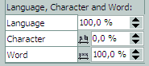

Начнем с последнего параметра. В счетчике **Word** (Слово) задается величина пробела между словами. При разработке любого шрифта (гарнитуры) в нем предусматривается, какую ширину должен иметь стандартный символ пробела. По умолчанию значение равно 100 %. Его мы и меняем, увеличивая или уменьшая межсловный интервал.

Параметр **Character** (Символ) управляет расстоянием между символами. Межсимвольное расстояние еще называется «_трекингом_». Трекинг измеряется в процентах от величины символа пробела. Проделаем пару маленьких экспериментов. Зададим для фразы значение трекинга 100 %. После этого видно, что пробелы «исчезли», межсимвольные интервалы стали равны интервалам между словами. А теперь попробуем сделать эту фразу тремя гарнитурами с разной шириной символов (см. рисунок ниже).

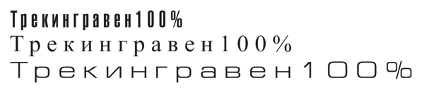

Видно, что межсимвольные расстояния для каждого шрифта разные. Это значит, что ширина пробела для каждой гарнитуры разрабатывается своя (в зависимости от ширины символов).

Из вышесказанного следует, что увеличив трекинг текста (такой набор еще называют «_разрядкой_»), не забудьте увеличить расстояния между словами с помощью счетчика **Word** (Слово), иначе слова сольются и текст станет трудночитаемым.  
При использовании межсимвольного интервала желательно учитывать некоторые особенности восприятия текста. Например, текст, набранный крупным шрифтом, выглядит лучше, если буквы расположены более плотно, чем при использовании стандартного интервала. Особенно это заметно, если все слово набрано прописными (заглавными) буквами. Степень необходимой коррекции трекинга зависит не только от кегля (размера), но и гарнитуры. Некоторые шрифты требуют довольно ощутимой настройки трекинга, другие же могут обойтись практически без нее.

Часто настройку межсимвольного интервала используют для того, чтобы разместить заданный текст на заданной площади. А иногда используют и как дизайнерский прием.

И опять я хочу обратить внимание на отличие идеологии CorelDRAW в плане горизонтальных интервалов. Для сравнения опять возьмем текстовый редактор MS Word и программу верстки Adobe InDesign. При изменении трекинга в этих программах изменяется соответственно и расстояние между словами. В CorelDRAW это приходится делать вручную.  
Менять интервалы можно и с помощью мыши. Поднесем мышку к правому нижнему углу рамки с простым текстом

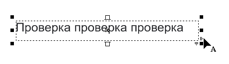

и потянем за маркер в виде двух вертикальных линий и стрелочки вправо. Мы увидим, что увеличиваются интервалы между символами и одновременно между словами! Если же тянуть будем с нажатой клавишей **Shift**, то меняться будут только интервалы между словами. А нажатая клавиша **Ctrl** позволит нам изменять только межсимвольные интервалы.  
Для фигурного текста (Artistic Text), аналогичные действия можно проделать только инструментом **Shape**.

Теперь рассмотрим специфические интервалы между парами символов. Вводится понятие «_кернинг_» — это расстояние между парами символов (букв). Как вы догадываетесь, межсимвольный пробел не должен быть одинаковым для всех букв текста. Форма литер различна и для различных сочетаний он тоже должен отличаться. Поэтому говорят о так называемых «_кернинговых парах_». Кернинговые пары — это пары символов, например, AW, Ta, HR, АЧ, АУ, ГА и др. Например, расстояние между символами А и Ч может быть меньше, чем между П и Н.

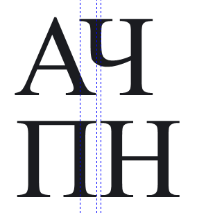

Обычно кернинг делается в сторону уменьшения пробела, так чтобы выступающие части одного символа заходили в пространство второго символа (на рисунке вверху — пара литер А и Ч). В результате размещение символов становится зрительно более равномерным. Поэтому настройка кернинговых пар, то есть, изменение ширины пробела между парами литер, является необходимой для улучшения зрительного восприятия текста. Фирменные шрифты снабжены таблицами кернинга, т.е. списком пар символов, между которыми необходимо сокращать пробел при наборе текста. Если в шрифте есть большая таблица пар кернинга, он будет хорошо, равномерно смотреться независимо от кегля. Обычно для каждого шрифта заданы свои интервалы для каждой пары символов. Это определяет художник, разрабатывающий шрифт. Поэтому менять их желательно только в том случае, когда это действительно необходимо.

Как же можно изменить кернинг в CorelDRAW? Для этого нам понадобится докер **Character Formatting** (Форматирование символов), вызываемый одноименной командой в меню **Text**. И счетчик **Range Kerning** (Кернинг).

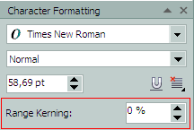

Выделяем символы, для которых нужно изменить кернинг, и уменьшаем или увеличиваем значение в поле ввода. Одновременно можно регулировать расстояние между любым числом символов. Измеряется кернинг в процентах от величины символа пробела данного шрифта.

Существуют еще кнопки изменения кернинга.

Называются они **Decrease Kerning** (Уменьшить кернинг) и **Increase Kerning** (Увеличить кернинг). Найти их можно здесь: Tools > Options… > Workspace > Customization > Commands > Text (Инструменты > Параметры > Рабочее пространство > Настройка > Команды > Текст). А затем поместить на панель инструментов «Текст» (по умолчанию их там нет) или на Панель свойств (Property Bar).

И как часто в среде CorelDRAW, операцию изменения кернинга можно провести интерактивно — вручную, используя мышь. Для этого выберите Инструмент **Shape** и щелкните мышью на тексте. Рядом с каждым символом появятся маленькие квадратные маркеры. Чтобы выделить символ, который нужно переместить, щелкните на маркере. Выделить можно и несколько символов. Тут те же правила, что и с выделением объектов. Выделив необходимые маркеры, можно их перемещать влево-вправо или вверх-вниз. При этом будут перемещаться и соответствующие символы.

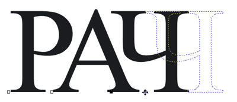

Для перемещения можно использовать также и клавиши управления курсором.  
Что можно сказать напоследок? Знание тонкостей и приемов работы с текстом сократит вам время на форматирование текста, а также поможет в создании профессионально выглядящих документов.

В конце этой статьи хочу порекомендовать универсальный докер для текста, созданный Sancho. Называется он **TextDocker** для X5 и содержит все самое необходимое для работы с текстом.

Ну и, конечно, настраивайте свой CorelDRAW! Это очень гибкий инструмент, позволяющий настроить рабочее пространство под свои нужды. И хотя варианты рабочих сред рассматриваются в отдельной теме «У кого какая рабочая среда Corel Draw», позволю себе поместить здесь пример моей Панели свойств (Property Bar) в режиме «Текст».

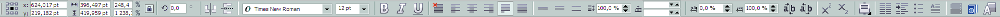

Это не образец для подражания, но пример, как довольно скудную по умолчанию Панель свойств, можно дополнить различными управляющими элементами.
