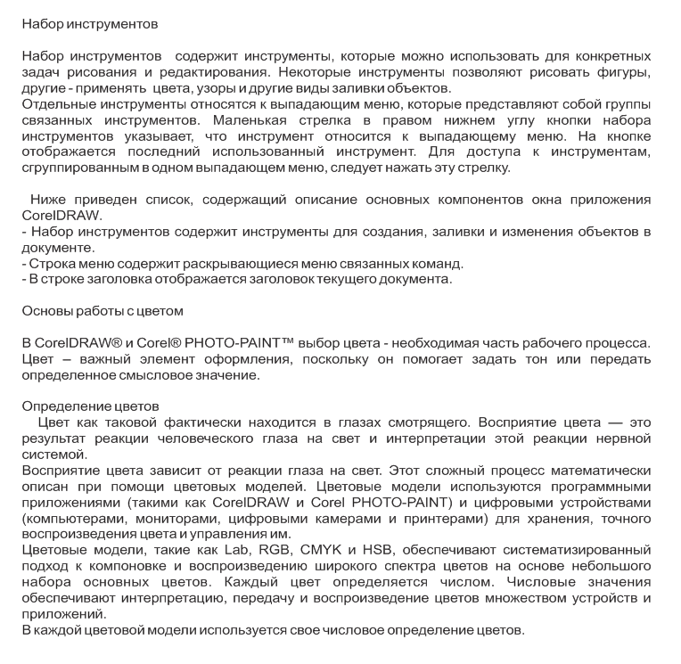
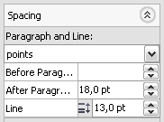
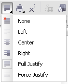
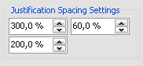
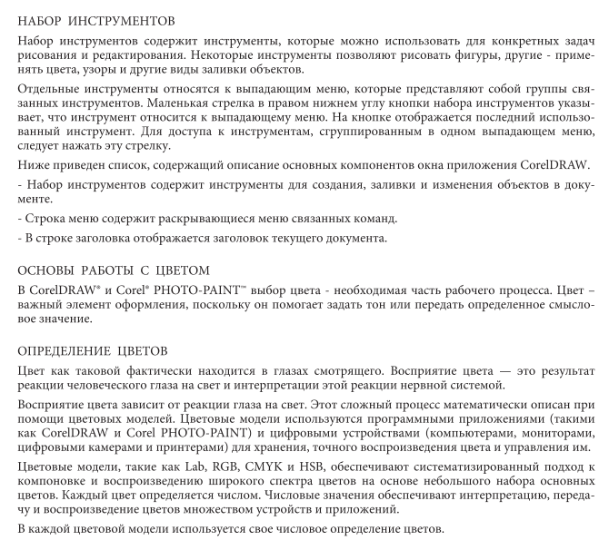

# Профессиональная работа с текстом (2 часть)

_Дата публикации: 11.06.2010_

В этой заметке я продолжу рассказ о работе с текстом в **CorelDRAW**. Сразу скажу, что это далеко не последний материал по данной теме, предвидится ещё как минимум два-три.

Итак, раз уж мы говорим о тексте и его оформлении, то нам необходим «подопытный кролик». В качестве нашего кролика будет некий текст, составленный из фрагментов, взятых из официального русского руководства по **CorelDRAW X5**. Я так же специально добавил в него несколько распространённых ошибок.

## Базовые параметры текста

Начинать всегда нужно с задания размера фрейма, а так же базовых параметров текста, таких как выбор гарнитуры шрифта, её начертания, кегля и т.д. В качестве примера я выбрал шрифт **Minion Pro**, и оставил значения кегля по умолчанию (12pt). В графическом редакторе CorelDRAW, в отличие от программ компании Adobe, значение межстрочного интервала (в профессиональной среде принято называть его **интерлиньяж**) по умолчанию задаются в процентах от высоты символов. Но это не единственный вариант, доступны ещё два — пункты (points) и проценты от размера шрифта (% of Pt. Size). Мне привычнее работать с пунктами, так что я задал значение интерлиньяжа равным 13pt.

Для тех, кто не особо знаком с программой, стоит отметить, что для работы с текстом, в CorelDRAW предусмотрено меню Text, панель свойств инструмента Text Tool, а так же два докера. Подробнее можно прочитать в первой части.

## Выключка и переносы

Вернёмся к нашему кролику.  По умолчанию, текст выровнен относительно левого края (Left). Кстати говоря, выравнивание текста называется **выключка**. Так вот, тут есть один нюанс — «рваный» правый край. Если Вас это не напрягает или оформление больше приемлет выключку именно по левому краю, то можно оставить и так. Лично я предпочитаю выключку по ширине, а точнее **Full Justify**.

Однако при таком способе выравнивания, в тексте могут возникнуть визуальные «дыры». Они возникают из-за того, что, растягивая строку на ширину колонки, программа должна как-то распределить все символы, и зачастую она излишне увеличивает пробелы между словами. Хочется обратить внимание, что CorelDRAW действует не так, как ему вздумалось, а на основе заданных параметров под общим названием **Spacing Settings**. Однако добраться до них очень не просто, так что многие о них просто не знают. Но мы с Вами поступим иначе — воспользуемся докером **TextDocker**. Этот докер содержит в себе всё самое необходимое для работы с текстом, так что надобность лазить по нескольким докерам, меню и т.д., просто-напросто отпадает.

Снова мы отвлеклись. Группа параметров Spacing Settings содержит всего три значения. **Max. word spacing** — максимальное значение на сколько процентов программа может растянуть пробелы между слов. Параметр **Min. word spacing** задаёт минимальное значение.  
Выключка Full Justify в большинстве случаев приводит к тому, что последняя строка каждого абзаца как бы немного слипается. В этом случае нам поможет установка значения Min. word spacing равным 100%.

Существует и ещё один способ избавиться от «дыр» — включить переносы. Делается это активацией опции **Use****Hyphenation** в меню Text. Кстати говоря, переносы тоже настраиваются. Если переносы у Вас не работают, то скорее всего дело в неправильной кодировке набранного текста, что обычно является последствием использования «кривых» шрифтов.

Также часто бывает, что те, кто набирает текст, допускают не только орфографические ошибки. Они так же могут поставить два, а то и три пробела подряд. Что естественно приводит всё к тем же «дырам». Бороться с этим можно и нужно! Хотя, опять же таки, всё на Вашей совести. Для тех, у кого она всё же присутствует, рассказываю. Делается это банальным поиском и заменой.

Но пробелы это лишь малая часть айсберга. Кто часто работает с большими объёмами текста, тот поймёт, о чём я говорю. Так вот, поиском и заменой в этом случае обходиться весьма проблематично, да и нудно. Для тех, кто любит делать всё быстро и без лишних заморочек, был придуман и написан **макрос Text Replacer**, который мало того что может выполнять несколько поисков/замен нажатием одной кнопки, так ещё и поддерживает использование **GREP** ([регулярные выражения](http://ru.wikipedia.org/wiki/Регулярные_выражения)).

## Нюансы параграф текста

Для работы с текстом предусмотрено большое кол-во всевозможных настроек. Многие из них, почему-то не используются дизайнерами. Ярким примером является красная строка. Процентов 90 текстов, которые мне приходилось видеть, содержали красные строки сделанные пробелами. Причём кол-во пробелов, почему-то варьируется от одного абзаца к другому. А между тем для красной строки предусмотрен отдельный параметр **First Line**. Преимущества данного параметра перед пробелами в том, что расстояние от начала строки всегда фиксированное, в то время как пробелы имеют свойства сжиматься или растягиваться, что приводит к «пляске» текста. И к тому же, параметр задаётся или меняется разово, сразу для всех абзацев в тексте, а вот пробелы вам придётся расставлять везде вручную.

Парад «ухищрений» можно продолжить пустыми абзацами вместо настройки специально параметра, а точнее даже двух — **Before Paragraph** и **After Paragraph**.

Итак, я уже почистил текст от лишних пробелов, абзацев и другого барахла, а так же задал значение параметра After Paragraph равное 18pt.

## Заглавные и строчные

В нашем тестовом блоке имеется несколько заголовков, и нам нужно их как-то обозначить. Выделяем их инструментом **Text Tool** и включаем каждому опцию **All capitals**. Получаем заголовки, набранные заглавными, или как ещё их называют, прописными буквами. Но тут нас поджидает маленькая неприятность — пробелы между словами в наших заголовках визуально почти не заметны. А выход очень прост — меняем пробелы на **En Space**, с помощью **Insert Formatting Code** или поиска/замены.

И ещё небольшой штрих. Меняем значение параметра **Before Paragraph** на 30pt для наших заголовков, и получаем некий отступ одной темы от другой.

