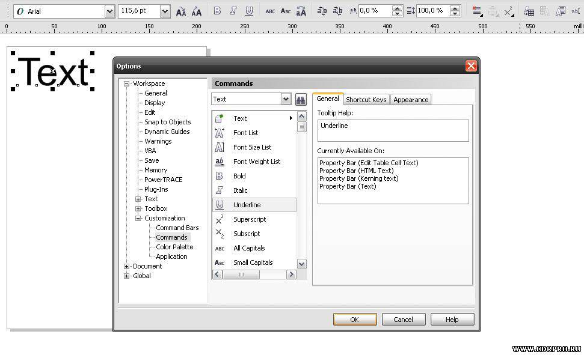
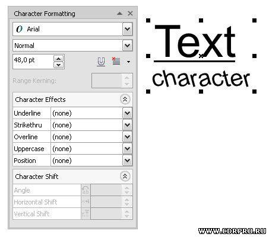
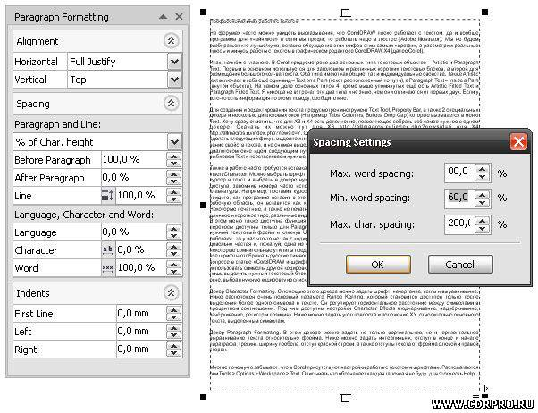

# Профессиональная работа с текстом (1 часть)

_Дата публикации: 02.11.2012_

На форумах часто можно увидеть высказывания, что CorelDRAW плохо работает с текстом, да и вообще программа для «чайников» и если вы профи, то работать надо в люстре (Adobe Illustrator). Мы не будем разбираться кто лучше/хуже, оставив обсуждение этих мифов этим самым «профи», а рассмотрим реальные плюсы и минусы работы с текстом в графическом редакторе CorelDRAW X4 (далее Corel).  

Итак, начнём с главного. В Corel предусмотрено два основных типа текстовых объектов – **Artistic** и **Paragraph Text**. Первый в основном используется для заголовков и различных коротких текстовых блоков, а второй для размещения большого кол-ва текста. Оба типа имеют как общие, так и индивидуальные свойства. Также Artistic text включает в себя ещё один вид – **Text on a Path** (текст расположенный по пути), а Paragraph Text – **Inside a Path** (внутри объекта). На самом деле основных типов 4, кроме выше упомянутых ещё есть Artistic Fitted Text и Paragraph Fitted Text. Я никогда не встречал эти два типа и не знаю, чем они отличаются от первых двух. Если у кого-то есть информация по этому поводу, сообщите мне.  

Для создания и редактирования текста предусмотрен инструмент **Text Tool**, **Property Bar**, а также 2 специальных докера и несколько диалоговых окон (Например **Tabs**, **Columns**, **Bullets**, **Drop Cap**) которые вызывается в меню Text. Хочу сразу отметить, что для Х3 и Х4 есть дополнение, позволяющее собрать всё самое нужное в одном докере! Позже добавлю линки. Стандартный вид **Property Bar** также далеко не идеален, поэтому можно сделать следующий фокус: выделяем любой текстовый объект, чтобы Property Bar переключился на редактирование свойств текста, и не снимая выделения вызываем настройки программы **Tools > Options**. В открывшемся диалоговом окне идём следующим путём **Workspace > Customization > Commands**, в выпадающем списке выбираем Text и перетаскиваем нужные команды из списка ниже, на панель Property Bar.  

Мощным инструментом редактирования текста является **Shape Tool**. Он очень прост и удобен в использовании; в одно движение мышкой можно менять сразу несколько параметров текста. Работает как с целым блоком текста, так и с отдельными символами.  

Докер **Character Formatting**. С помощью этого докера можно задать шрифт, начертание, кегль и выравнивание. Ниже расположен очень полезный параметр Range Kerning, который становится доступен только после выделения более одного символа в тексте. Он регулирует горизонтальное расстояние между символами в процентном соотношении. Под ним доступны настройки Character Effects (подчёркивание, надчёркивание, зачёркивание, регистр и позиция). Ниже можно задать угол поворота и положение XY, относительно основного текста, выделенным символам.  

Докер **Paragraph Formatting**. В этом докере можно задать не только вертикальное, но и горизонтальное выравнивание текста относительно фрейма. Ниже можно задать интерлиньяж, отступ в конце и начале параграфа, трекинг, ширину пробела, отступ красной строки, а также отступы текста от фрейма с левой и правой сторон.

При работе с **Paragraph Text**, к сожалению, нельзя применить некоторые параметры только к выделенному тексту. Они применятся ко всему текущему параграфу в целом. Ещё одним минусом является то, что при установке горизонтального выравнивания **Full Justify**, последняя строка в параграфе становится немного короче, чем должна быть на самом деле. Исправить это можно поменяв значение **Min. word spacing** с 60% на 100%. В стандартном интерфейсе добраться до этого параметра непросто, однако установка и использование одного из расширенных докеров, о которых говорилось выше, существенно упростит этот вопрос.  

Также в работе часто требуется вставка символов, которые не доступны на клавиатуре. В этом поможет докер **Insert Character**. Можно выбрать шрифт и кодировку. Для того чтобы вставить нужный символ, нужно поставить курсор в текст и выбрать в докере нужный символ 2-м кликом. Под таблицей расположен номер быстрого доступа, запомнив номера часто используемых символов, можно не пользоваться докером, а вводить с клавиатуры. Например, поставив курсор в нужное место текста, зажав **Alt** и набрав **0169** на клавиатуре, вы увидите, как программа вставит в это место символ копирайта ©. Если перетащить символ из таблицы в рабочую область, он вставится как кривая. Это очень удобно для работой с символьными шрифтами. Некоторые печатные, а также не печатные символы собраны в меню Text > **Insert Formatting Code** (например: длинное и короткое тире, различные виды пробелов, а также принудительный перенос слова).

В этом меню также доступна функция **Custom Optional Hyphens**. Хочу обратить ваше внимание на то, что переносы доступны только для Paragraph Text, и по умолчанию отключены. Включить их можно, выделив нужный текстовый фрейм и кликнув **Use Hyphenation** в меню Text. Если даже в этом случае переносы не работают, то у вас что-то не так с кодировками текста в системе, или со шрифтом. Подстановка кодировок – довольно частая и, пожалуй, одна из самых грубых ошибок в работе со шрифтами. Бывает даже так, что некоторые сомнительные утилиты предлагают нам изменить кое-что в системе и тем самым, якобы, заставить все шрифты отображать русские символы. Делать этого ни в коем случае не стоит. Немного подробней об этом вопросе в статье [CorelDRAW и шрифты](../coreldraw-i-shrifty/index.md). Если уж так сильно надо использовать символы другой кодировки, то Corel с этой задачей справляется вполне нормально. Достаточно лишь выделить нужный текстовый блок, выполнить команду **Encode** в меню Text и в появившемся диалоговом окне, выбрав нужную кодировку из списка, нажать ОК.  

Многие почему-то забывают, что в Corel присутствуют настройки работы с текстом и шрифтами. Располагаются они **Tools > Options > Workspace > Text**. Описывать что обозначает каждая галочка я не буду, для этого есть Help.   

Проверить кодировки, а также вернуть значение по умолчанию поможет утилита codepage_edit.zip.   
ВНИМАНИЕ: при нажатии кнопки EDIT утилита запишет изменения в реестр.  
Если вы не уверенны в своих действиях, то лучше её не нажимать ))))
