# Табуляция в CorelDRAW

Автор: Роман Тищенко

Начну издалека. В 90-е годы я начинал свою «полиграфическую» деятельность, работая в учебном заведении и делая там всякие документы. Это были списки студентов, результаты сессий и др. «Ваять» сии, иногда довольно объемные, документы приходилось в текстовых редакторах на слабых машинах с установленной DOS. Это были Multi Edit, ChiWriter, Лексикон, Слово–Дело. Потом машины стали мощнее и появился волшебник Windows с его MS Word'ом и AmiPro. Работать стало намного проще.

Таблицы, бланки, списки и другие образцы сложно–структурированных текстов полились широким потоком. И когда я, работая уже в полиграфической конторе, впервые столкнулся с CorelDRAW 6, то меня стразу заинтересовали возможности этого графического редактора в плане обработки текста.  
Конечно же, там не было таблиц, там не было многого из того, что есть в последних версиях DRAW (маркированных списков, разнообразия кодов форматирования, принудительного разрыва абзаца…), но табуляция там была!  
Мне часто приходилось пользоваться этой возможностью, работая в текстовых процессорах. Пригодилась она и в CorelDRAW.

Что же это такое? Позиции табуляции (по терминологии Corel, просто **Tabs**) помогают выстроить текст столбцами. Примеров тому множество: меню, оглавления и содержания, календари, различные списки и многое другое.

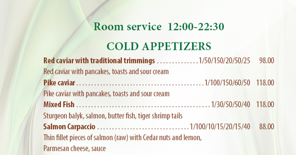

Не раз приходилось наблюдать, как не знающий человек пробелом пытается выровнять текст, как точками пытается сделать аккуратную дорожку, за которую бы цеплялся глаз. Иногда ограничиваются полумерами — нажимая несколько раз клавишу **Tab**, при этом текст, все-таки, выравнивают, но той гибкости, которую дает знание табулирования, нет. Скажу сразу — табуляция применима только к простому тексту (**Paragraph Text**).  
Итак, в строку можно вставлять специальные маркеры, по которым можно выстраивать текст определенным образом.

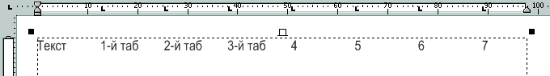

На рисунке вверху видны позиции табуляции, на которые перескакивает текстовый курсор при нажатии клавиши **Tab**. По умолчанию позиции уже расставлены с интервалом 0,5 дюйма. Но их можно двигать, удалять и добавлять новые. Чтобы они стали видны, и появилась возможность ими интерактивно управлять, необходимо переключиться на инструмент **Text tool** (F8), и поместить курсор внутрь текстового блока. Тогда часть линейки шириной в текстовый блок станет белой и на ней вы увидите расставленные по умолчанию значки позиций табуляции. Они похожи на латинскую букву «L».  
Чтобы перетащить маркер, потяните его мышкой влево или вправо. Чтобы удалить маркер, потащите его мышкой вниз, а чтобы добавить — щелкните указателем мыши по линейке.  
Выравнивание текста при табуляции может быть четырех видов:

*   **Left** (по левому краю) — выравнивание по умолчанию, когда столбец текста будет выравниваться по первому символу;
*   **Right** (по правому краю) — выравнивание по последнему символу;
*   **Center** (по центру) — выравнивание по центру столбца;
*   **Decimal** (по десятичному разделителю) — выравнивание десятичных дробей по разделительному знаку (точка или запятая).

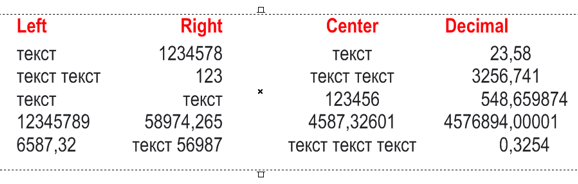

Чтобы вставить маркер другого типа выравнивания, щелкайте по значку на пересечении линеек. Или можете выбрать варианты из контекстного меню линейки.

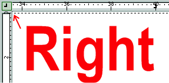

Чтобы изменить тип выравнивания уже существующего табулятора, щелкните по нему правой кнопкой мыши и выберите в контекстном меню тип выравнивания.

Чтобы выставить позиции табуляции точно, необходимо воспользоваться диалоговым окном **Tab Settings**. Для этого выделите текст (напоминаю, это относится только к Paragraph Text) и выберите команду меню **Text > Tabs…** (Текст > Табуляции…).

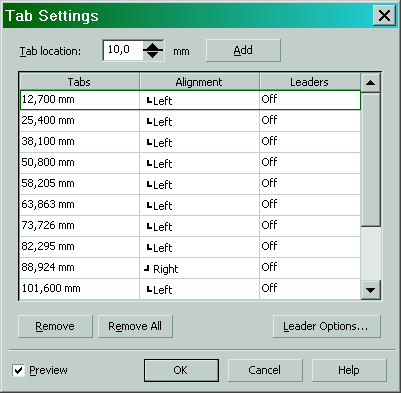

Рассмотрим это окошко поподробнее.  
Мы видим таблицу, в которой занесены все существующие табуляторы и с помощью которой можно менять параметры этих табуляторов. В столбце **Tabs** указаны координаты позиций. Чтобы их изменить, щелкните мышкой по координате и введите новое число.

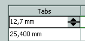

Во втором столбце **Alignment** (Выравнивание) можно поменять тип выравнивания табулятора. Щелкните мышкой и в выпадающем списке выберите нужный тип выравнивания.

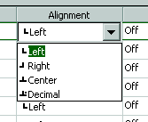

В третьем столбце **Leaders** (Выносные линии) можно задать повторяющийся символ–заполнитель, который будет заполнять на строке все пространство до табулятора. Их еще называют «отточия». По умолчанию отточия отключены (off). Щелкаем мышкой и выбираем **off** или **on**.

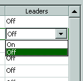

По умолчанию символом выносной линии (отточием) является точка. Чаще всего ее и используют. Но можно выбрать и другой символ. Нажмите на кнопку **Leader Options…** (Параметры выносной линии…) и в появившемся диалоговом окне **Leader Settings** выберите желаемый символ (**Character**) и интервал между повторяющимися символами (**Spacing**).

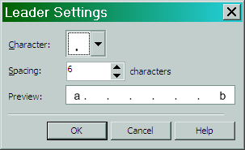

В окошке **Preview** можно увидеть, как все это будет выглядеть.  
Отточия обычно применяют в оглавлениях книг, в меню и др. ситуациях, когда нужно как-то обозначить строку, облегчить, так сказать, скольжение взгляда до следующего далекого табулятора :)

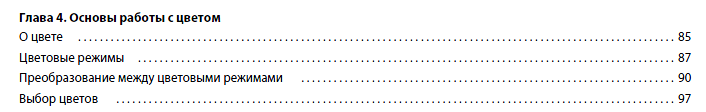

Вверху диалога **Tab Settings** мы видим кнопку **Add** (Добавить), которая добавляет позиции табуляции и числовое значение **Tab location** (Местоположение вкладки), которое указывает, на каком расстоянии от последней табуляции будет отстоять вновь созданная.  
Ну, и кнопки **Remove** и **Remove All**, удаляют соответственно текущую позицию табуляции и все табуляции.

Табуляторы — это почти такие же символы, как и обычные буквы. Только они не показываются (если специально не включить их показ). Чтобы увидеть Tabs, выберите пункт меню **Text > Show Non-Printing Characters** (Текст > Служебные символы).

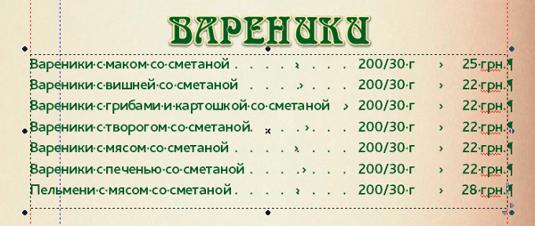

Как видно на рисунке вверху, табуляторы показаны символом **>**, концы абзаца символом **¶**, пробелы — приподнятой точкой. Кстати, в других программах для кодов форматирования обозначения аналогичные.

И напоследок, несколько практических советов.

1.  Как и другие символы, табуляторы можно копировать, как и обычный текст — выделить, скопировать, вставить.
2.  Чтобы изменить табуляторы только в текущем абзаце, необходимо, чтобы текстовый курсор находился в этом абзаце. Тогда, все вновь созданные нажатием **Enter** абзацы, будут иметь аналогичное форматирование (выравнивание, отступы, позиции табуляции и др.).
3.  Чтобы изменить **Tabs** в уже существующих абзацах, нужно выделить их все и уже тогда менять позиции, тип выравнивания, отточия и др. Либо интерактивно мышкой, либо в диалоговом окне **Tab Settings**.
4.  Если выделить всю текстовую рамку (фрейм) инструментом **Pick tool** и в диалоговом окне **Tab Settings** изменить параметры табуляции, то эти изменения применятся ко всей выделенной рамке.
5.  Если вам часто приходится использовать окно **Tab Settings**, то кнопку **Tabs…** (Табуляции...), можно вынести на панель инструментов «Текст» (по умолчанию ее там нет) или на Панель свойств (Property Bar). Можно также назначить горячую клавишу.
6.  И, так же как и колонки, табуляция может применяться к созданию календарей. Если по какой-то причине вам не подходит автоматизированный генератор календарей или если у вас CorelDRAW старой версии (до 14-й), когда он не поддерживал таблицы.

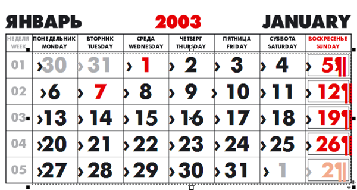

На рисунке вверху показан пример квартального календаря, сделанного в 11-й версии DRAW с помощью табуляции (я включил для наглядности отображение служебных символов)...

Итак, всем, кто много работает с текстом в CorelDRAW , кому приходится создавать меню, оглавления, многоколоночные списки и другой структурированный текст, рекомендую пользоваться табуляцией, чтобы документы выглядели аккуратно, грамотно, профессионально и стильно.