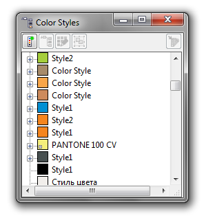

# Решаем проблему цветовых стилей (Color Styles)

_Дата публикации: 02.11.2012_

Случалось ли у вас так, что **CDR файл** весит мало, а открывается долго, копирование и вставка элементарных объектов занимает длительный промежуток времени? Пожалуй, это одна из самых больших проблем, с которой до сих пор сталкиваются пользователи графического редактора **CorelDRAW**. Однако, как и любую другую проблему, её можно решить. Но прежде чем рассмотреть пути решения, а также предотвращения появления этой проблемы, я немного углублюсь в суть вопроса.

Итак, разберёмся, почему так происходит. В **CorelDRAW** присутствует возможность создавать и хранить **цветовые стили (Color Styles)**. С помощью них очень удобно работать с большими документами – меняя цвет стиля, Вы автоматически меняете цвет объектов, к которым был применён этот стиль. Однако разработчики не учли один момент – эти стили могут накапливаться. Каким именно образом, если честно, для меня до сих пор загадка. Просто у меня они никогда не накапливались. Но факт есть факт, и порой приходится лицезреть CDR файл с простым векторным логотипом, который весит намного больше чем должен. Например, файл, реальный вес которого 300 Кб, весит больше 6 Мб. Ощутимая разница, да? Все эти 5 с лишним Мб – цветовые стили. И если у вас CorelDRAW ниже версии X4 SP2, то можно и не дождаться когда откроется такой файл.

Решается эта проблема довольно просто, однако есть нюансы. Если у Вас CorelDRAW ниже версии X4 SP2, то выход только один – патчить его с помощью changeCLOL! В противном случае, часть проблемы за нас решили разработчики, но остаётся другая часть. Первое что нужно сделать, зайти в настройки _Tools > Options > Document_, отметить галочку **Save options as default for new documents**, затем снять галочку **Styles** и нажать OK. Остаётся ещё один нюанс – копирование / вставка по-прежнему могут тормозить. Происходит это потому что, копируя любой объект из «зараженного» файла, вместе с ним вы копируете все цветовые стили, которые присутствуют в документе. А вставка такого объекта в «чистый» файл повлечёт за собой его «заражение», но нам это, конечно же, не нужно! Так что, единственный выход – очистить «зараженный» файл. А сделать это можно, пересохранив его в **CMX файл**, а затем этот CMX обратно в CDR. Макрос reSaveCMX сводит эти действия к одному клику. Но стоит так же помнить, что CMX не поддерживает эффекты и многостраничность.

Наверное, Вы спросите, а зачем все эти телодвижения с CMX и т.п., если есть changeCLOL. Дело в том, что, применяя **патч changeCLOL**, Вы подписываетесь на возможные вылеты градиентных заливок. Оплата испорченного тиража из своего кармана, оно вам нужно? В общем, в любом случае, выбор остаётся за вами.

## Важно!!!

В версии 15.1.0.588 можно комфортно работать не задумываясь о стилях, по следующим причинам:

1. Стили не создаются автоматически.  
1. Стили не копируются в другие файлы через буфер обмена с объектами.

## Полезно знать

Для версии **CorelDRAW 13.0.739** существует [макрос wx_PatchDraw](http://recentfiles.netfirms.com/misc/wx_PatchDraw.exe) динамических настроек, в числе которых отключение чтения и сохранения стилей.
