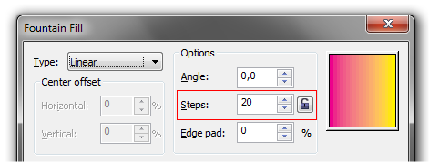
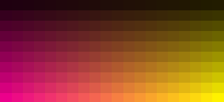

# Steps в градиентной заливке

_Дата публикации: 20.11.2010_

Мало кто обращает внимание на параметр **Steps** в свойствах градиентной заливки. Конечно в повседневной работе он мало кому пригодится, однако иногда он серьёзно выручает. Итак, разберёмся в вопросе более детально.

Кто знаком с английским языком, уже наверное догадался, по названию, на что влияет параметр Steps. А влияет он на количество градаций (ступеней, шагов... называйте как хотите) заливки. Например если задать значение Steps равное 3 для градиента от чёрного к белому, то получится следующий эффект:

По умолчанию значение этого параметра всегда равно **256**. Максимальное же доступное значение соответствует 999\. Оно может понадобиться для больших фоновых градиентов с сильно отличающимися цветами. Хочу сразу сказать что не стоит использовать значения больше 256 для печати, а вот для веба пожалуйста.

Небольшой пример использования параметра Steps:

