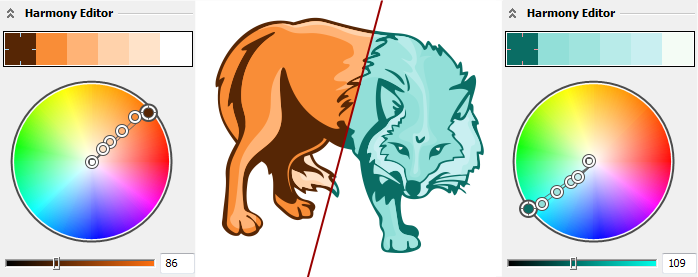
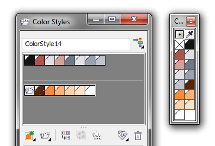

# Стили цвета (Color Styles) в CorelDRAW X6

Шестнадцатая версия **CorelDRAW** предоставляет нам совершенно новые возможности в работе со **стилями цвета**. Именно новые, так как цветовые стили не являются доработкой старых стилей, и полностью их игнорируют. Помимо самих стилей, новый «инструмент» также предоставляет возможности по созданию **цветовых гармоний (Harmony)**.

Стоит сразу отметить, что отличить стиль цвета от самого цвета, можно по скосу верхнего левого уголка:

## Для чего нужны стили цвета?

Их можно использовать в различных целях, например для быстрой перекраски векторного изображения (в том числе сетчатых заливок), но основным их применением является стандартизация цвета в рабочем документе. Например, предположим что мы делаем многостраничный каталог, и на определённом этапе работы приходится менять какой либо цвет (или вообще все цвета) во всём документе. Конечно можно использовать поиск/замену или макросы, но намного проще доверить эту работу стилям. Достаточно будет изменить цвет в стиле, и он обновится везде, где применён этот стиль. На самом деле, это один из самых простых примеров, и использование стилей может быть более разнообразным и обширным.

## Управление цветовыми стилями

Основное управление цветовыми стилями выполняется через **докер Color Styles**. Помимо этого, докер также предоставляет возможности по созданию и управлению цветовыми гармониями и градациями цвета. Часть функций можно найти в контекстном меню объекта.

Для большей гибкости использования стилей цвета, с докером связана специальная палитра **Color Style Palette**, которая содержит идентичный список стилей.
