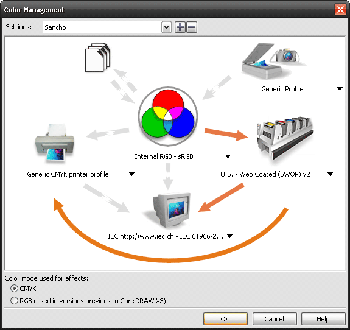
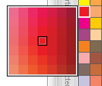

# Цвет в CorelDRAW

_Дата публикации: 02.11.2012_   
_Автор: Михаил Борисов_   
_Редактор: Александр (aka Sancho)_

**От редактора:** Сразу хочу отметить, что статья писалась давно, но она актуальна и на сегодняшний день. В некоторых моментах, я взял на себя ответственность внести поправки в текст, так чтобы, с технической точки зрения, статья была актуальна для **CorelDRAW Х4**.

Часто можно слышать различные обвинения в адрес **CorelDRAW** — дескать, он «глючный» (особенно его русифицированные версии), постоянно «вешает» операционную систему, EPS генерирует плохие, а что касается цвета — так об этом лучше вообще не говорить. Чувствуется какая-то странность: в самом деле, если программа настолько плоха, как заявляют некоторые специалисты, так почему же она получила такое широкое распространение? Может быть, эти «спецы» не совсем объективны, или же их выводы базируются на собственном раннем, не слишком удачном опыте?

В общем-то, статья и возникла в результате долгого спора с одним из сторонников лозунга «дрова маст дай» (DRAW must die) — в ней я постарался отделить «зерна от плевел», а именно: особенности (нюансы) работы DRAW от надуманных обвинений в адрес нынешней версии редактора. Да, как и любая другая программа такого уровня, CorelDRAW имеет недостатки. Я надеюсь, что эта публикация поможет изменить мнение о программе у многих ее противников и поколебать суждения даже радикально настроенных пользователей.

Предвидя риск попасть под перекрестный огонь тех, кто абсолютно «не переваривает» CorelDraw, хочу сделать небольшое отступление. Поскольку все познается в сравнении, при оценке качеств программы неизбежен вопрос о ее конкурентах. Как известно компания Adobe купила Macromedia. FreeHand, судя по всему, был закрыт, и одним конкурентом стало меньше. Так что единственным конкурентом, на данный является Adobe Illustrator. Я избегаю сопоставления его с CorelDRAW по нескольким причинам. Во-первых, обзор преимуществ и недостатков обязательно сведется к сравнению разных платформ — Macintosh и PC — а тут, как говорится, на вкус и цвет товарищей нет. Во-вторых, пользователи, работающие на Macintosh, автоматически считаются профессионалами в полиграфии и, естественно, имеют больший авторитет, нежели пользователи РС. А поскольку на Macintosh исторически доминирует Illustrator, это выливается в пренебрежительное отношение «профи» к любым другим продуктам, даже превосходящим его по возможностям. Автор был свидетелем уникальной ситуации, когда в вину CorelDRAW вменялось то, что он «не дисциплинирует» пользователей, то есть предоставляет слишком широкий выбор средств для реализации идей! Не правда ли, занятный аргумент?

Итак, совершив краткий экскурс в стан конкурентов, вернемся к **CorelDRAW**.

Давайте разберемся с вызывающей много нареканий работой DRAW с цветом. Настройки цвета по умолчанию в программе весьма условны, ибо все используют разные настройки и разные профили. Естественно, не каждый утруждает себя открытием **CMS (Color Management System)**. В результате оказался виноват DRAW, хотя этот нюанс можно считать тестом на профпригодность для занимающихся полиграфией. Как настраивать CMS, написано в статье [Настройка CMS (Color Management System) в CorelDRAW](../nastroyka-cms-color-management-system-v-coreldraw/index.md).

## Cоветы и секреты

Итак, DRAW поддерживает цвет в любой модели — RGB, CMY, CMYK, HSB, Lab и т.д.. Для доступа к ним достаточно выбрать соответствующий пункт из вкладки Uniform Fill (Однотонная заливка), Models (Модели). Пакет поддерживает и все палитры цветов PANTONE. Наряду со стандартной палитрой CorelDRAW, с программой идет библиотека дополнительных палитр (Dockers (Докеры), Color Palette Browser (Браузер палитр цветов)) — они сгруппированы тематически, что помогает в них ориентироваться. Открытыми могут быть сразу несколько палитр — их достаточно указать в докере Color Palette Browser.

Кроме стандартных цветов, имеющихся в палитре по умолчанию, DRAW позволяет отображать и более мелкие градации цветов — для этого достаточно нажать левой кнопкой мыши на образец в палитре подержать, и подержать около секунды. Появится небольшая палитра (7x7 образцов с цветами), в которой будут располагаться цвета, промежуточные между окружающими основной образец в палитре. Таким образом, вы можете достаточно быстро подобрать подходящий вам цвет, не делая лишних движений. Есть в программе и еще одна возможность быстрой коррекции цвета — нажав клавишу Ctrl и выбрав любой образец с цветом, вы добавите 10% выбранного цвета к первоначальному. Например, если вначале объект был закрашен чистым голубым, то нажав и выбрав образец с красным цветом, в конечном счете вы получите цвет с компонентами (100% С, 10% М, 10% Y, 0% K).

Интерактивность и лёгкость DRAW в работе с цветом, и не только, безусловно, является одной из главных особенностей редактора. Не будем далеко ходить за примерами и сразу обратимся к Fountain Fill (градиентная заливка). Все знают этот инструмент, однако не все знают его одну из лучших сторон. Выбрав этот инструмент и применив заливку к объекту, не переключаясь на другой инструмент, мы можем перетащить цвета мышкой из палитры прямо на градиент. Заменить цвет любого имеющегося узла в градиенте можно, перетащив цвет с палитры прямо на узел. Зажав при этом клавишу Ctrl (возле курсора появится знак «+») можно добавить к текущему цвету узла 10% выбранного цвета. Если же нужно добавить ещё один узел, достаточно перетащить цвет на свободное место в линии градиента. Вообще эта функция перетаскивания цвета работает и для обводок и для Uniform Fill (Однотонная заливка) в том числе. Ещё одним полезным инструментом является Interactive Fill Tool, который удобно вызывать клавишей G.

Что касается коррекции цветов, то в программе предусмотрены достаточно мощные механизмы регулировки цветовых составляющих объектов — они сосредоточены в Effects (Эффекты), Adjust (Настройка). Для того чтобы результат коррекции отображался сразу же, нужно нажать кнопку автоматического применения (с нарисованным замком) — это гораздо удобнее, чем каждый раз нажимать кнопку Preview. Если же по какой-то причине результат не подходит, можно, нажав треугольник в левом верхнем углу окна, выбрать другой метод либо применить имеющиеся в программе фильтры обработки изображения. Некоторые настройки в окне Adjust предназначены для коррекции только растровых изображений, что можно считать достаточно бесполезным. Ведь если иногда возникает необходимость «сдвинуть» цвета в ту или иную сторону в объектах, то заниматься этим с изображениями в векторном редакторе вряд ли кто-то отважится.

Для более удобной работы с именованными цветами и оттенками на их основе, в DRAW предусмотрен специальный докер — **Color Styles** (Window (Окно), Dockers (Докеры), Color Styles (Стили цветов)). Однако именно эта возможность стала большим минусом программы. Цветовые стили имеют свойство накапливаться в документе и передаваться в другие с объектами. В результате, при большом кол-ве стилей документ начинает сильно тормозить при открытии и операциях копирования и вставки. А так же увеличивается размер файлов. К счастью первую проблему решили во втором сервис паке для Х4 (до этого спасал неофициальный патч **changeCLOL**). Со второй проблемой, если это для вас критично, можно справится вручную, пересохранив в CMX и обратно в новый CDR, или макросом **reSaveCMX**.

Довольно удачной следует признать возможность подбора гармонирующих цветов (Uniform Fill, Mixers (Смесители)). На основании шести способов (Primary (Первичный), Complement (Комплиментарный), Triangle 1 (Триангулярный 1), Triangle 2 (Триангулярный 2), Rectangle (Прямоугольный), Pentagon (Пентагональный)) можно подобрать к имеющимся цветам те, которые «подходят» к ним. Также вы можете использовать способность программы создавать оттенки, отличающиеся по цветовой гамме (холодная, теплая, более темная, более светлая и менее насыщенная), что может вам пригодиться в работе.

Некоторым может показаться более удобным постоянно держать под рукой палитру с цветами, чем вызывать каждый раз соответствующее окно. Эта палитра отображается в докере Color (Window, Dockers, Color) и через нее можно управлять как цветом заполнения, так и цветом окантовки. Единственное, при работе с этим докером (как, впрочем, и со всеми остальными докерами) не нужно забывать о том, что с его помощью можно только установить цвет объекта, но не узнать его — название цвета отображается в панели статуса. Кроме того, поскольку **Color Docker** занимает достаточно много экранного места, его целесообразно использовать вместе с другими открытыми докерами — в этом случае экранное место расходуется более экономно.

Среди средств, предназначенных для профессиональной работы с цветом, стоит отметить возможность программы визуально показывать объекты с установленным атрибутом печати поверх других красок (overprint), причем объекты отображаются по разному в зависимости от того, для чего задан атрибут — для заливки, окантовки, либо того и другого вместе. Это помогает при работе со сложным макетом, поскольку всегда можно быстро проверить параметры объектов. Особенно полезна эта функция при импорте объектов из коллекции изображений, идущей вместе с пакетом, поскольку некоторые старые изображения почему-то для заливки имеют включенный «оверпринт» — при этом вы сразу же сможете локализовать потенциальную проблему. Для просмотра макета со включенным overprint, в DRAW предусмотрен отдельный режим отображения документа — **Enhanced With Overprints**. Напомню, что атрибут «оверпринт» для объектов можно установить через контекстное меню, вызываемое правой кнопкой мыши (Overprint Fill, Overprint Outline и Overprint Bitmap).

Большую помощь при работе со сложным макетом может оказать команда Document Info (Информация о документе). Однако эта стандартная возможность не лишена минусов. Во-первых, она иногда показывает то, чего в макете нету, а во-вторых — нет возможности узнать какой именно объект содержит те или иные свойства. Такое положение вещей меняет [макрос CdrPreflight](http://cdrpro.ru/macros/cdrpreflight/). Он отображает полную информацию об объектах, присутствующих в документе. Так, например, можно обнаружить объекты с RGB-заливкой или же узнать максимальное количество узелков в кривой; выяснить, весь ли текст переведен в кривые или же шрифты еще используются; сообщает о наличии эффектов. В общем, перед тем, как отдать документ в стороннюю организацию или же перед сохранением в формате EPS может стать хорошим тоном проверка статистики по макету — этим вы обезопасите себя от возможных неприятностей.

Ну а если вдруг обнаружилось, что в макете присутствуют объекты в модели RGB или понадобилось заменить элементы с определенной заливкой на другую? Тут вам на помощь придут возможности программы по поиску/замене (Find/Replace). Они широки, но есть задачи, с которыми макросы справятся намного лучше. Например, для замены цвета есть отличный бесплатный макрос ColorReplacer. А с различного рода конвертациями (текст в кривые, RGB в CMYK и т.д.) быстрее и удобнее справится всё тот же CdrPreflight.

В актив DRAW можно занести и достаточно мощную функцию Bitmap Color Mask (Цветовая маска карты битов). Она позволяет делать прозрачными как строго определенные цвета в растровом изображении, так и окружающие его цвета в заданном диапазоне, который регулируется движком Tolerance (Допуск). С другой стороны, такие настройки гораздо легче делать в специализированных редакторах типа Photoshop или PhotoPAINT — в них возможностей по точному указанию границ гораздо больше. Желательно помнить и о том, что DRAW позволяет перекрашивать черно-белые изображения в самой программе — при этом для закраски белой области используется тот же метод, что и для изменения заливки объекта, для перекраски черной — окантовки.

Итак, мы рассмотрели возможности программы при работе с цветом. Если вас убедили мои доводы в том, что DRAW — это достаточно надежная программа, попробуйте, отбросив предубеждения, поработать с ней — и, быть может, ваше сердце оттает. Во всяком случае, по широте возможностей и по скорости работы равных ей нет.
