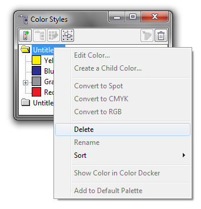

# Удаление (старых) цветовых стилей

_Дата публикации: 10.11.2010_

Начиная с версии _15.2.0.661_, в CorelDRAW появилась возможность быстрого удаление всех **цветовых стилей (Color Styles)** документа одной кнопкой.

Для этого необходимо открыть докер цветовых стилей (Window > Dockers > Color Styles), а затем, вызвав контекстное меню необходимой папки, выбрать пункт **Delete**.

