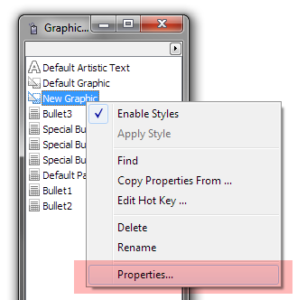
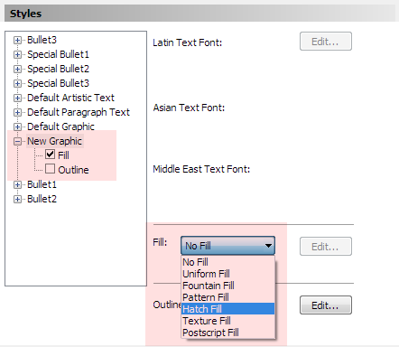
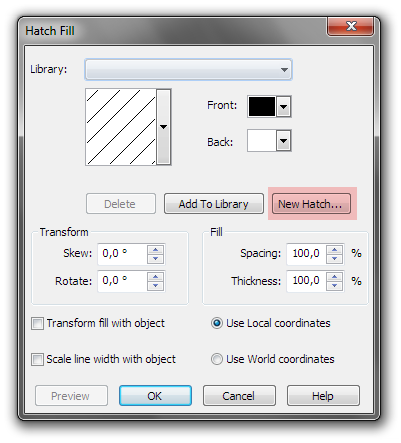

# Заливка штриховкой (Hatch Fill) в CorelDRAW

_Дата публикации: 02.11.2012_

Итак, как же сделать заливку штриховкой в CorelDRAW?!

1\. Откроем докер **Graphic and Text Styles** (Ctrl + F5).  
2\. Создадим новый Graphic стиль и сразу откроем его свойства (Properties).

3\. Укажем чтобы стиль применялся только к заливке.  
4\. В выпадающем списке выбираем **Hatch Fill** и жмём рядом кнопку Edit.

5\. Саму заливку можно настроить нажав кнопку New Hatch.

**Внимание!!!** Если в окне New Hatch from Selected выбрать Enhanced Line Style, то CorelDRAW вылетит.

Проверялось на Х4.
