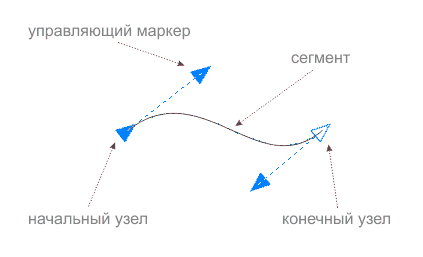
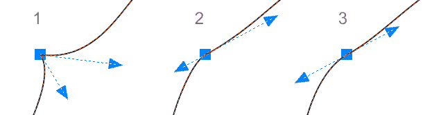
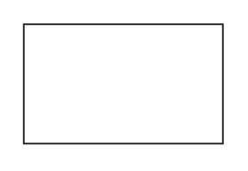
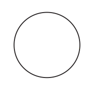

# Инструмент Shape (Форма). Работа с кривыми и не только!

Инструмент **Shape**, пожалуй, один из ключевых в графическом редакторе **CorelDRAW**. В основном, он используется для **редактирования кривых**. Однако, на этом область его применения не заканчивается, а только начинается. Рассказать **всё об инструменте Shape** в рамках одного материала не получится, но я постараюсь затронуть основные моменты.

Итак, как я уже сказал, основная задача инструмента **Shape — редактирование кривых**. С его помощью можно перемещать, добавлять, удалять, и совершать прочие манипуляции над узлами и сегментами, из которых и состоит кривая.

Все операции производятся с помощью панели свойств или контекстного меню, а самые важные из них доступны интерактивно. Например, что бы добавить узел, необходимо выполнить двойной клик инструментом Shape на сегменте кривой, а для удаления узла — двойной клик по узлу.  
_На заметку: Если выделить несколько узлов кривой и дважды кликнуть по одному из них, все они будут удалены._

Узлы и сегменты могут быть нескольких типов. Для их настройки предусмотрены специальные кнопки на панели свойств инструмента Shape:

Как видно, узлы могут быть трёх типов:

1.  Cusp (перегиб)
2.  Smooth (сглаженный)
3.  Symmetrical (симметрический)

А сегменты двух типов — кривой и прямой.

Остальные кнопки панели свойств инструмента **Shape** имеет смысл рассмотреть в отдельных материалах.

## Shape и базовые фигуры

Как говорилось в начале данного материала, функции инструмента Shape не ограничиваются одним лишь редактированием кривых. С помощью этого инструмента можно управлять определёнными параметрами базовых фигур, например скруглениями углов прямоугольника.

Или формированием сектора из окружности.

## Shape и текстовые объекты

Инструмент **Shape**, так же можно использовать для интерактивного форматирования текста. При выделении текстового объекта этим инструментом, появляются два управляющих маркера. С помощью правого можно настраивать интервал между букв и слов, а с помощью левого — между строк и абзацев. Важно отметить, что удерживание **Shift** или **Ctrl** влияет на то, какой именно параметр будет изменяться. Например, при манипуляциях с правым маркером, Shift позволяет настраивать интервал только между слов, а Ctrl — только межбуквенный интервал внутри слов.

Так же, инструмент Shape позволяет интерактивно менять положение букв/слов/строк относительно текстового объекта в целом.

Как вы видите, **Shape** — один из самых мощных **инструментов CorelDRAW**, и это далеко не все примеры его использования.

## Полезно знать

* Инструмент **Pick tool** умеет автоматически, на время, переключатся в режим редактирование узлов. Подробнее об этом в материале "Всё об инструменте Указатель".
* Двойной клик по кривой инструментом **Pick tool**, позволяет переключиться на инструмент **Shape**.
* Что бы выделить **все узлы одного пути** в кривой, необходимо удерживая клавиши **Shift и Ctrl**, выделить любой узел этого пути с помощью инструмента Shape.
* Для изменения типа узла можно использовать клавиши:   
  C — переключает между Cusp и Smooth   
  S — переключает между Symmetrical и Smooth
