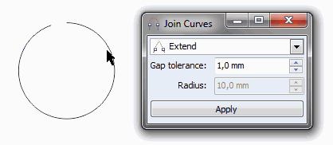

# Объединение узлов

Предположим, у нас есть незамкнутая кривая или две кривые, и нужно объединить их в одну, соединив близлежащие узлы. Это можно сделать двумя способами, один из которых стал доступен только с 15-й версии CorelDRAW.

## Способ первый (ручной)

Если необходимо объединить узлы в двух отдельных кривых, нужно предварительно объединить сами кривые. Для этого выделите их и примените команду **Combine**. Для объединения двух узлов, выделите их инструментом **Shape** и примените команду **Join two nodes**.

## Способ второй (полуавтоматический)

Выделяем необходимые кривые инструментом **Pick tool**, открываем докер **Join Curves**, указываем необходимые настройки и применяем их. Настроек там всего три, да и радиус доступен только для одного типа соединения, так что, думаю, не заблудитесь.

Докер, ко всему прочему, когда вы меняете значения, показывает изменения в реальном времени.

## На заметку

Докер Join Curves, как и остальные, доступен через меню Window (Окно) > Dockers (Окна настройки).