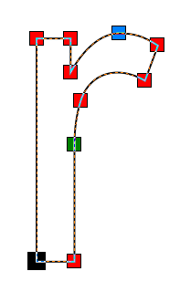

# Отображение узлов разного типа разными цветами

В очередной раз речь пойдёт об инструменте **Shape** в **CorelDRAW**. Недавно я делал беглый обзор основных возможностей этого инструмента, и в том числе, перечислил какого типа бывают узлы в кривой. Так вот, благодаря «скрытой» настройке, можно заставить CorelDRAW отображать каждый тип своим цветом.



Соотношение типа узла и цвета:

*   Cusp (перегиб) — красный
*   Smooth (сглаженный) — зелёный
*   Symmetrical (симметрический) — голубой

_Чёрным цветом отображается первый узел кривой, вне зависимости от его типа._

Итак, для того чтобы включить эту особенность, необходимо закрыть CorelDRAW. Затем, создать пустой текстовый файл, и вставить в него следующий текст:

```
Windows Registry Editor Version 5.00  
[HKEY_CURRENT_USER\Software\Corel\CorelDRAW\15.0\Draw\Application Preferences\Node Edit Tool]  
"NodeColorCoding"="1"
```

Сохранить его, и после, переименовать расширение с **txt** на **reg**. И наконец, запустить файл двойным кликом и согласиться на добавление данных в реестр Windows.

Как видно из вставляемого текста, данный «секрет» предназначен для **Х5**. Для других версий нужно изменить путь.

_Данная опция, на ряду с несколькими другими, так же доступна для настройки с помощью утилиты [CDRtuning](http://cdrpro.ru/macros/)._
