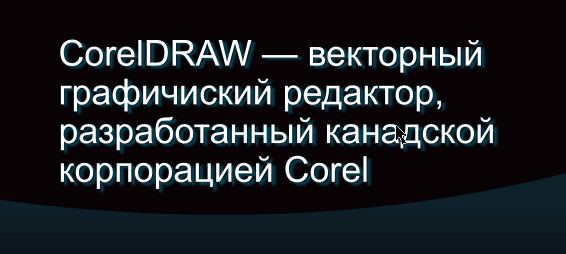

# Работа с отдельными путями кривой, как с объектами

Как известно, кривая в CorelDRAW может состоять из нескольких путей. Их принято называть _subpath_ (в русском переводе — _фрагменты_). Я же, называю их просто путями. Так вот, иногда возникает потребность редактировать некоторые пути независимо от остальных находящихся в одной кривой. К примеру, это может понадобиться для редактирования уже переведённого в кривые текста — заменить какие то буквы. Согласитесь, «разбивать» объект на десятки «огрызков», а после редактирования снова его объединять, не совсем удобно. А если к этому объекту применён эффект тень, тогда это вообще проблема. Есть способ намного лучше.

Для начала рассмотрим две стандартные функции, которые предоставляет инструмент **Shape**. С их помощью можно масштабировать, деформировать и поворачивать отдельные пути и даже отдельные узлы. Речь об **Stretch or scale nodes** (Растянуть или масштабировать узлы) и **Rotate or skew nodes** (Повернуть или наклонить узлы).

_Полезно знать: для того, чтобы выделить только один путь кривой из нескольких, необходимо с зажатыми Shift + Ctrl кликнуть левой кнопкой мыши в любой узел этого пути._

Однако, на мой взгляд, такой способ не даёт той свободы и лёгкости действий с путями, которую предоставляет инструмент **Pick tool** с объектами. Рассмотрим другой вариант.

В составе [макроса CdrTools](http://cdrpro.ru/macros/) есть функция **EditModeEx**, благодаря которой можно использовать все преимущества обычной работы с объектами, в работе с путями. Эта функция предоставляет возможность «входить» в группы, контейнеры, и в том числе, в кривые. При этом остальная часть рабочей области накрывается белой «пеленой», акцентируя внимание на доступные для редактирования объекты, но при этом не скрывая общей «картины». При выходе из этого режима редактирования, эффекты возвращаются объекту (например, прозрачность или падающая тень), если таковые были.

Давайте рассмотрим один пример. Допустим в наличии есть некий текст переведённый в кривые, и при этом к нему применён эффект падающей тени. Но в тексте ошибка, и нужно её исправить именно в этом варианте, так как нет уже времени ждать пока дизайнер исправит и перешлёт макет заново. Тень нужно сохранить пока именно как эффект, т.к. она должна будет измениться после внесения правок в текст.

Смотрим как легко это сделать с помощью функции **EditModeEx**:

Как видите, макросом этот вопрос решается очень легко и быстро. И это лишь один пример из многих.
