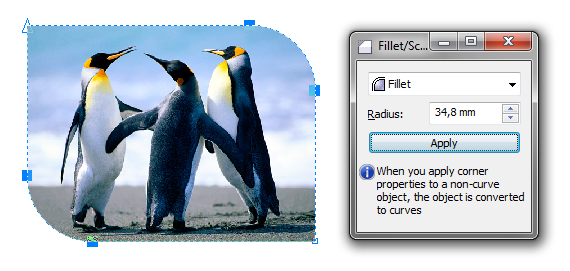

# Растровое изображение — кривая?!

Я уже упоминал о том, что в **CorelDRAW** своя логика работы с **растровыми изображениями**, и приводил пример обтравки с помощью инструмента **Shape**. Программа позволяет работать с «контуром» изображения, как с кривой — мы можем добавлять и удалять узлы, редактировать сегменты. Это значит, что мы можем применять некоторые, специфичные для кривых, функции.

Например, скругление углов. Для этого выделите изображение инструментом **Pick tool** или только некоторые узлы инструментом Shape, и с помощью докера **Fillet/Scallop/Chamfer** примените необходимые настройки.
