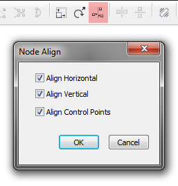

# Выравнивание узлов

В этой заметке, я продолжаю рассказывать про инструмент **Shape** и работу с кривыми в **CorelDRAW**. А конкретнее, про **выравнивание узлов** относительно друг друга.

Стандартными средствами, выравнивать узлы можно только по вертикали и горизонтали, и только в одной кривой за раз. Функция выравнивания доступна в виде кнопки **Align Nodes** на панели свойств инструмента **Shape**, которая вызывает специальное диалоговое окно.

Настроек всего три: первые две отвечают за выравнивание самих узлов, а последняя за выравнивание управляющих маркеров. Стоит отметить, как и в случае обычного выравнивания объектов, операция происходит относительно последнего выделенного элемента, в данном случае узла.
